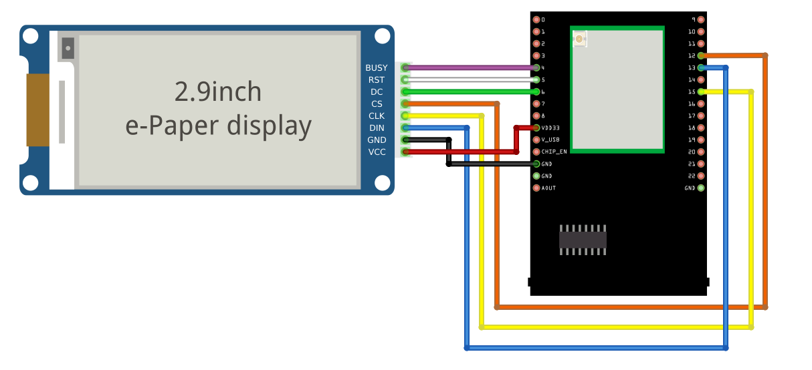

Display Images
==============

.. contents::
  :local:
  :depth: 2

Materials
---------

-  `AMB82-mini <https://www.amebaiot.com/en/where-to-buy-link/#buy_amb82_mini>`_ x 1

-  Waveshare E-Paper [2.9inch E-Paper HAT (D)/ 2.9inch E-Paper V2/ 2.9inch e-Paper Module (B)/ 4.2inch e-Paper Module/ 7.5-inch E-Ink display HAT] x1

Example
-------

Introduction
------------

In this example, Ameba Pro2 board will be used to connect to a Waveshare
e-Paper module (2.9inch/ 4.2inch/ 7.5inch) to display images. The
display uses the flexible substrate as base plate, with an interface and
a reference system design. You may refer to the
official `datasheet <https://www.waveshare.net/w/upload/b/b5/2.9inch_e-Paper_(D)_Specification.pdf>`__ to
know more information about these modules.

Procedure
---------

**AMB82-Mini wiring diagram:**

2.9inch HAT (D) e-Paper Module

|image01|

2.9inch E-Paper V2 e-Paper Module/ 2.9inch e-Paper Module (B)

|image02|

4.2inch e-Paper Module

|image03|

7.5-inch e-Paper Module

Do note that Display Config should be set to B and Interface Config
should be set to 0.

|image04|

Firstly, prepare a picture/photo and resize the image based on the
e-Paper display that you are using. You can look for a photo resizing
tool online, for example, the `Online Image
Resizer <https://resizeimage.net/>`__. Simply follow the instructions on
the website to resize the picture and download the resized image in JPEG
format.

2.9” e-Paper module: 296x128 pixels

4.2” e-Paper module: 400x300 pixels

7.5” e-Paper module: 800x480 pixels

Secondly,
use `Image2LCD <http://www.waveshare.net/w/upload/3/36/Image2Lcd.7z>`_ tool
to convert the resized JPEG image into hexadecimal codes. You can visit
this `YouTube <https://www.youtube.com/watch?v=kAmnU5Y96MA&t=363s>`_ link
to learn more about how to use the Image2LCD tool.

Next, download the Eink zip library, AmebaEink.zip,
at `https://github.com/ambiot/ambpro2_arduino/tree/dev/Arduino_zip_libraries <https://github.com/ambiot/ambpro2_arduino/tree/dev/Arduino_zip_libraries>`_
Then install the AmebaEink.zip by navigating to “Sketch” -> “Include
Library” -> “Add .ZIP Library…”.

Eink examples are categorised based on the size and modules of the
e-Paper display.

|image05|

Open one of the “EinkDisplayImages” examples. For example, “File” →
“Examples” → “AmebaEink” → “EPD_2in9v2”-> “EinkDisplayImages”:

|image06|

You may choose any GPIO pins for Busy, Reset and DC pin. You can refer
to for AMB82-Mini's `pinmap <https://www.amebaiot.com/en/amebapro2-amb82-mini-arduino-getting-started>`_.

|image07|

Upload the code to the board and press the reset button after uploading
is done. Wait for around 1-2 seconds for the e-Paper module to refresh
its screen. Images will start to loop on the e-Paper display, each image
will be displaying for 4 seconds.

|image08| 

|image09|

The 2.9-inch e-Paper Module (B) supports three colours—red, black, and
white. You may refer to the example for 2.9-inch e-Paper Module (B) to
learn how to display red images by navigating to “File” → “Examples” →
“AmebaEink” → “EPD_2in9b”-> “EinkDisplayImages”.

Red image displaying on 2.9-inch Module (B) e-Paper display is shown
below.

|image10|

.. |image01| image:: ../../_static/Example_Guides/E-Paper/Display_Images/image01.png
   :width: 1257 px
   :height: 624 px

.. |image04| image:: ../../_static/Example_Guides/E-Paper/Display_Images/image04.png
   :width: 1015 px
   :height: 688 px

