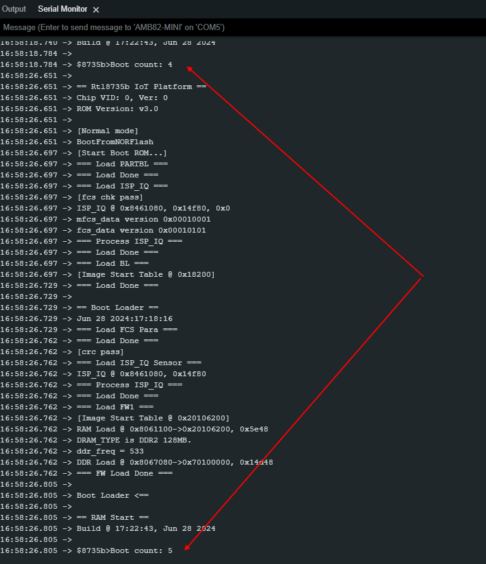

Read Write Stream
=================

.. contents::
  :local:
  :depth: 2

Materials
---------

- `AMB82-mini <https://www.amebaiot.com/en/where-to-buy-link/#buy_amb82_mini>`_ x 1

Example
-------

Flash Memory API uses memory of 3 \* 4K bytes (12Kb), which is normally sufficient for most application. However, larger memory can be provided by specifying a specific memory address and required size.

In this example, specify the starting address of flash memory is 0xFD000 (“FLASH_MEMORY_APP_BASE”) and size is 0x1000 (“TEST_SIZE” set by user). There is no offset that refers to default offset value 0. The target flash memory address is 0xFD000. Read all values from the address till “TEST_SIZE” that is 0xFD000 to 0xFE000, then store all values in “buf” and increase by 1. Next, compare all values if they all the same that result success. Final step, write all new values back into the same addresses. The read value will increase every time Ameba reboots until “RESET_THRESHOLD” (up to 0xFFFFFFFF), then reset to 0. The result may fail serval times until pass first threshold. However, if it continues fail after more than 2 threshold period, that result a 100% fail.

Open the sample code in “File” -> “Examples” -> “AmebaFlashMemory” -> “ReadWriteStream”. Compile and upload to Ameba, then press the reset button multiple times. Open the Serial Monitor, review the result.

|image01|

By default, the Flash Memory API uses address 0xFD000~0xFFFFF to store data. There is limitation when writing to flash memory. That is that it is not allowed directly write data to the same address used in last write unless erase the sector first. The Flash Memory API has 1 erase related functions.

- Use “FlashMemory.eraseSector(sector_offset)” to erase a sector (4K bytes) of target address of flash memory.

- Use “FlashMemory.eraseWord(offset)” to erase a word (4 bytes) of target address of flash memory.

