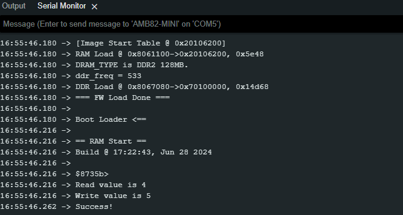

Read Write Word
===============

.. contents::
  :local:
  :depth: 2

Materials
---------

- `AMB82-mini <https://www.amebaiot.com/en/where-to-buy-link/#buy_amb82_mini>`_ x 1

Example
-------

Flash Memory API uses memory of 3 \* 4K bytes (12Kb), which is normally sufficient for most application. However, larger memory can be provided by specifying a specific memory address and required size.

In this example, specify the starting address of flash memory is 0xFD000 (“FLASH_MEMORY_APP_BASE”) and size is 0x1000. Use offset 0x1F00, that is, 0xFD000 + 0x1E00 = 0xFEE00 in flash memory. Read the value of the address, then increase by 1. Next, write the new value into the same address. Final step, read the value from the address again and compare with the increased value. If the values are same that proves that read and write a word success. The read value will increase every time Ameba reboots until “RESET_THRESHOLD” (up to 0xFFFFFFFF), then reset to 0.

Open the example, “File” -> “Examples” -> “AmebaFlashMemory” -> “ReadWriteWord”. Compile and upload to Ameba, then press the reset button multiple times. Open the Serial Monitor, review the result.

|image01|

By default, the Flash Memory API uses address 0xFD000~0xFFFFF to store data. There is limitation when writing to flash memory. That is that it is not allowed directly write data to the same address used in last write unless erase the sector first. The Flash Memory API has 1 erase related functions.

- Use “FlashMemory.eraseSector(sector_offset)” to erase a sector (4K bytes) of target address of flash memory.

- Use “FlashMemory.eraseWord(offset)” to erase a word (4 bytes) of target address of flash memory.

