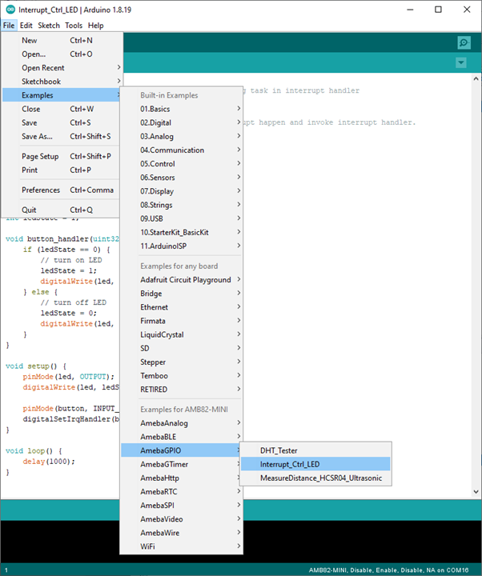
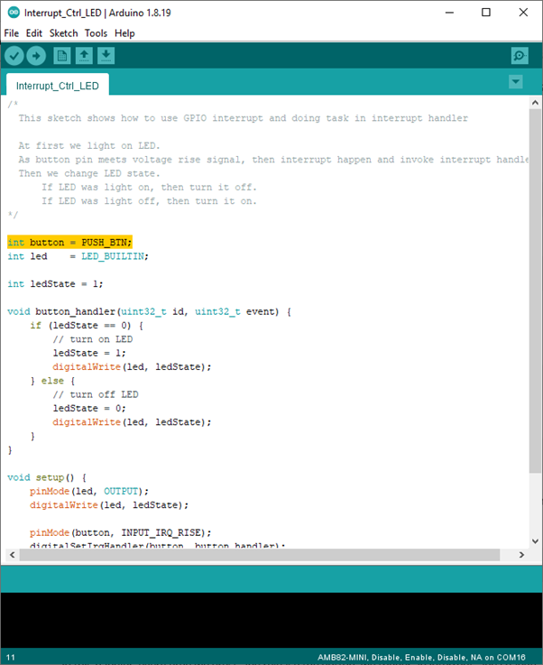
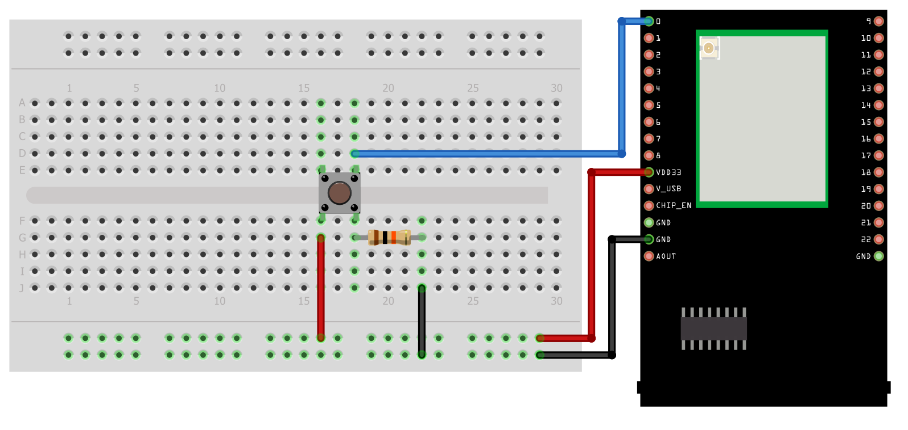

Interrupt Control LED
=====================

.. contents::
  :local:
  :depth: 2

Materials
---------

- `AMB82-mini <https://www.amebaiot.com/en/where-to-buy-link/#buy_amb82_mini>`_ x 1

-  Button x 1

Example
-------

In this example, we use a button to trigger interrupt and control the LED.
When we press and release the button, the LED dims, press and release the button again, and the LED lights up.Note that in the Arduino example “Button and LED”, LED only lights up when the button is pressed and hold, when we release the button, the LED dims.

Open the example, “File” -> “Example” -> “AmebaGPIO” -> “Interrupt_Ctrl_LED”

|image01|

Since there is no in-built push button on AmebaPro2 [AMB82 MINI], you may choose to change the code highlighted in yellow to any GPIO pin number. In this example, GPIO pin 0 is used.

|image02|

**AMB82 MINI wiring diagram:**

|image03|

| Compile and upload the program, press the reset button on the Ameba.
| The LED will light up at first. Press and release the button, then the LED should dim. Press the button again the LED should light up.

Code Reference
--------------

In

.. code-block:: c++

    setup()

we set the GPIO pin in the above example to

.. code-block:: c++

    INPUT_IRQ_RISE

, this means that an interrupt occurs when the voltage of this pin changes from GND to 3V3. Therefore, we connect the other side of the button to 3V3, so as to trigger interrupt event when the button is pressed.

.. code-block:: c++

    pinMode(button, INPUT_IRQ_RISE);

On the other hand, we can set the GPIO pin in the above example to

.. code-block:: c++

    INPUT_IRQ_FALL

, this means that an interrupt occurs when the voltage of this pin changes from 3V3 to GND. In this case, the other side of the button is connected to GND. Next, we need to specify the function to be executed to handle the interrupt:

.. code-block:: c++

    digitalSetIrqHandler(button, button_handler);

The second parameter is a function pointer, with prototype:

.. code-block:: c++

    void button_handler(uint32_t id, uint32_t event)

In this handler, every time we press and release the button, we trigger an interrupt, and change the status of the LED.

