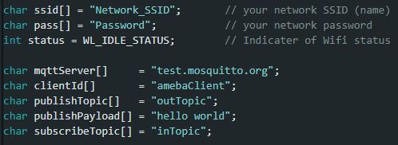
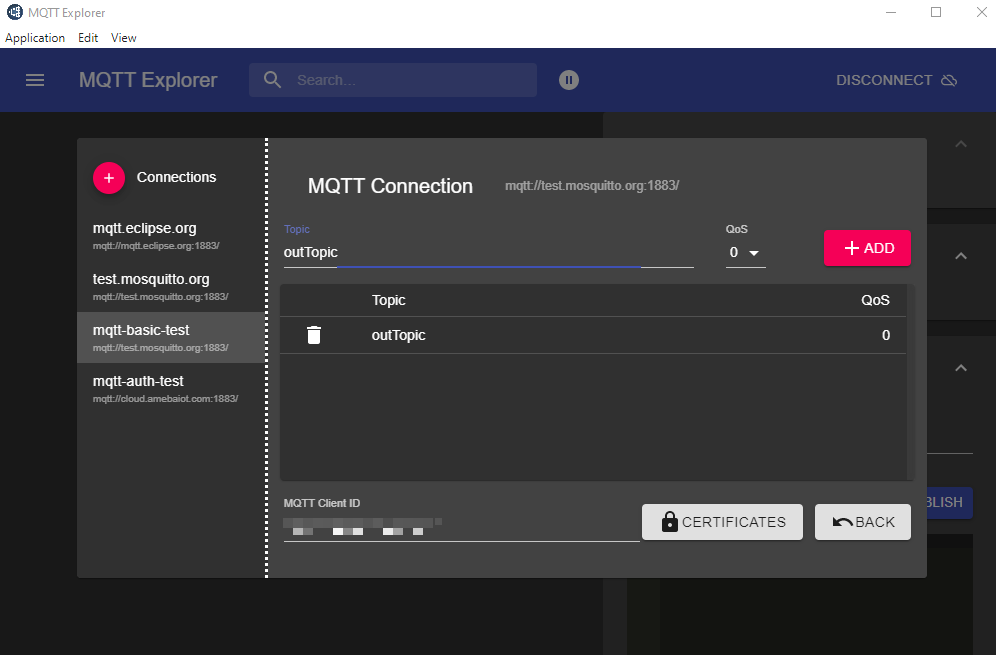
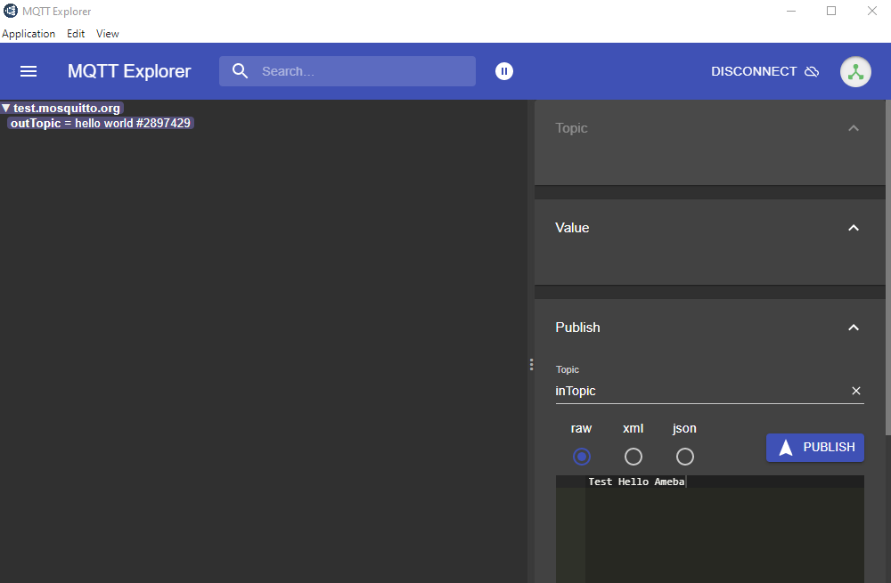
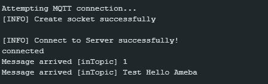
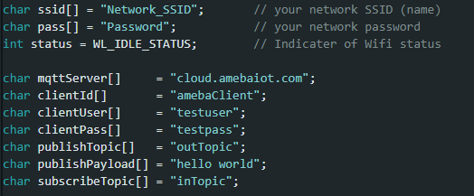
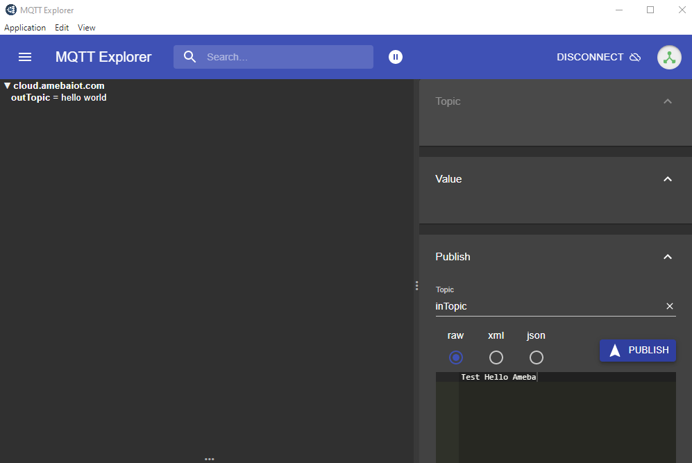

Set up MQTT Client to Communicate with Broker
==============================================

.. contents::
  :local:
  :depth: 2

Materials
---------

- `AMB82-mini <https://www.amebaiot.com/en/where-to-buy-link/#buy_amb82_mini>`_ x 1

Example
-------

MQTT (Message Queuing Telemetry Transport) is a protocol proposed by IBM and Eurotech. The introduction in MQTT Official Website:
MQTT is a machine-to-machine (M2M)/”Internet of Things” connectivity protocol. It was designed as an extremely lightweight publish/subscribe messaging transport.We can say MQTT is a protocol designed for IoT. MQTT is based on TCP/IP and transmits/receives data via publish/subscribe.

Please refer to the figure below:

|image01|

In the operation of MQTT, there are several roles:

-  Publisher: Usually publishers are the devices equipped with sensors
   (ex. Ameba). Publishers uploads the data of the sensors to
   MQTT-Broker, which serves as a database with MQTT service.

-  Subscriber: Subscribers are referred to the devices which receive and
   observe messages, such as a laptop or a mobile phone.

-  Topic: Topic is used to categorize the messages, for example the
   topic of a message can be “PM2.5” or “Temperature”. Subscribers can
   choose messages of which topics they want to receive.

In this page, there are 3 examples that connect Ameba to MQTT-Broker.
Then send messages as publisher and receive messages from MQTT-Broker as
subscriber.

1. MQTT_Basic

2. MQTT_Auth

3. MQTT_Publish_In_Callback

**MQTT_Basic example**

| Open the MQTT example “File” -> “Examples” -> “AmebaMQTTClient” -> “MQTT_Basic”
| Please modify some WiFi-related parameter and some information related to MQTT:

|image02|

-  “ssid” is the network SSID for internet access.

-  “pass” is the network password for internet access.

-  “mqttServer” refers to the MQTT-Broker, there is free MQTT sandbox
   “test.mosquitto.org” for testing.

-  “clientId” is an identifier for MQTT-Broker to identify the connected
   device.

-  “publishTopic” is the topic of the published message in the example
   it is “outTopic”. The devices that subscribed to “outTopic” will
   receive the message.

-  “publishPayload” is the content to be published.

-  “subscribeTopic” is to tell MQTT-broker which topic to subscribe to
   by the board.

Next, compile the code and upload it to Ameba. Press the reset button, then open the serial monitor.

|image03|

After Ameba is connected to MQTT server, it sends the message “hello world” to “outTopic”. To see the message, another MQTT client needs to be set up.

The “MQTT Explore” is an all-platform application that can be set as the MQTT client. Refer to the website http://mqtt-explorer.com/.

Click “Connections” at top left to start a new connection setup. “Name” can be customized. Set “Host” as “test.mosquitto.org”.

|image04|

Click “ADVANCED” at bottom for topic setup. Use “outTopic” that same as “publishTopic” of the board. Click “ADD” then “BACK”.

|image05|

Click “CONNECT”. The “hello world” message show up at left side. At right side, under “Publish” use “inTopic” same as “sucribeTopic” of the board. Choose “raw” and input “Text hello Ameba”, then click “PUBLISH”. The board will receive the MQTT Explorer published raw message. Note, because of the host is a free public host, the board may receive unexpected messages.

|image06|

|image07|

**MQTT_Auth example**

| Open the MQTT example “File” -> “Examples” -> “AmebaMQTTClient” -> “MQTT_Auth”
| Please modify some WiFi-related parameter and some information related to MQTT:

|image08|

-  “mqttServer” refers to the MQTT-Broker, there is free MQTT auth host
   provided by amebaiot homepage “cloud.amebaiot.com”. Please visit
   https://www.amebaiot.com/en/cloud-getting-started/ for account setup.

-  “clientId” is an identifier for MQTT-Broker to identify the connected
   device. In this case, it is the registered device name. Refer to
   https://www.amebaiot.com/en/cloud-service/.

-  “clientUser” is the authentication username. In this case, it is the
   login username of Realtek IoT/Wi-Fi MCU Solutions website. Note, it
   will be unable to receive message if use the email as “clientUser”.

-  “clientPass” is the authentication password. In this case, it is the
   login password of Realtek IoT/Wi-Fi MCU Solutions website.

-  The other parameters are same as pervious.

Next, compile the code and upload it to Ameba. Press the reset button, then open the serial monitor. After Ameba is connected to MQTT server, it sends the message “hello world” to “outTopic”. To see the message, another MQTT client needs to be set up.

Start the MQTT Explore, and setup the auth connection.

Click “Connections” at top left to start a new connection setup. “Name” can be customized. Set “Host” as “cloud.amebaiot.com”. “Username” and “Password” are same as “clientUser” and “clientPass”.

|image09|

Click “ADVANCED” at bottom for topic setup. Use “outTopic” that same as “publishTopic” of the board. Click “ADD” then “BACK”.

Click “CONNECT”. The “hello world” message show up at left side. At right side, under “Publish” use “inTopic” same as “sucribeTopic” of the board. Choose “raw” and input “Text hello Ameba”, then click “PUBLISH”. The board will receive the MQTT Explorer published raw message. Note, “hello world” sometimes is not shown up because the boards connect to MQTT broker before the MQTT Explorer.

|image10|

|image11|

**MQTT_Publish_In_Callback example**

Open the MQTT example “File” -> “Examples” -> “AmebaMQTTClient” ->
“MQTT_Publish_In_Callback”

Please modify some WiFi-related parameter and some information related
to MQTT:

-  All parameters are same as MQTT_Auth example.

Next, compile the code and upload it to Ameba. Press the reset button,
then open the serial monitor. After Ameba is connected to MQTT server,
it sends the message “hello world” to “outTopic”. To see the message,
another MQTT client needs to be set up.

Start the MQTT Explore, and setup the auth connection. All setting is
same as MQTT_Auth example.

Click “ADVANCED” at bottom for topic setup. Use “outTopic” that same as
“publishTopic” of the board. Click “ADD” then “BACK”.

Click “CONNECT”. The “hello world” message show up at left side. At
right side, under “Publish” use “inTopic” same as “sucribeTopic” of the
board. Choose “raw” and input “Text hello Ameba”, then click “PUBLISH”.
The board will receive the MQTT Explorer published raw message. Then
publish it from the board side and MQTT Explorer will receive at the
left side. Note, “hello world” sometimes is not shown up because the
boards connect to MQTT broker before the MQTT Explorer.

|image12|

|image13|

.. |image01| image:: ../../_static/Example_Guides/MQTT/Set_up_Client/image01.png
   :width:  940 px
   :height:  617 px

.. |image03| image:: ../../_static/Example_Guides/MQTT/Set_up_Client/image03.png
   :width:  662 px
   :height:  438 px

.. |image04| image:: ../../_static/Example_Guides/MQTT/Set_up_Client/image04.png
   :width:  1002 px
   :height:  654 px

.. |image09| image:: ../../_static/Example_Guides/MQTT/Set_up_Client/image09.png
   :width:  998 px
   :height:  652 px

.. |image11| image:: ../../_static/Example_Guides/MQTT/Set_up_Client/image11.png
   :width:  538 px
   :height:  155 px

.. |image12| image:: ../../_static/Example_Guides/MQTT/Set_up_Client/image12.png
   :width:  1001 px
   :height:  653 px

.. |image13| image:: ../../_static/Example_Guides/MQTT/Set_up_Client/image13.png
   :width:  548 px
   :height:  151 px