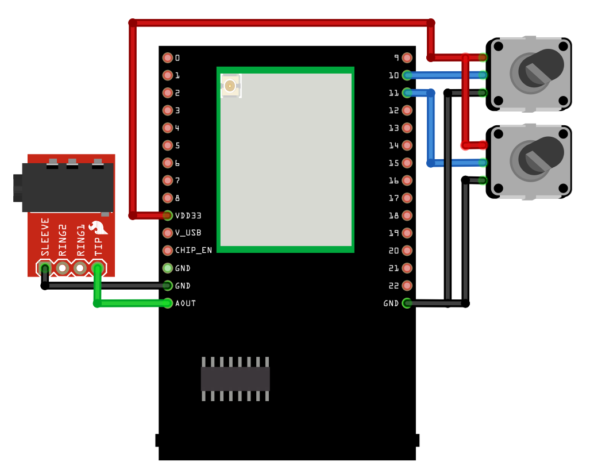
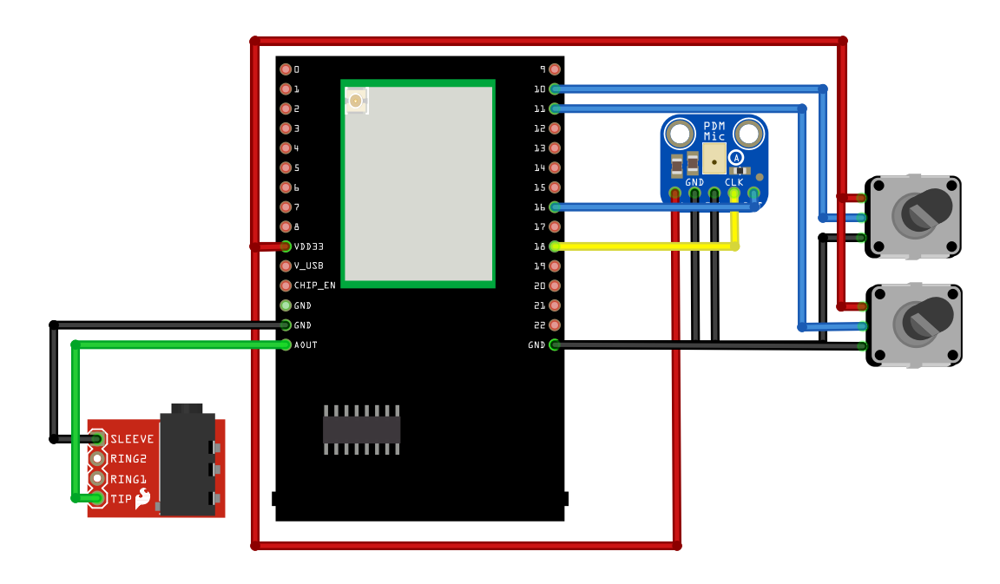

Audio Basic
===========

.. contents::
  :local:
  :depth: 2

Materials
---------

- `AMB82-mini <https://www.amebaiot.com/en/where-to-buy-link/#buy_amb82_mini>`_ x 1
- 3.5mm TRS/TRRS breakout x 1 (e.g., Adafruit 2791 / Sparkfun 11570)
- Adafruit PDM Microphone Breakout x 1 [Optional]
- Potentiometer x 2

Example
-------
In this example, we will use the Ameba Pro2 board to playback audio recorded by the onboard analogue microphone or an external PDM (Pulse Density Modulation) microphone.

The following examples are relevant to this guide.

1. LoopbackTest
2. AudioVolumeAdjust

Connect the audio jack and potentiometers to the Ameba board as shown in the diagram.

|image01|

Alternatively, connect the audio jack, potentiometers, and PDM Microphone as shown in the diagram below if you would like to use a digital microphone.

|image02|

Open one of the Audio examples in “File” -> “Examples” -> “AmebaMultimedia” -> “Audio”.

|image03|

Compile the code and upload it to Ameba.

Plug in a pair of wired earbuds into the audio jack. After pressing the Reset button, you should be able to hear sounds picked up by the onboard microphone replayed through the earbuds.
In the “AudioVolumeAdjust” example, turning the potentiometers will adjust either the input volume of the microphone or the output volume of the audio jack.

.. |image03| image:: ../../_static/Example_Guides/Multimedia/Audio_Basic/image03.png
   :width:  768 px
   :height: 832 px