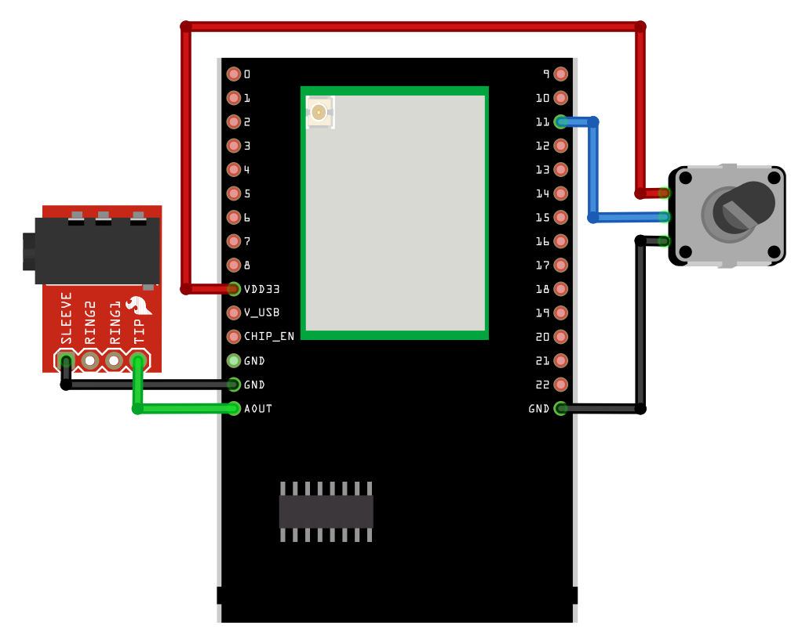
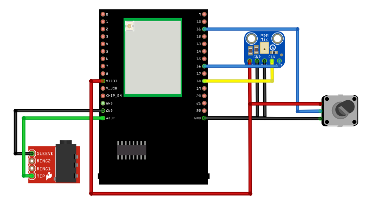
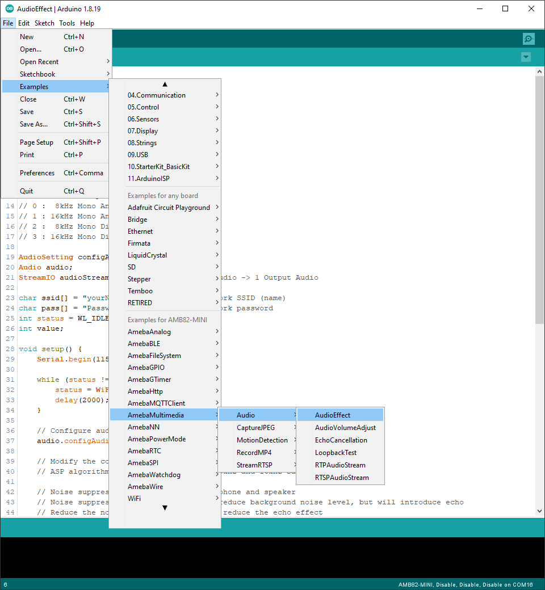
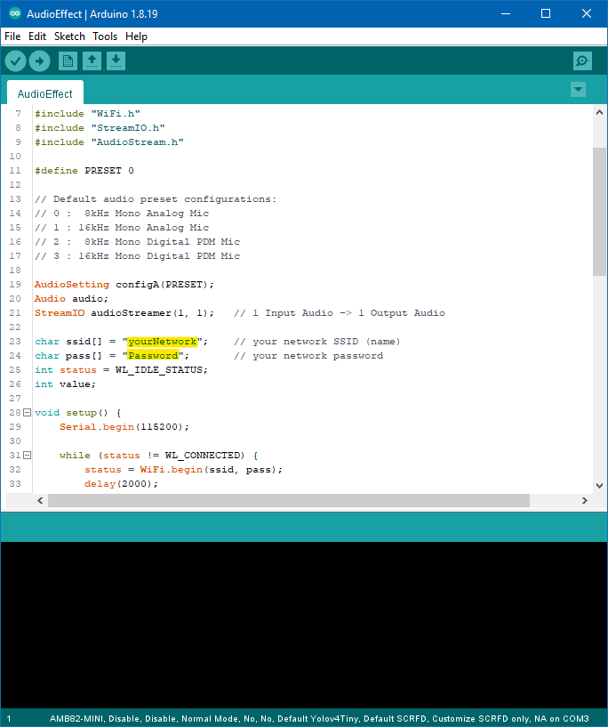
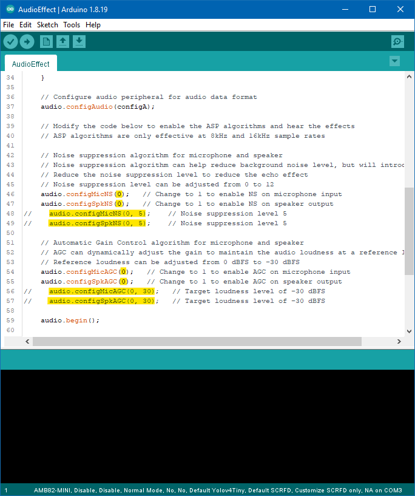

Audio Effects
=============

.. contents::
  :local:
  :depth: 2

Materials
---------

- `AMB82-mini <https://www.amebaiot.com/en/where-to-buy-link/#buy_amb82_mini>`_ x 1
- 3.5mm TRS/TRRS breakout x 1 (e.g., Adafruit 2791 / Sparkfun 11570)
- Adafruit PDM Microphone Breakout x 1 [Optional]
- Potentiometer x 2

Example
-------
This example shows how to use the Automatic Gain Control (AGC) and Noise Suppression (NS) audio effects of the Ameba board.

Connect the audio jack and potentiometers to the Ameba board as shown in the diagram.

|image01|

Alternatively, connect the audio jack, potentiometers, and PDM Microphone as shown in the diagram below if you would like to use a digital microphone.

|image02|

Open the example in “File” -> “Examples” -> “AmebaMultimedia” -> “Audio” -> “AudioEffect”.

|image03|

In the highlighted code snippet, fill in the “ssid” with your WiFi network SSID and “pass” with the network password.

|image04|

Compile the code and upload it to Ameba.
Plug in a pair of wired earbuds into the audio jack. After pressing the Reset button, you should be able to hear sounds picked up by the onboard microphone replayed through the earbuds.
In this example, turning the potentiometers will adjust the microphone sensitivity. Increasing the sensitivity will allow the microphone to pick up softer sounds but will also increase the background noise.
Modify the highlighted lines of code to enable or disable the NS and AGC audio effect algorithms on the microphone audio input or the speaker audio output. Recompile and reupload the code to hear the effects.

|image05|

Code Reference
--------------
Both the NS and AGC algorithm are limited to 8 kHz and 16 kHz sample rates.

The NS algorithm can reduce the loudness of background noise and is able to significantly reduce the backgound noise introduced due to increasing the microphone sensitivity. However, a side effect is that it adds an echo like effect to the audio. The strength level of the NS effect can be adjusted with the second argument of configMicNS and configSpkNS, with 0 being the weakest and 12 being the strongest.

The AGC algorithm can dynamically adjust the gain and sensitivity to maintain the audio signal at a target loudness level. The target reference level of the AGC can be adjusted with the second argument of configMicAGC and configSpkAGC, with 0 representing 0 dBFS the loudest level, and 30 representing -30 dBFS the softest level.

