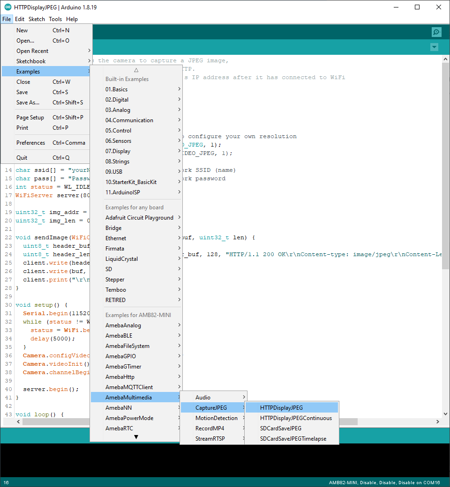
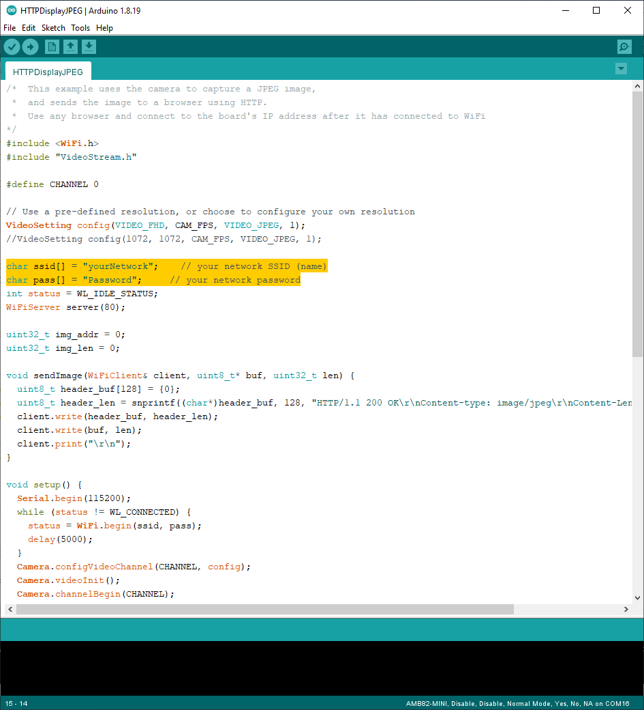

Capture JPEG display over HTTP
==============================

.. contents::
  :local:
  :depth: 2

Materials
---------

- `AMB82-mini <https://www.amebaiot.com/en/where-to-buy-link/#buy_amb82_mini>`_ x 1

Example
-------

In this example, we will be using Ameba Pro2 development board to capture a JPEG image and send the image to a browser using HTTP.
The following examples shows different use cases of capturing JPEG images.

1. HTTPDisplayJPEG

2. HTTPDisplayJPEGContinuous

For the “HTTPDisplayJPEG” example, use any browser and key in the IP address of the board in browser’s address bar after the board is connected to the WiFi to view the image.

For the “HTTPDisplayJPEGContinuous” example, use the Firefox browser and key in the IP address of the board in browser’s address bar after the board is connected to the WiFi to view the image.

Open one of the CaptureJPEG examples in “File” -> “Examples” -> “AmebaMultimedia” -> “CaptureJPEG” -> “HTTPDisplayJPEG”.

|image01|

In the highlighted code snippet, fill in the “ssid” with your WiFi network SSID and “pass” with the network password.

|image02|

Compile the code and upload it to Ameba. After pressing the Reset button, wait for the Ameba Pro 2 board to connect to the WiFi network. The board’s IP address will be shown in the Serial Monitor.

|image03|

Next, using a computer or a cell phone in the same network domain, open a browser window and enter the IP address shown in the Serial Monitor.

|image04|

You can view the JPEG image that was captured by the camera on the webpage. To view a new JPEG image taken by the camera, simply refresh the page. By running “HTTPDisplayJPEGContinuous”, image will be taken repeatedly, and the image will be sent to the browser using HTTP, creating the effect of a video. Note that for the “HTTPDisplayJPEGContinuous” example, Firefox browser has been tested to work best.

.. |image03| image:: ../../_static/Example_Guides/Multimedia/Capture_JPEG_display_over_HTTP/image03.png
   :width:  642 px
   :height: 393 px

.. |image04| image:: ../../_static/Example_Guides/Multimedia/Capture_JPEG_display_over_HTTP/image04.png
   :width:  675 px
   :height: 323 px