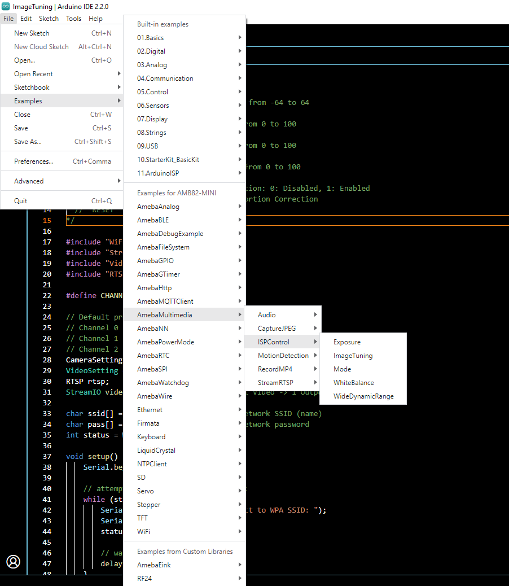
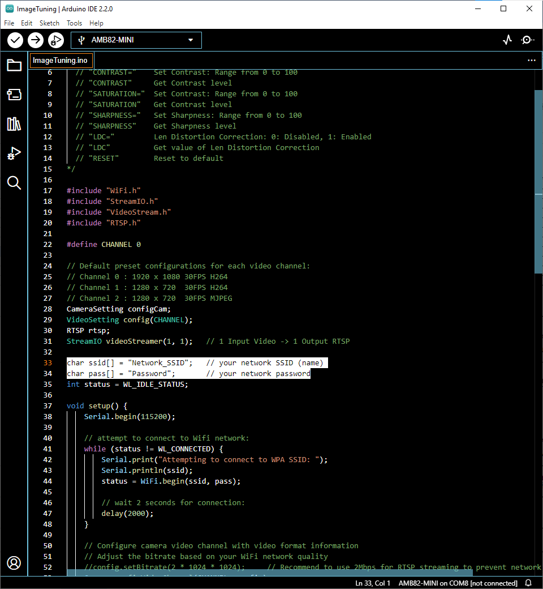
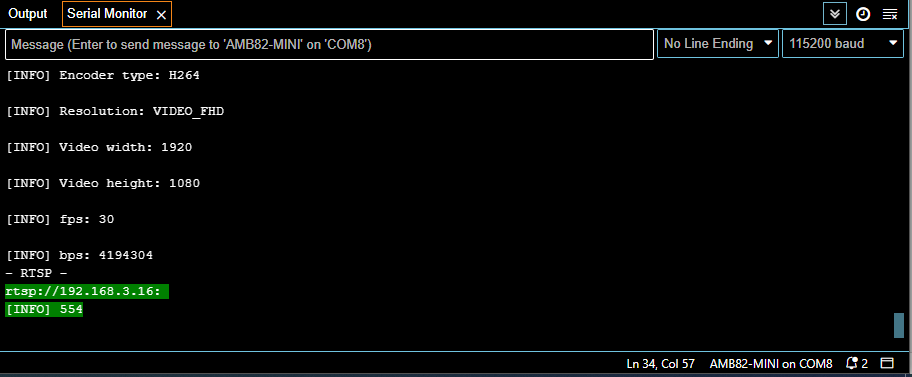
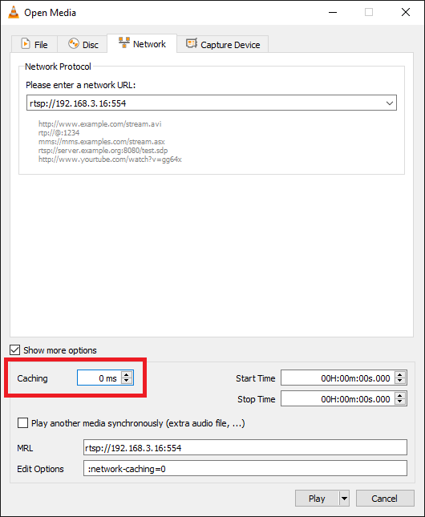
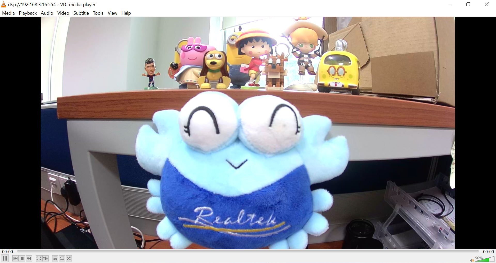
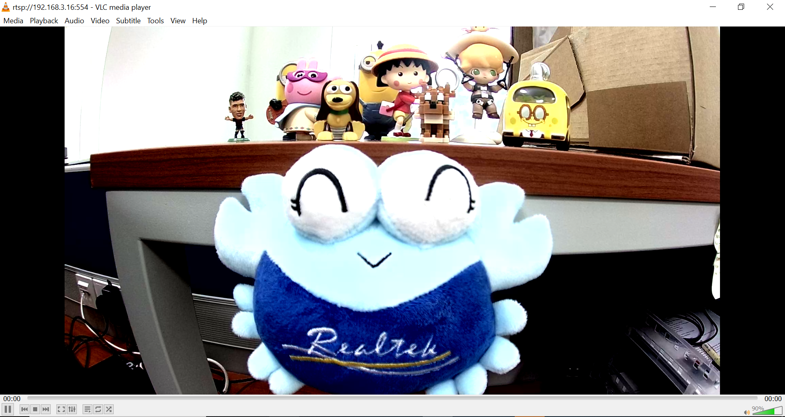
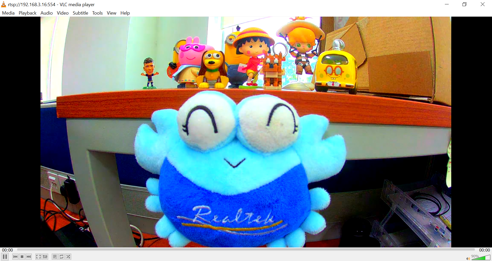
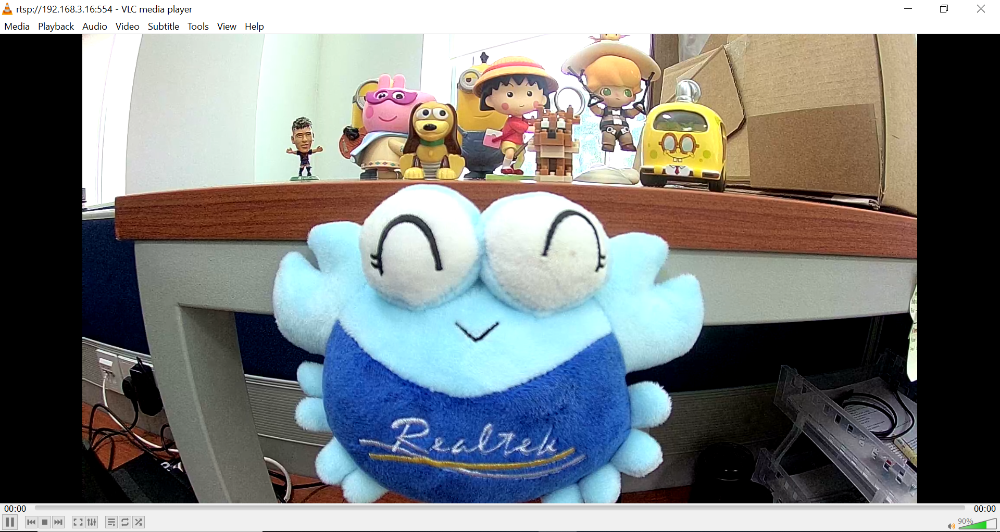
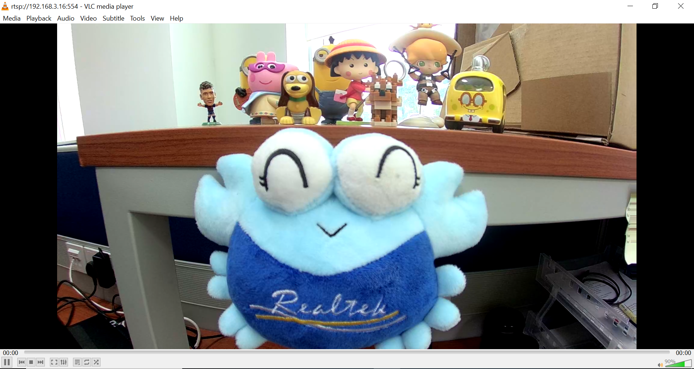

ISP Control
===========

.. contents::
  :local:
  :depth: 2

Materials
---------

- `AMB82-mini <https://www.amebaiot.com/en/where-to-buy-link/#buy_amb82_mini>`_ x 1

Example
-------
In this example, we will use the Ameba Pro2 board to perform customized image tuning for the on-board camera sensor (JX-F37P) and stream the processed output to a computer via RTSP (Real Time Streaming Protocol) to see the result.
The following examples are relevant to this guide.

1. Exposure
2. ImageTuning
3. Mode
4. WhiteBalance
5. WideDynamicRange

Open one of the ISP Control examples in “File” -> “Examples” -> “AmebaMultimedia” -> “ISPControl”.

|image01|

In the highlighted code snippet, fill in the “ssid” with your WiFi network SSID and “pass” with the network password.

|image02|

Compile the code and upload it to Ameba. After pressing the Reset button, wait for the Ameba Pro 2 board to connect to the WiFi network. The board’s IP address and network port number for RTSP will be shown in the Serial Monitor.

You may download VLC media player from the link here.

Upon the completion of the software installation, open VLC media player, and go to “Media” -> “Open Network Stream”.

|image03|

Make sure your PC is connected to the same network as the Ameba Pro2 board for streaming. Since RTSP is used as the streaming protocol, key in `“rtsp://{IPaddress}:{port}”` as the Network URL in VLC media player, replacing {IPaddress} with the IP address of your Ameba Pro2 board, and {port} with the RTSP port shown in Serial Monitor `(e.g., “rtsp://192.168.3.16:554”)`. The default RTSP port number is 554. In the case of two simultaneous RTSP streams, the second port number defaults to 555.

|image04|

You may choose to change the caching time in “Show more options”. A lower cache time will result in reduced video latency but may introduce playback stuttering in the case of poor network conditions.

|image05|

Next, click “Play” to start RTSP streaming. The video stream from the camera will be shown in VLC media player. Meanwhile, in your Serial Monitor, the message “rtp started (UDP)” will appear.

In one of the ISP Control examples, “ImageTuning” example allows you to adjust the brightness, contrast, saturation, sharpness levels and enabling Lens Distortion Correction (LDC) during video streaming.

| **To adjust brightness level:**
| Enter “**BRIGHTNESS={value}**” to change the brightness value of the image.
| Enter “**BRIGHTNESS**” to get the brightness value of the image.

BRIGHTNESS=20

|image06|

| **To adjust contrast level:**
| Enter “**CONTRAST={value}**” to change the contrast value of the image.
| Enter “**CONTRAST**” to get the contrast value of the image.

CONTRAST=75

|image07|

| **To adjust saturation level:**
| Enter “**SATURATION={value}**” to change the saturation value of the image.
| Enter “**SATURATION**” to get the saturation value of the image.

SATURATION=75

|image08|

| **To adjust sharpness level:**
| Enter “**SHARPNESS={value}**” to change the sharpness value of the image.
| Enter “**SHARPNESS**” to get the sharpness value of the image.

SHARPNESS =75

|image09|

| **To enable/disable LDC:**
| Enter “**LDC={value}**” to enable or disable lens distortion correction.
| Enter “**LDC**” to get the LDC value of the image.

LDC=0

|image10|

LDC=1

|image11|

| **“Exposure” example**
| Exposure can be set to Auto or Manual mode. It is default set as Auto.
| **To set Exposure Mode:**
| Enter “**AE={value}**” to set exposure mode to Auto or Manual. (0: Manual, 1: Auto).
| Enter “**AE**” to get the mode of exposure.
| If Exposure mode is set to Manual, you can set your preferred Exposure time and AE Gain.
| **To set Exposure time:**
| Enter “**EXPTIME={value}**” to set the Exposure time. Exposure time should be less than or equals to 33333us.
| Enter “**EXPTIME**” to get the Exposure time in us.
| **To set AE Gain:**
| Enter “**GAIN={value}**” to set the gain value. (Range from 256-32768)
| Enter “**GAIN**” to get the gain value.
| **To set Power Line Frequency (Anti Flicker mode):**
| You are also allowed to set the power line frequency to anti-flickering. If Anti Flicker mode is set to Auto, 50Hz will be used as default to check whether there is flickering.
| Enter “**PLF={value}**” to set Power Line Frequency for Anti Flicker mode. (0: Disable, 1: 50Hz, 2: 60Hz, 3: Auto)
| Enter “**PLF**” to get Power Line Frequency.

| **“Mode” example**
| Day Night mode as well as Gray mode can be set.
| **To set Day or Night mode:**
| Enter “**DAYNIGHT={value}**” to set Day or Night mode. (0: Day mode, 1: Night mode)
| Enter “**DAYNIGHT**” to get the value of Day or Night Mode.
| **To set gray mode:**
| Enter “**GRAY={value}**” to set Gray mode. (0: colour mode, 1: Gray mode)
| Enter “**GRAY**” to get the value of Gray mode.

| **“WhiteBalance” example**
| White Balance mode can be set to Auto or Manual mode. It is default set as Auto.
| **To set White Balance mode:**
| Enter “**AWB={value}**” to set White Balance mode to Auto or Manual mode. (0: Manual, 1: Auto).
| Enter “**AWB**” to get the mode of White Balance.
| If White Balance mode is set to Manual, preferred red and blue balance gain can be set.
| **To set red and blue balance gain:**
| Enter “**RED={value}**” to set red balance gain. (Range from 256-2047).
| Enter “**RED**” to get the value of red balance.
| Enter “**BLUE={value}**” to set blue balance gain. (Range from 256-2047).
| Enter “**BLUE**” to get the value of blue balance.
| **To get White Balance Temperature:**
| Enter “**WBTEMP**” to get the value of white balance temperature.

| **“WideDynamicRange” example**
| Wide Dynamic Range (WDR) can be enabled or disabled. WDR can be set to Auto or Manual mode. It is default set as disabled.
| **To enable or disable WDR:**
| Enter “**WDR={value}**” to set WDR mode to Disabled, Auto or Manual. (0: Disabled, 1: Manual, 2: Auto).
| Enter “**WDR**” to get the mode of WDR.
| If WDR mode is set to Manual, preferred WDR level can be set.
| **To set WDR level:**
| Enter “**LEVEL={value}**” to set preferred WDR level. (Range from 50 to 100).
| Enter “**LEVEL**” to get the value of WDR level.

| **To reset all the ISP Control value to default:**
| Enter “**RESET**” to set all the values to default value.

Code Reference
--------------

The camera can produce 3 simultaneous video stream channels, with the default configuration for each channel as shown. You may choose to edit the code to use a different video stream.

| Channel 0: 1920 x 1080, 30FPS, H264 format
| Channel 1: 1280 x 720, 30FPS, H264 format
| Channel 2: 1280 x 720, 30FPS, MJPEG format

|image12|

You may adjust the video bitrate based on your WiFi network quality, by uncommenting the highlighted code below.

|image13|

.. |image03| image:: ../../_static/Example_Guides/Multimedia/ISP_Control/image03.png
   :width:  432 px
   :height: 482 px

.. |image12| image:: ../../_static/Example_Guides/Multimedia/ISP_Control/image12.png
   :width:  482 px
   :height: 427 px

.. |image13| image:: ../../_static/Example_Guides/Multimedia/ISP_Control/image13.png
   :width:  665 px
   :height: 754 px