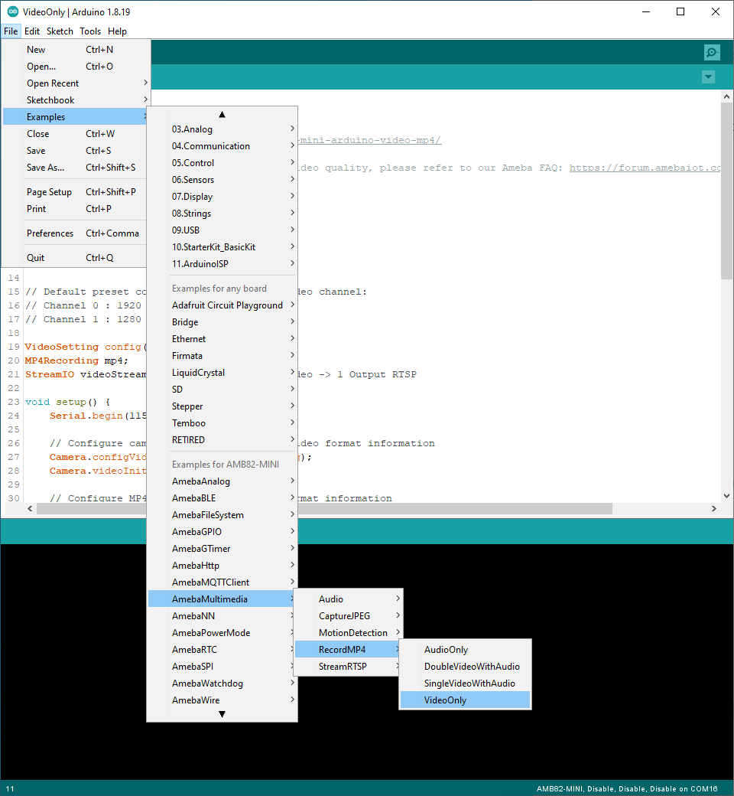
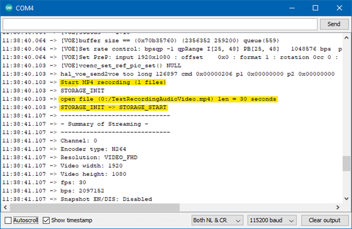
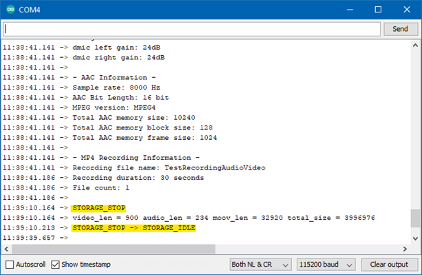
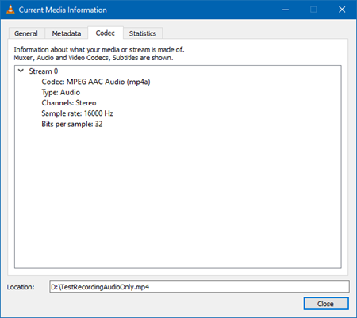
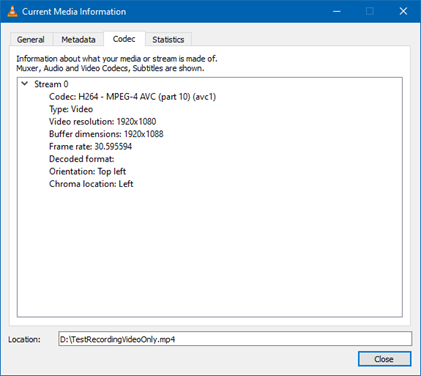
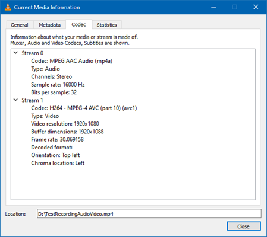
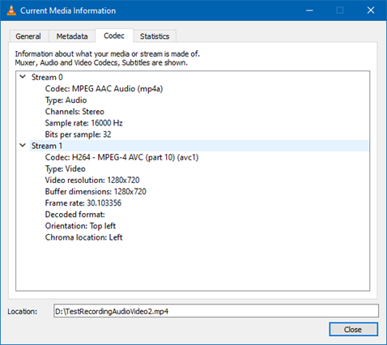

MP4 Recording
=============

.. contents::
  :local:
  :depth: 2

Materials
---------

- `AMB82-mini <https://www.amebaiot.com/en/where-to-buy-link/#buy_amb82_mini>`_ x 1
- SD card x 1

Example
-------

In this example, we will use the Ameba Pro2 development board to record video and audio data from the on-board camera sensor (JX-F37P) and audio codec to an MP4 file on the SD card.

The following examples shows different use cases for MP4 recording.

1. AudioOnly
2. VideoOnly
3. SingleVideoWithAudio
4. DoubleVideoWithAudio

Open one of the RecordMP4 examples in “File” -> “Examples” -> “AmebaMultimedia”-> “RecordMP4”.

|image01|

Compile the code and upload it to Ameba. After pressing the Reset button, the Ameba Pro 2 board will start recording MP4 to SD card.

|image02|

After the recording duration has passed, the MP4 file will stop recording.

|image03|

Disconnect power from the Ameba Pro 2 board, remove the SD card and connect it to a computer to view the contents. Depending on the compiled example, there will be either one or two MP4 videos. Using VLC to open the MP4 file, detailed information about the MP4 files can be obtained in “Tools” -> “Codec Information”.

+--------------------------------+----------------------------------------------------------+
| **Example**                    | **MP4 file details**                                     |
+--------------------------------+----------------------------------------------------------+
| RecordMP4AudioOnly             | Single 30 second MP4 file with audio only                |
|                                |                                                          |
|                                | |image04|                                                |
+--------------------------------+----------------------------------------------------------+
| RecordMP4AudioOnly             | Single 30 second MP4 file with video only                |
|                                |                                                          |
|                                | |image05|                                                |
+--------------------------------+----------------------------------------------------------+
| RecordMP4SingleVideoWithAudio  | Single 30 second MP4 file with audio and video           |
|                                |                                                          |
|                                | |image06|                                                |
+--------------------------------+----------------------------------------------------------+
| RecordMP4DoubleVideoWithAudio  | One 30 second and one 15 second MP4 file                 |
|                                |                                                          |                 
|                                | Both files with audio and video                          |  
|                                |                                                          |
|                                | |image07|                                                |
|                                |                                                          |
|                                | |image08|                                                |
+--------------------------------+----------------------------------------------------------+

There are 4 additional examples that has been integrated with NTPClient. These examples complement the original examples, by being able to set the last modified time of the recordings to the actual time and date automatically.
They are:

1) AudioOnlyWithNTPClient
2) VideoOnlyWithNTPClient
3) SingleVideoWithAudioAndNTPClient
4) DoubleVideoWithAudioAndNTPClient

