Motion Detection Google Line Notify
===================================

.. contents::
  :local:
  :depth: 2

Materials
---------

- `AMB82-mini <https://www.amebaiot.com/en/where-to-buy-link/#buy_amb82_mini>`_ x 1
- Micro SD Card x1
- Google Account x1
- Line Account x2

Example
-------
In this example, we will use the AmebaPro2 board equipped with an AI-driven motion detection model, suspicious movements will be captured via the on-board camera sensor (JX-F37P). Upon detection, the system captures an image, saves it to an SD Card, uploads it to Google Drive, and concurrently sends an alert through Line Notify to the user’s mobile phone, ensuring swift response and heightened security.

**1. Set up Google Script**

A Google Apps Script function designed to handle POST requests so that captured photo can be saved to google drive. Its main functionalities include receiving a file and some related parameters, then saving that file to a specific folder in Google Drive. In our case, when AMB82 detected motion, it will capture a photo and saved to SD card. This photo image will be transferred to Google Drive and saved into a user specified folder. Finally, it sends a message containing the link of the saved image file using Line Notify.

First, login to Google Script official website with your own Google Account by clicking the “Start Scripting” button: https://www.google.com/script/start/

|image01|

Next, create a new Google Script project, copy the script below into the “Code.gs” file, renaming it as “amb82_doPost_test” then click the “Save” icon to save your script:

|image02|

.. code-block:: javascript

    function doPost(e) {
        // Retrieve variables from the POST requests
        var myFoldername = e.parameter.myFoldername;
        var myFile = e.parameter.myFile;
        var myFilename = Utilities.formatDate(new Date(), "GMT", "yyyyMMddHHmmss")+"-"+e.parameter.myFilename;
        var myToken = e.parameter.myToken;

        // Store the file type and Base64 encoded data
        var contentType = myFile.substring(myFile.indexOf(":")+1, myFile.indexOf(";"));
        var data = myFile.substring(myFile.indexOf(",")+1);
        data = Utilities.base64Decode(data);
        var blob = Utilities.newBlob(data, contentType, myFilename);

        // Save a captured image to Google Drive.
        var folder, folders = DriveApp.getFoldersByName(myFoldername);
        if (folders.hasNext()) {
            folder = folders.next();
        } else {
            folder = DriveApp.createFolder(myFoldername);
        }
        var file = folder.createFile(blob);
        file.setDescription("Uploaded by " + myFilename);

        // Returning Results
        return ContentService.createTextOutput(myFoldername+"/"+myFilename+"\n"+imageUrl+"\n"+res);
    }

The script processes a POST request, extracting variables like “myFoldername,” “myFile,” “myFilename,” and “myToken.” It decodes the Base64-encoded file data and creates a Blob object with the decoded data and its content type. Base64 encoding is a method to encode binary data using 64 characters to convert binary data to an ASCII string for easier transport or storage in text formats.

Based on the “myFoldername” parameter, the script locates or creates the corresponding folder in Google Drive. The image data is then stored in this folder. Lastly a summary containing the folder name, file name, image URL, and Line Notify feedback is returned.

Upon the script is ready, select “Deploy” -> “New deployment” to initialize necessary configurations before script publishment:

|image03|

In the “Select type” under the “New deployment” configuration menu, choose to deploy your script as a “Web app” and grant the permission to “Anyone” who is using your script if it is a public project, then click “Deploy”. Google requires to “Authorize access” by logging into your own Google Account credentials, so that the script could retrieve information from your Google Drive.

Click “Advanced” -> “Go to amb82-doPost_test (unsafe)” that allows the Google Script to: “See, edit, create, and delete all of your Google Drive files”. Upon deployment is finished, copy your “Deployment ID” into example code, and replace it into “myScript” variable in the example highlighted section.

|image04|

|image05|

**2. Set up Line Notify**

Line Notify is a notification service that allows users to receive notification messages from various sources such as websites, applications, devices, or other online services through the Line app. There are 2 methods of linking your Google Script to your Line Notify, which are Google Script and IFTTT. In this article, we will mainly use IFTTT since it allows you to directly view the image in Line Notify. While the Google Script only provided an URL link of the image on the other hand. To understand the details of how to set up the IFTTT Applet, please refer to the link.

In this example, to receive a notification in Line Notify when the photo of motion detected is being uploaded to Google Drive, you need to set up an IFTTT Applet using “New photo in Google Drive” as input and “Send message in Line Notify” as output. The IFTTT Applet allows you to log in with your Google or Line account.

|image06|

**3. Upload Example**

Open the example in “File” -> “Examples” -> “Multimedia” -> “MotionDetectionGoogleLineNotify”.

|image07|

Since the video receiving end is mobile devices, in the highlighted code snippet, instead of using the default video settings, we will set the video resolution to VIDEO_D1 (720×480) to limit the video receiving latency.

|image08|

In the highlighted code snippet, fill in the “ssid” with your WiFi network SSID and “pass” with the network password. Since the video streaming receiving end is mobile phone, we suggested to use 5G network since it features lower latency, higher capacity, and increased bandwidth to provide a better video streaming quality.

|image09|

Compile the code and upload it to Ameba. After pressing the Reset button, wait for the board to connect to the Wi-Fi network. The board’s IP address and network port number for RTSP will be shown in the Serial Monitor. You may download VLC media player from the link here.

Upon the completion of the software installation, open VLC media player, and go to “Media” -> “Open Network Stream”.

|image10|

Make sure your PC is connected to the same network as the Ameba Pro2 board for streaming. Since RTSP is used as the streaming protocol, key in `“rtsp://{IPaddress}:{port}”` as the Network URL in VLC media player, replacing {IPaddress} with the IP address of your Ameba Pro2 board, and {port} with the RTSP port shown in Serial Monitor `(e.g., “rtsp://192.168.1.154:554”)`. The default RTSP port number is 554. In the case of two simultaneous RTSP streams, the second port number defaults to 555.

|image11|

Next, click “Play” to start RTSP streaming. The video stream from the camera will be shown in VLC media player. When motion is detected in the video, a box will be generated enclosing the detected motion.

|image12|

This photo will be saved into SD card, then transmit to Google Drive and send to Line Notify at the same time.

|image13|

|image14|

Code Reference
--------------

1. Google Script: https://github.com/fustyles/webduino/blob/gs/SendCapturedImageToGoogleDriveAndLinenotify_doPost.gs

2. https://github.com/fustyles/Arduino/tree/master/ESP32-CAM_GoogleDrive_Linenotify

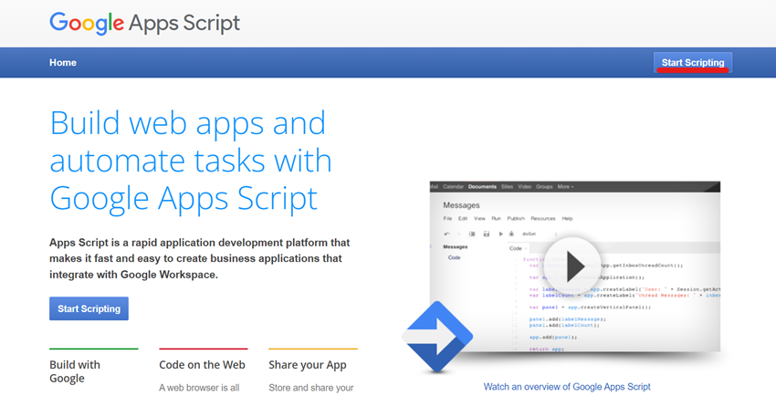

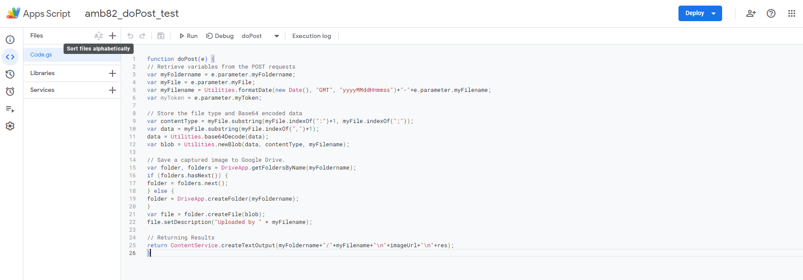

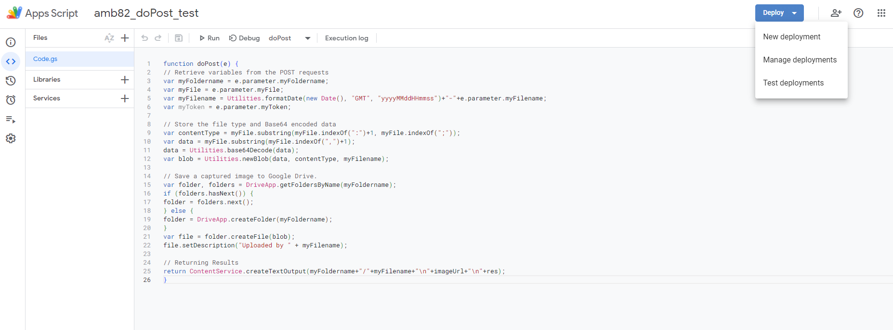

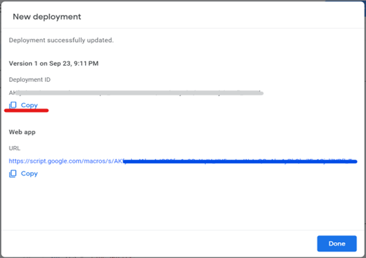

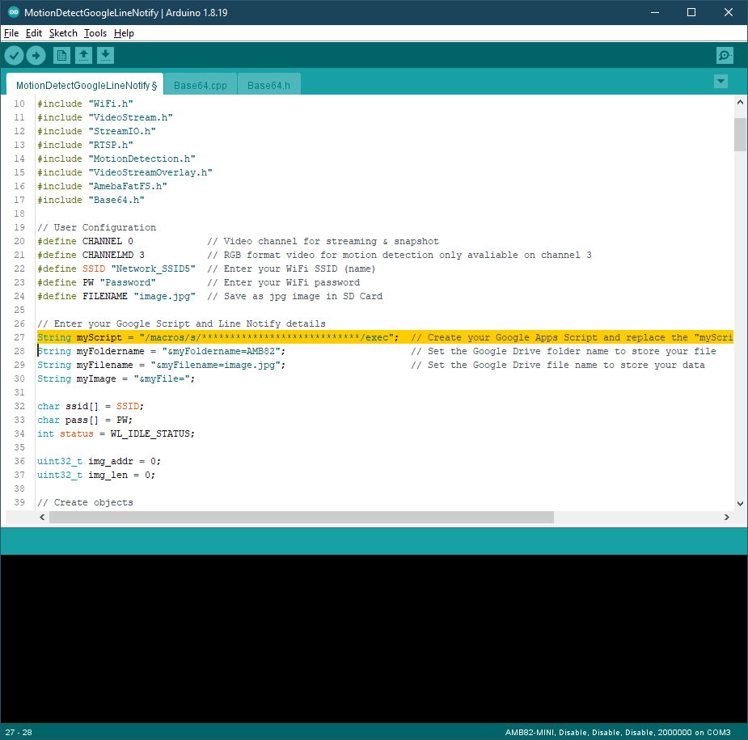

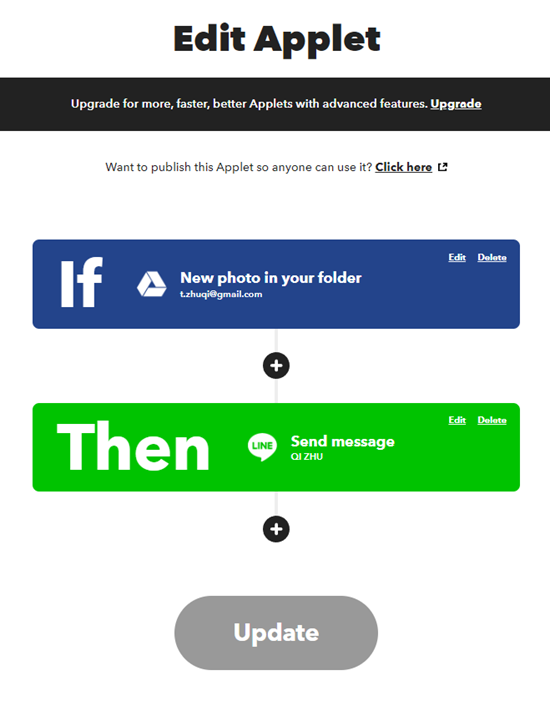

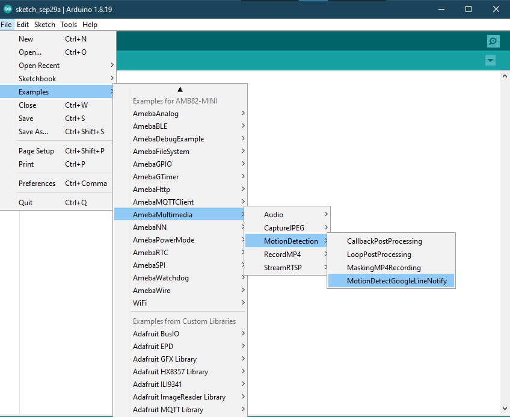

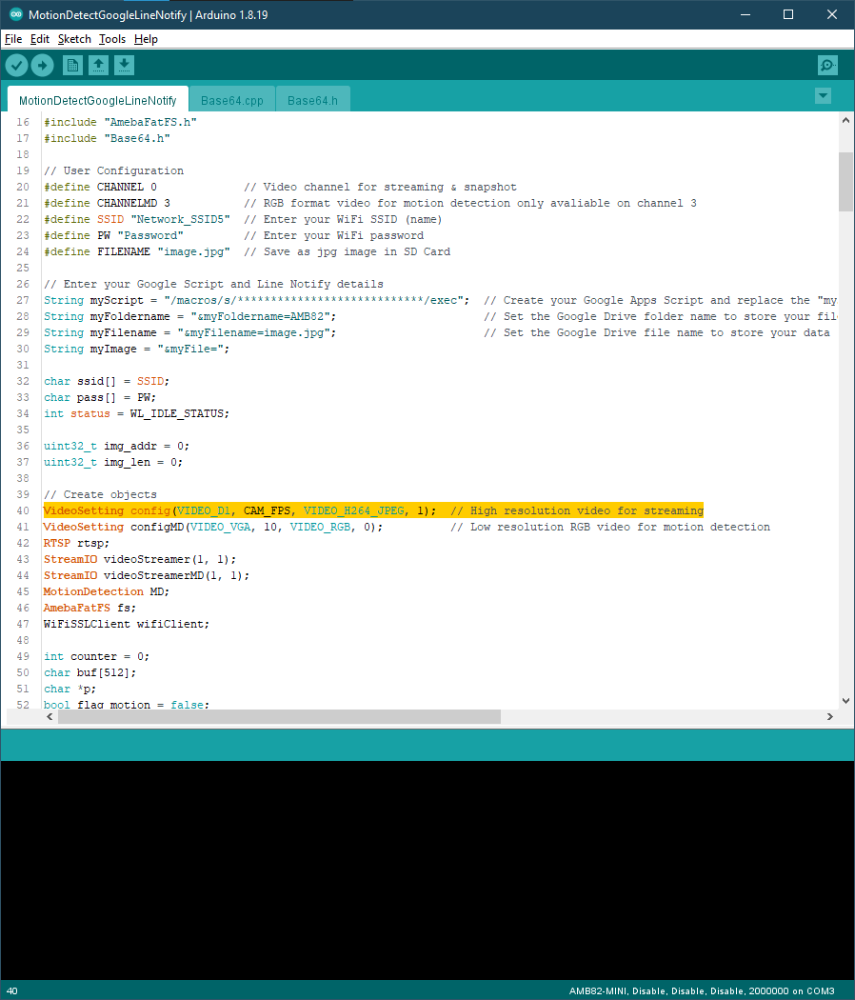

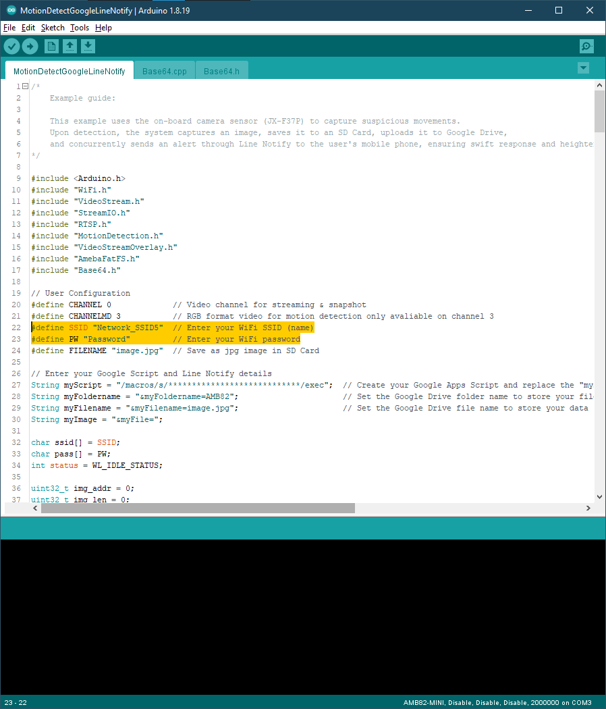

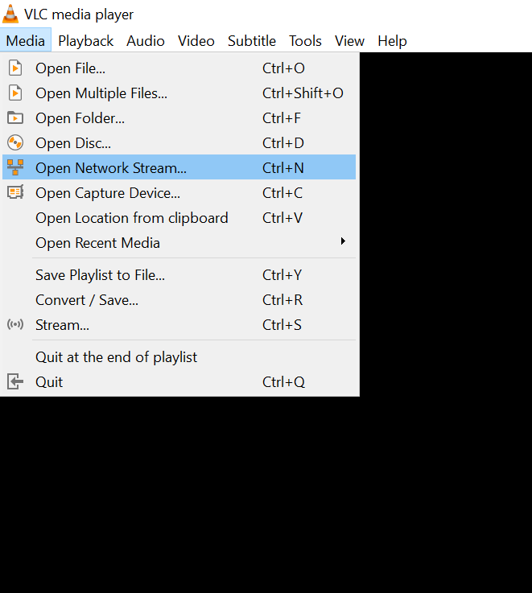

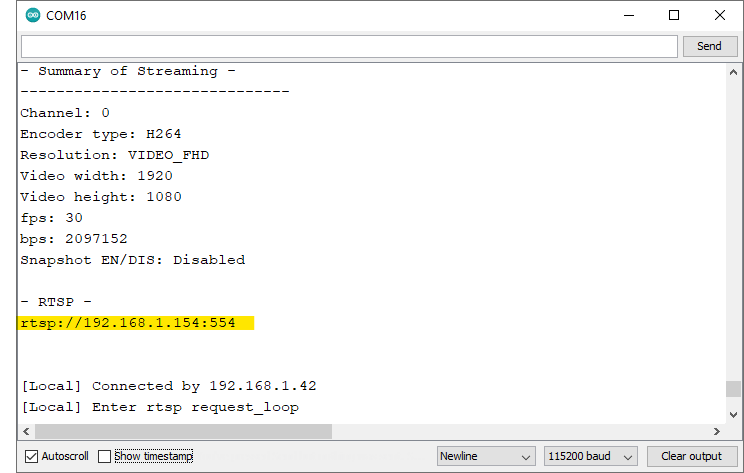

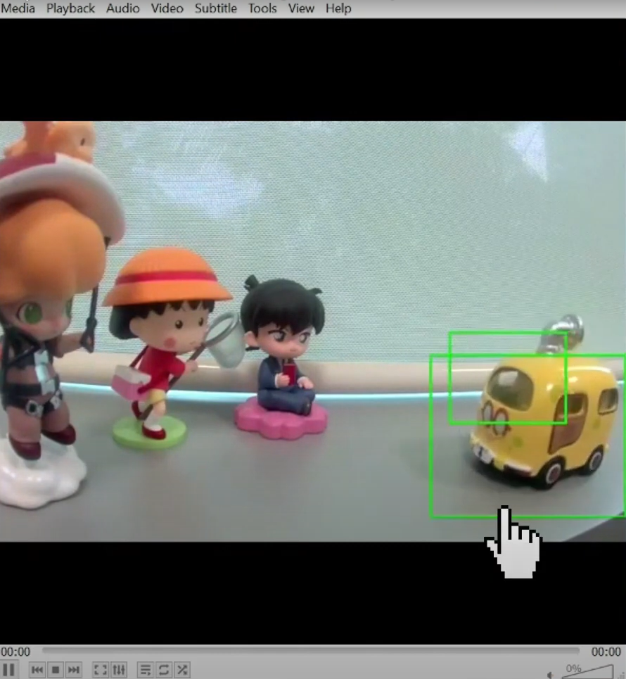

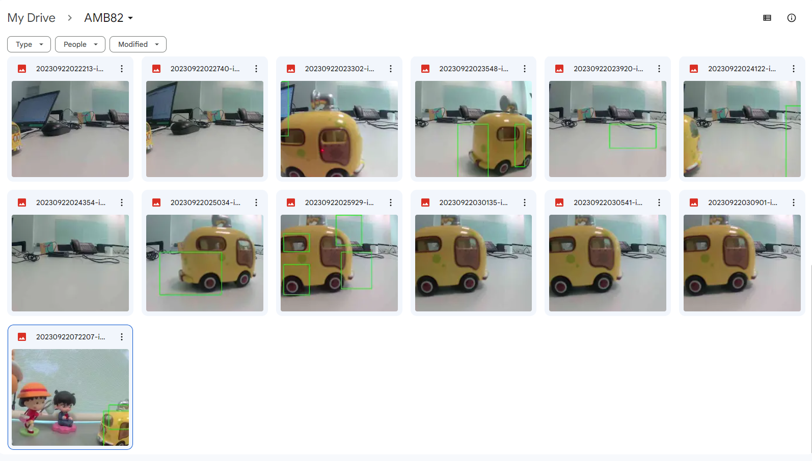

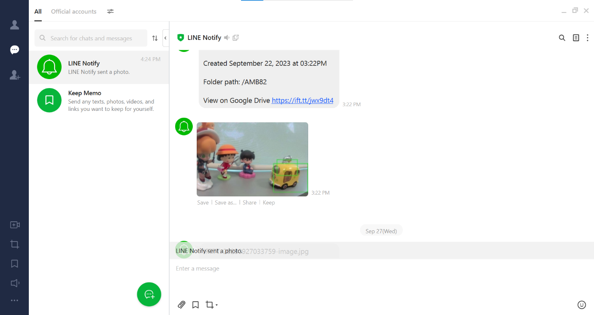
