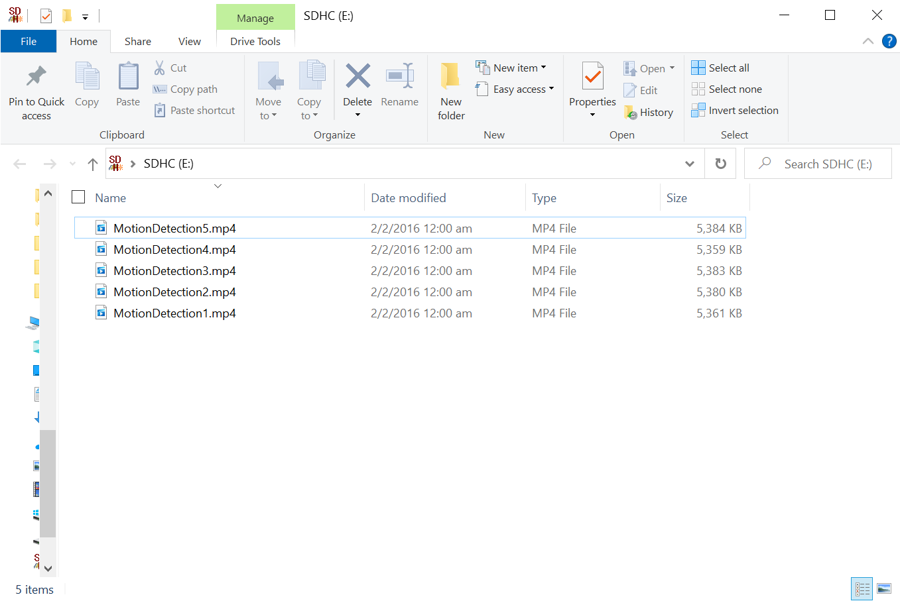

Motion Detection Masking with MP4 Recording
===========================================

.. contents::
  :local:
  :depth: 2

Materials
---------

- `AMB82-mini <https://www.amebaiot.com/en/where-to-buy-link/#buy_amb82_mini>`_ x 1
- SD Card x 1
- Green LED x 1
- 220 Ohm resistor x1
- Buzzer x 1 (Optional)

Example
-------
n this example, we will be using Ameba Pro2 development board to create a simple security system based on motion detection that will begin recording a 30-second MP4 video each time motion is detected. An alarm feature can be added by connecting to a buzzer; however, this is optional. Alarm is by default disabled.

**AMB82 MINI wiring diagram:**

|image01|

Open the Motion Detection example in “File” -> “Examples” -> “AmebaMultimedia” -> “MotionDetection” -> “MaskingMP4Recording”.

|image02|

In the highlighted code snippet, fill in the “ssid” with your WiFi network SSID and “pass” with the network password.

|image03|

To include alarm feature, connect the buzzer to Ameba Pro2 mini Pin 7 and uncomment the pin definition code for buzzer and tone() function highlighted in yellow.

|image04|

|image05|

Note: The detection mask array can be found in MotionDetection.h which is used to set a specific region in the video stream to enable motion detection. 1 means region enabled for motion detection, 0 means region disabled for motion detection.

Compile the code and upload it to Ameba. After pressing the Reset button, wait for the Ameba Pro 2 board to connect to the WiFi network. The board’s IP address and network port number for RTSP will be shown in the Serial Monitor.
The result can be validated using VLC. You may download VLC media player from the link here (https://www.videolan.org/vlc/).
Upon the completion of the software installation, open VLC media player, and go to “Media” -> “Open Network Stream”.

|image06|

Make sure your PC is connected to the same network as the Ameba Pro2 board for streaming. Since RTSP is used as the streaming protocol, key in `“rtsp://{IPaddress}:{port}”`` as the Network URL in VLC media player, replacing {IPaddress} with the IP address of your Ameba Pro2 board, and {port} with the RTSP port shown in Serial Monitor `(e.g., “rtsp://192.168.1.154:554”)`. The default RTSP port number is 554.
Next, click “Play” to start RTSP streaming to see the result. The video stream from the camera will be shown in VLC media player.

|image07|

When motion is detected in the video, a box will be generated enclosing the detected motion. In this example, motion detection will only be activated at the right as a mask is established to disable motion detection at the left side of the grid.

|image08|

On top of that, when there’s motion detected, the green LED will light up and a 30-second MP4 video will begin recording and save to SD card. Each MP4 recording that is successfully recorded will have a file with the name MotionDetection{MP4filecounter}.mp4

|image09|

|image10|

.. |image06| image:: ../../_static/Example_Guides/Multimedia/Motion_Detection_Masking_with_MP4_Recording/image06.png
   :width:  432 px
   :height: 482 px
   
.. |image07| image:: ../../_static/Example_Guides/Multimedia/Motion_Detection_Masking_with_MP4_Recording/image07.png
   :width:  633 px
   :height: 594 px

