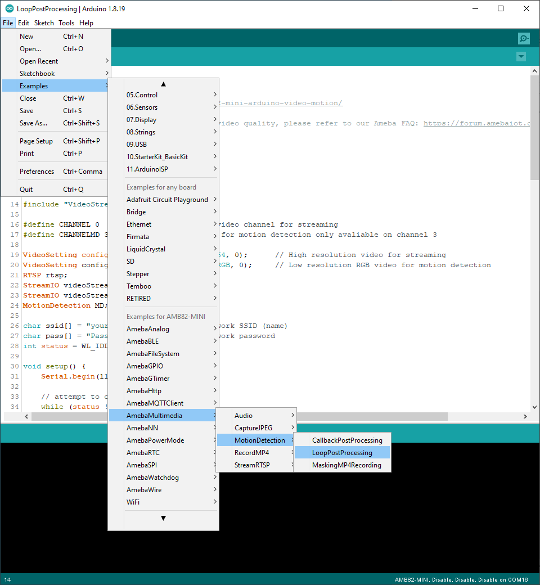
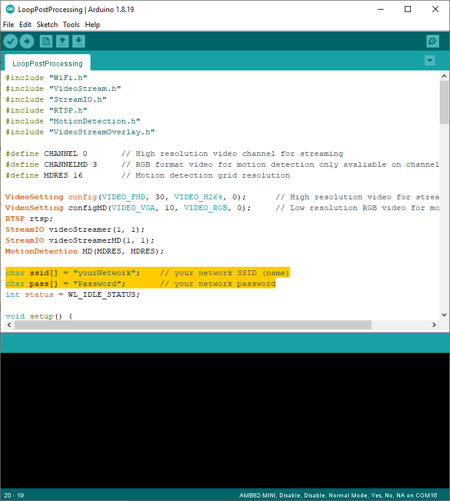
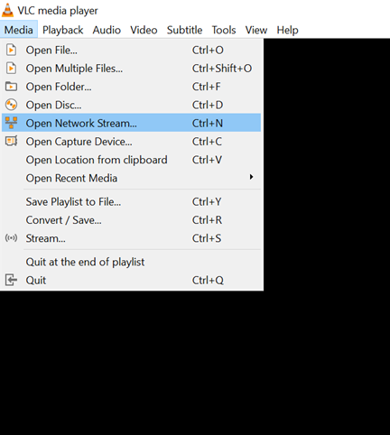
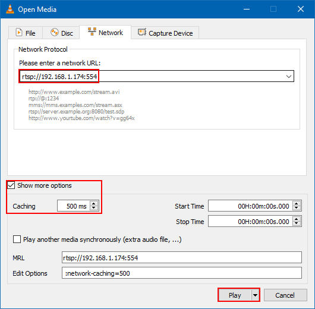
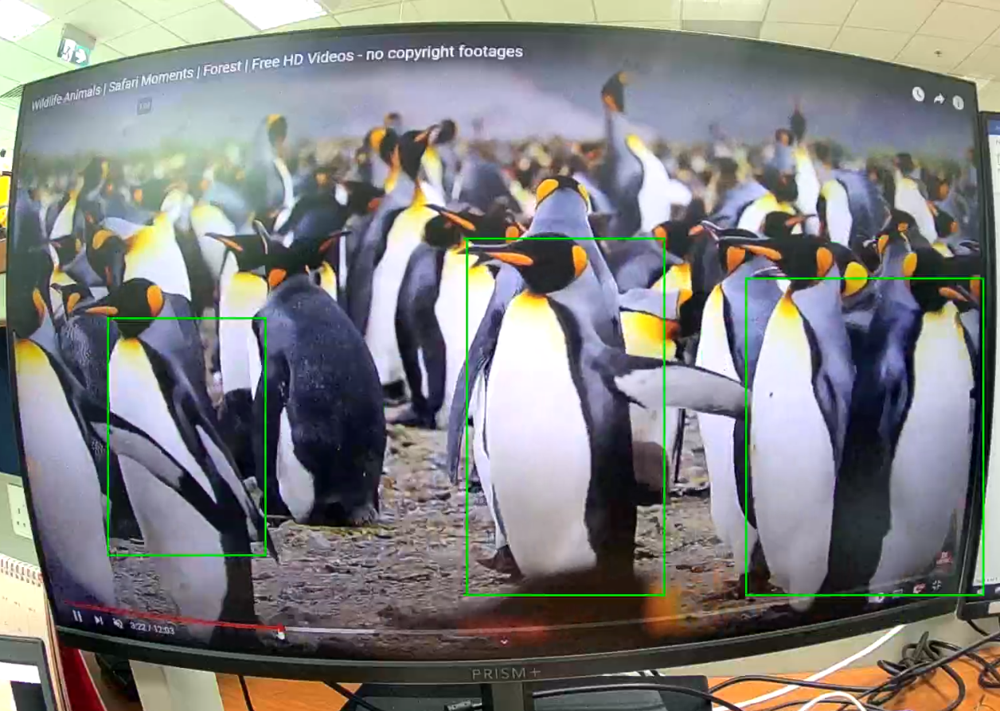
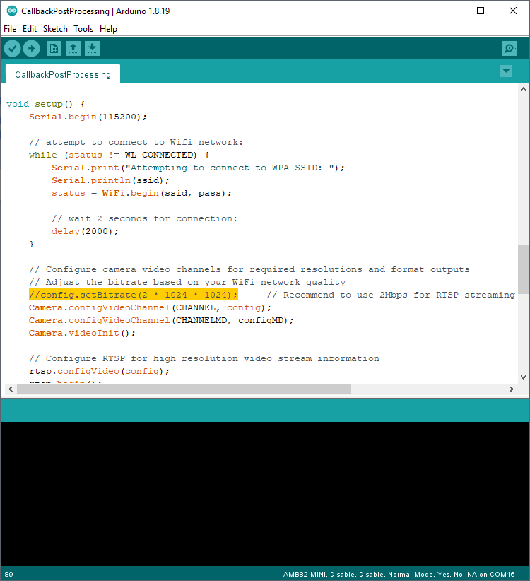

Motion Detection with On-Screen Display
=======================================

.. contents::
  :local:
  :depth: 2

Materials
---------

- `AMB82-mini <https://www.amebaiot.com/en/where-to-buy-link/#buy_amb82_mini>`_ x 1

Example
-------
In this example, we will be using Ameba Pro2 development board to detect motion and highlight it on a RTSP video stream. Motion Detection is achieved by comparing the RGB information of each image frame captured from the on-board camera sensor (JX-F37P).

The following examples shows how Motion Detection and the On-Screen Display is used. The main difference between the two examples is where the Motion Detection results are processed. “CallbackPostProcessing” uses a callback function, while “LoopPostProcessing” deals with the results in the loop function.

1. LoopPostProcessing
2. CallbackPostProcessing

Open one of the Motion Detection examples in “File” -> “Example” -> “AmebaMultimedia” -> “MotionDetection” -> “LoopPostProcessing”.

|image01|

In the highlighted code snippet, fill in the “ssid” with your WiFi network SSID and “pass” with the network password.

|image02|

Compile the code and upload it to Ameba. After pressing the Reset button, wait for the Ameba Pro 2 board to connect to the WiFi network. The board’s IP address and network port number for RTSP will be shown in the Serial Monitor.

|image03|

You may download VLC media player from the link (`here <https://www.videolan.org/vlc/>`_).

Upon the completion of the software installation, open VLC media player, and go to “Media” -> “Open Network Stream”.

|image04|

Make sure your PC is connected to the same network as the Ameba Pro2 board for streaming. Since RTSP is used as the streaming protocol, key in `“rtsp://{IPaddress}:{port}”` as the Network URL in VLC media player, replacing {IPaddress} with the IP address of your Ameba Pro2 board, and {port} with the RTSP port shown in Serial Monitor `(e.g., “rtsp://192.168.1.174:554”)`. The default RTSP port number is 554.

You may choose to change the caching time in “Show more options”. The default value of 1000 will introduce a one second delay between what the camera sees and what is displayed on screen. A lower cache time will result in reduced video latency but may introduce playback stuttering in the case of poor network conditions.

|image05|

Next, click “Play” to start RTSP streaming. The video stream from the camera will be shown in VLC media player. Multiple green boxes will be generated to identify the regions that are in motion.

|image06|

Code Reference
--------------
You may adjust the video bitrate based on your WiFi network quality, by uncommenting the highlighted code below.

|image07|

.. |image03| image:: ../../_static/Example_Guides/Multimedia/Motion_Detection_with_On-Screen_Display/image03.png
   :width:  642 px
   :height:  393 px

   
