RTP Audio Stream
================

.. contents::
  :local:
  :depth: 2

Materials
---------

- `AMB82-mini <https://www.amebaiot.com/en/where-to-buy-link/#buy_amb82_mini>`_ x 1
- 3.5mm TRS/TRRS breakout x 1 (e.g., Adafruit 2791 / Sparkfun 11570)

Example
-------
This example shows how to stream audio from a computer to the Ameba Pro 2 board.

Connect the audio jack to the Ameba board as shown in the diagram.

|image01|

Open the example in “File” -> “Examples” -> “AmebaMultimedia” -> “Audio” -> “RTPAudioStream”.

|image02|

In the highlighted code snippet, fill in the “ssid” with your WiFi network SSID and “pass” with the network password.

|image03|

Compile the code and upload it to Ameba.

After pressing the Reset button, wait for the Ameba Pro 2 board to connect to the WiFi network.

On a computer connected to the same WiFi network, open VLC media player, and go to “Media” -> “Stream”.

|image04|

Using the add button, add the audio file you would like to stream to the Ameba board, and click the stream button.

|image05|

In the new window that appears, click on next to move to the destination setup page. In the dropdown menu, select “RTP Audio/Video Profile” and click on the add button next to it.

|image06|

In the new tab that appears, enter the IP address of the Ameba Pro 2 board in the address field. Ensure that the base port uses the default value of 5004. Click on the next button.

|image07|

For transcoding options, ensure that “Activate Transcoding” is checked. If you already have a profile created for the Ameba Pro 2, select the existing profile, and skip the next section showing how to create a profile. Otherwise, click on the highlighted button to create a new profile for the Ameba Pro 2 Board.

|image08|

In the new window that appears, give a suitable name for the new transcoding profile. Ensure that “RAW” is selected in the “Encapsulation” tab.

|image09|

Ensure that “Video” and “Subtitle” are disabled in the “Video codec” and “Subtitles” tabs.

|image10|

|image11|

In the “Audio codec” tab, ensure that “Audio” is enabled. Select “MPEG 4 Audio (AAC)” for the codec, and 1 for the number of channels. For the sample rate, this value should be the same as the AudioSetting configuration for the Ameba Pro 2, which is 8000 Hz by default for this example. Click on the create button, ensure that the new profile is selected, and click on the next button.

|image12|

In the next window, click on the stream button, and VLC will begin streaming the audio file to Ameba Pro 2 using RTP.

Plug in a pair of wired earbuds into the audio jack, and you should hear the audio streamed from the computer. You can use the buttons in VLC to control the playback.

.. |image01| image:: ../../_static/Example_Guides/Multimedia/RTP_Audio_Stream/image01.png
   :width:  732 px
   :height:  763 px

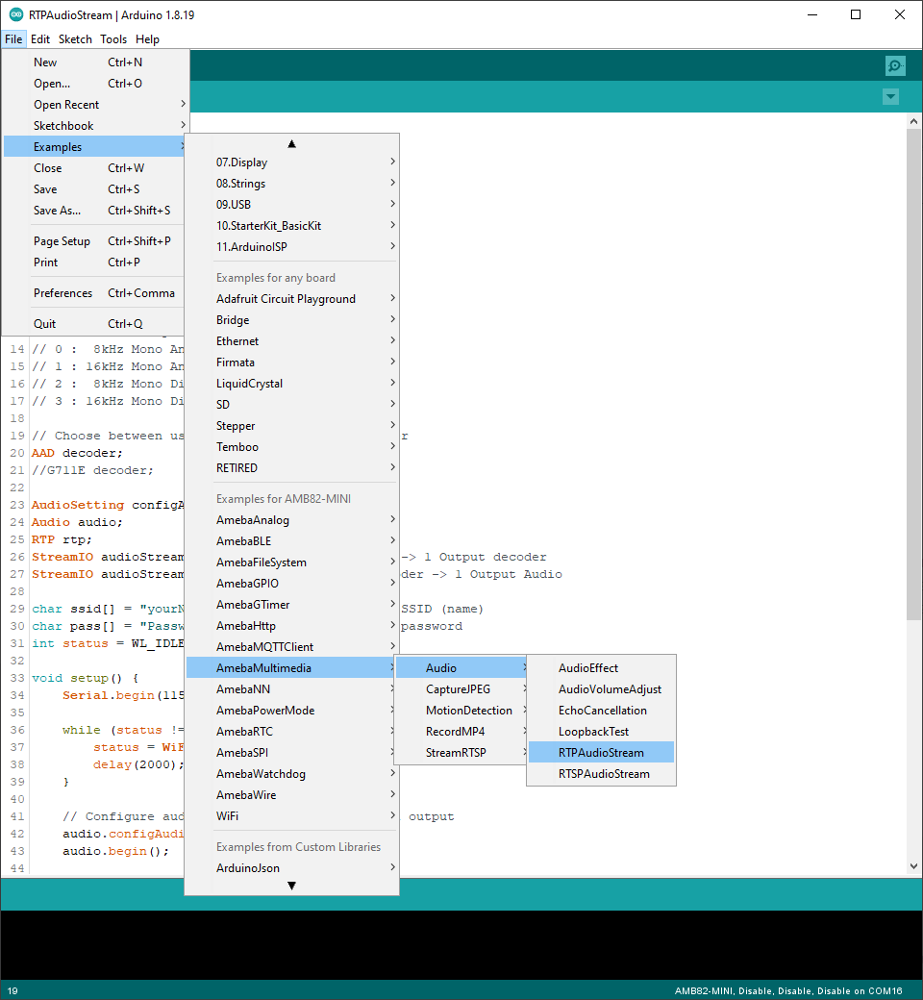

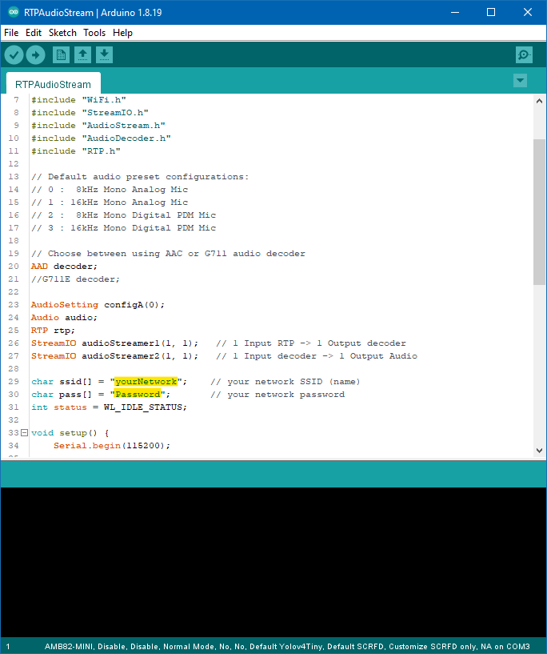

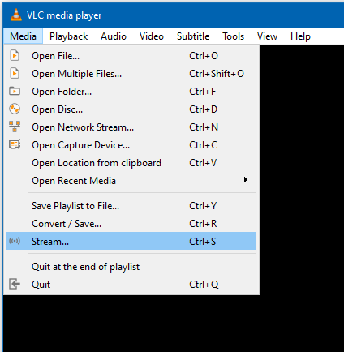

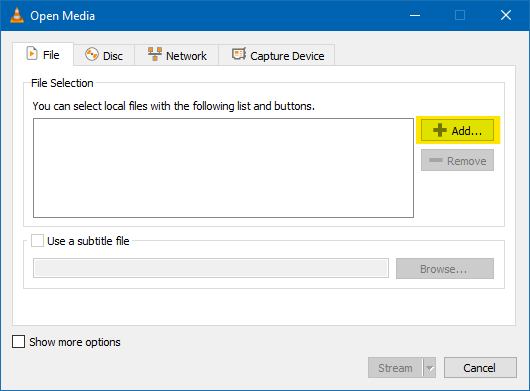

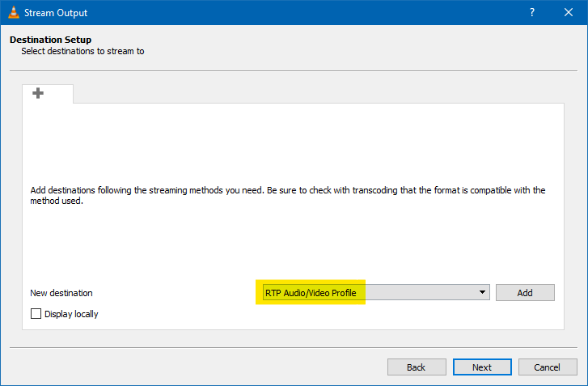

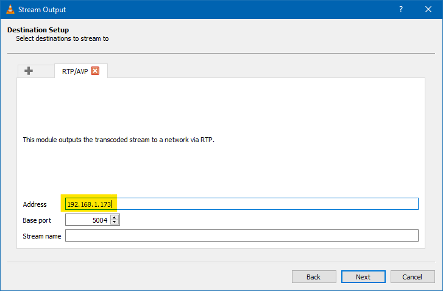

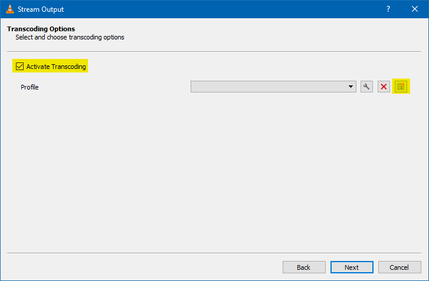

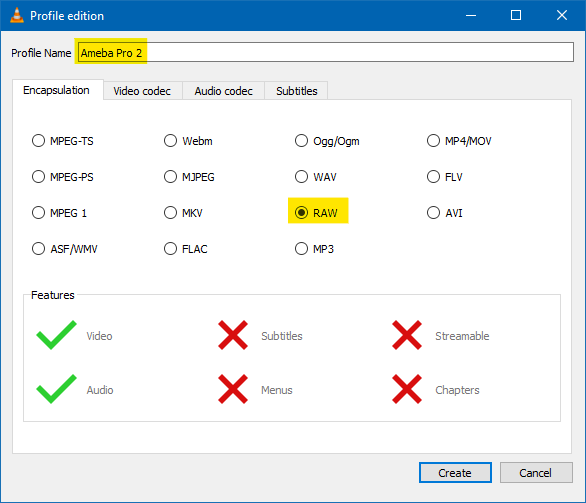

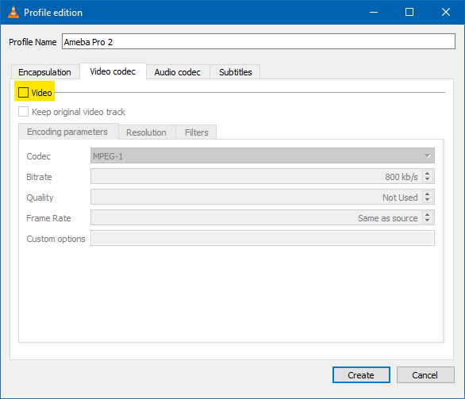

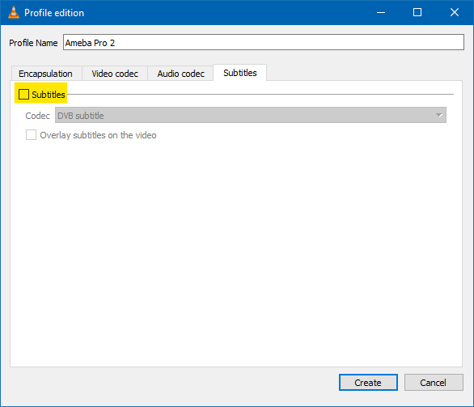

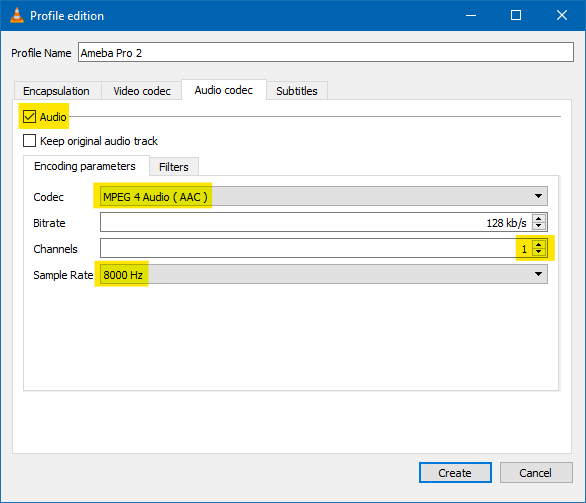