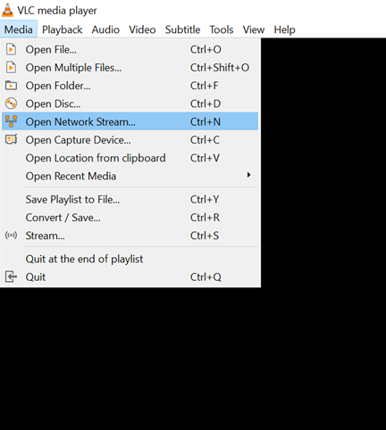

RTSP Audio Stream
=================

.. contents::
  :local:
  :depth: 2

Materials
---------

- `AMB82-mini <https://www.amebaiot.com/en/where-to-buy-link/#buy_amb82_mini>`_ x 1

Example
-------
This example shows how to use the Ameba Pro2 board to stream audio recorded by the onboard analogue microphone in different formats.

Open the example in “File” -> “Examples” -> “AmebaMultimedia” -> “Audio” -> “RTSPAudioStream”.

|image01|

In the highlighted code snippet, fill in the “ssid” with your WiFi network SSID and “pass” with the network password.

|image02|

Compile the code and upload it to Ameba.

After pressing the Reset button, wait for the Ameba Pro 2 board to connect to the WiFi network. The board’s IP address and network port number for RTSP will be shown in the Serial Monitor.

On a computer connected to the same WiFi network, open VLC media player, and go to “Media” -> “Open Network Stream”.

|image03|

Since RTSP is used as the streaming protocol, key in `“rtsp://{IPaddress}:{port}”`` as the Network URL in VLC media player, replacing {IPaddress} with the IP address of your Ameba Pro2 board, and {port} with the RTSP port shown in Serial Monitor. The default RTSP port number is 554.

|image04|

Next, click “Play” to start RTSP streaming. You should be able to hear sounds picked up by the onboard microphone replayed through computer.

Code Reference
--------------
The code can be modified to use the G.711 audio codec (PCMU/PCMA) instead of the default AAC. The G.711 audio codec is optimized for human speech and can maintain the clarity and understandability of spoken speech while reducing the data bandwidth needed.

