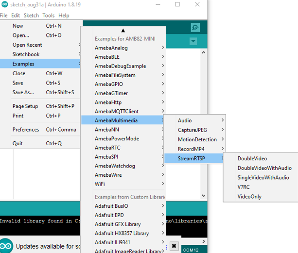
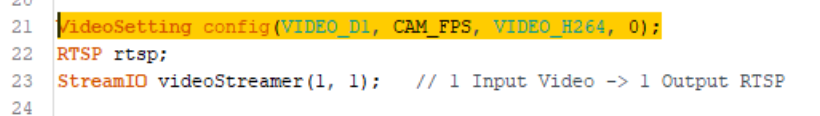
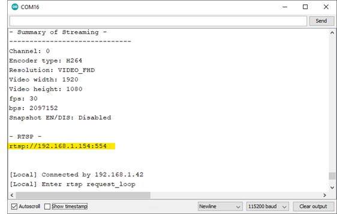
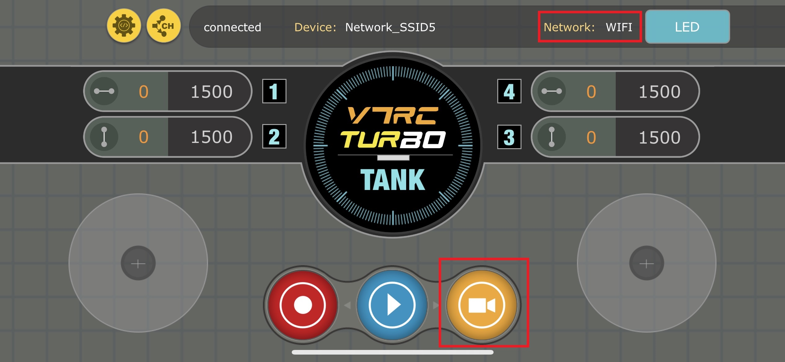
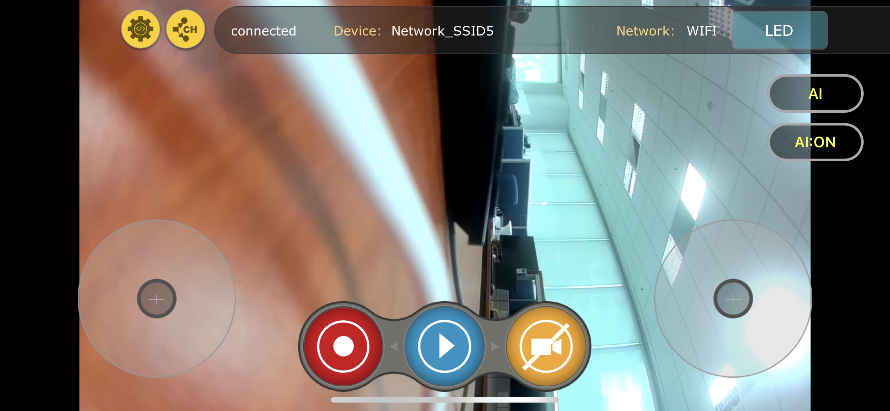

RTSP Streaming V7RC
===================

.. contents::
  :local:
  :depth: 2

Materials
---------

- `AMB82-mini <https://www.amebaiot.com/en/where-to-buy-link/#buy_amb82_mini>`_ x 1
- Android / iOS mobile phone x1

Example
-------
In this example, the Ameba board is used to stream video from the on-board camera sensor (JXF37) to V7RC mobile app via RTSP (Real Time Streaming Protocol). V7RC is a remote controller APP that provides two kinds of control UI: 2 channels for RC cars, and 4 channels for tanks and bulldozers.

Open the StreamRTSP example in “File” -> “Examples” -> “AmebaMultimedia” -> “StreamRTSP” -> “V7RC”.

|image01|

Since the video receiving end is mobile devices, in the highlighted code snippet, instead of using the default video settings, we will set the video resolution to VIDEO_D1 (720×480) to limit the video receiving latency.

|image02|

Fill in the “ssid” with your WiFi network SSID and “pass” with the network password. Since the video streaming receiving end is mobile phone, it is suggested to use 5G network to features lower latency, higher capacity, and more bandwidth, that provides better video streaming quality.

Compile and Upload. After pressing the Reset button, wait for the board to connect to the Wi-Fi network. The board’s IP address and network port number for RTSP will be shown in the Serial Monitor.

|image03|

Download V7RC APP from the links provided below.

• Android Users: https://play.google.com/store/apps/details?id=com.v7idea.v7rcliteandroidsdkversion&hl=en_US

• iOS Users: https://apps.apple.com/nz/app/v7rc/id1390983964

Upon the completion of the APP installation to the device, make sure the smart device is connected to the same network as the Ameba board for streaming. Open V7RC APP and select “Control Centre”:

|image04|

Under NETWORK section, select “WIFI”. Under CAMERA section select “RTSP”. Since RTSP is used as the streaming protocol, key in “rtsp://{IPaddress}:{port}” as the Network URL in V7RC in the text box below CAMERA section, replacing {IPaddress} with the IP address of Ameba board, and {port} with the RTSP port shown in Serial Monitor. The default RTSP port number is 554. In the case of two simultaneous RTSP streams, the second port number defaults to 555. Lastly, click the “Save” button and return to the home page:

|image05|

Back to the V7RC home page, check the Wi-Fi connection status on the top of the APP. Click video button (orange) to monitor the video streaming in real-time.

|image06|

The video stream from the camera will be shown in V7RC APP.

|image07|

Code Reference
--------------

| The settings below have been tested for better V7RC RTSP streaming quality:
| VideoSetting config(VIDEO_HD, CAM_FPS, VIDEO_H264, 0); // 1280x720
| VideoSetting config(VIDEO_D1, CAM_FPS, VIDEO_H264, 0); // 720x480

.. |image04| image:: ../../_static/Example_Guides/Multimedia/RTSP_Streaming_V7RC/image04.png
   :width:  1218 px
   :height:  563 px

.. |image05| image:: ../../_static/Example_Guides/Multimedia/RTSP_Streaming_V7RC/image05.png
   :width:  1218 px
   :height:  563 px

