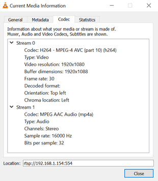

RTSP Streaming
==============

.. contents::
  :local:
  :depth: 2

Materials
---------

- `AMB82-mini <https://www.amebaiot.com/en/where-to-buy-link/#buy_amb82_mini>`_ x 1

Example
-------
In this example, we will use the Ameba Pro2 board to stream video and audio data from the on-board camera sensor (JX-F37P) and audio codec to a computer via RTSP (Real Time Streaming Protocol).

The following examples shows different use cases of RTSP streaming.

1. VideoOnly
2. SingleVideoWithAudio
3. DoubleVideo
4. DoubleVideoWithAudio

|image01|

In the highlighted code snippet, fill in the “ssid” with your WiFi network SSID and “pass” with the network password.

|image02|

Compile the code and upload it to Ameba. After pressing the Reset button, wait for the Ameba Pro 2 board to connect to the WiFi network. The board’s IP address and network port number for RTSP will be shown in the Serial Monitor.

You may download VLC media player from the link (`here <https://www.videolan.org/vlc/>`_).

Upon the completion of the software installation, open VLC media player, and go to “Media” -> “Open Network Stream”.

|image03|

Make sure your PC is connected to the same network as the Ameba Pro2 board for streaming. Since RTSP is used as the streaming protocol, key in `“rtsp://{IPaddress}:{port}”` as the Network URL in VLC media player, replacing {IPaddress} with the IP address of your Ameba Pro2 board, and {port} with the RTSP port shown in Serial Monitor `(e.g., “rtsp://192.168.1.154:554”)`. The default RTSP port number is 554. In the case of two simultaneous RTSP streams, the second port number defaults to 555.

|image04|

You may choose to change the caching time in “Show more options”. A lower cache time will result in reduced video latency but may introduce playback stuttering in the case of poor network conditions.

|image05|

Next, click “Play” to start RTSP streaming. The video stream from the camera will be shown in VLC media player. Meanwhile, in your Serial Monitor, the message “rtp started (UDP)” will appear.

|image06|

|image07|

You may also view detailed information about the video stream in “Tools” -> “Codec Information”.

+-----------------------------------+--------------------------------------------------------------------+
| **Example**                       | **Stream details**                                                 |
+-----------------------------------+--------------------------------------------------------------------+
| StreamRTSPVideoOnly               | Single RTSP stream of video only, on network port 554.             |
|                                   |                                                                    |
|                                   | |image08|                                                          |
+-----------------------------------+--------------------------------------------------------------------+
| StreamRTSPSingleVideoWithAudio    | Single RTSP stream of video and audio, on network port 554.        |
|                                   |                                                                    |
|                                   | |image09|                                                          |
+-----------------------------------+--------------------------------------------------------------------+
| StreamRTSPDoubleVideo             | Two RTSP streams of video only, on network ports 554 and 555.      |
|                                   |                                                                    |
|                                   | |image10|                                                          |
|                                   |                                                                    |
|                                   | |image11|                                                          |
+-----------------------------------+--------------------------------------------------------------------+
| StreamRTSPDoubleVideoWithAudio    | Two RTSP streams of video and audio, on network ports 554 and 555. |
|                                   |                                                                    |                 
|                                   |                                                                    |
|                                   | |image12|                                                          |
|                                   |                                                                    |
|                                   | |image13|                                                          |
+-----------------------------------+--------------------------------------------------------------------+

Code Reference
--------------
The camera can produce 3 simultaneous video stream channels, with the default configuration for each channel as shown. You may choose to edit the code to use a different video stream.

| Channel 0: 1920 x 1080, 30FPS, H264 format
| Channel 1: 1280 x 720, 30FPS, H264 format
| Channel 2: 1280 x 720, 30FPS, MJPEG format

|image14| 

You may adjust the video bitrate based on your WiFi network quality, by uncommenting the highlighted code below.

|image15| 

.. |image03| image:: ../../_static/Example_Guides/Multimedia/RTSP_Streaming/image03.png
   :width:  432 px
   :height:  482 px

.. |image04| image:: ../../_static/Example_Guides/Multimedia/RTSP_Streaming/image04.png
   :width:  562 px
   :height:  357 px

.. |image05| image:: ../../_static/Example_Guides/Multimedia/RTSP_Streaming/image05.png
   :width:  383 px
   :height:  471 px

.. |image07| image:: ../../_static/Example_Guides/Multimedia/RTSP_Streaming/image07.png
   :width:  529 px
   :height:  343 px

