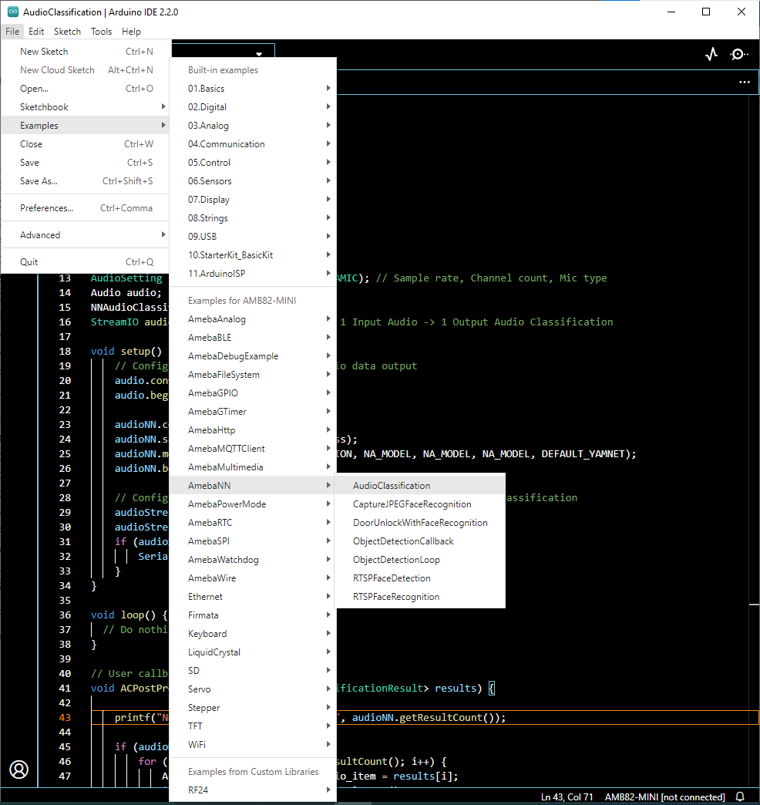
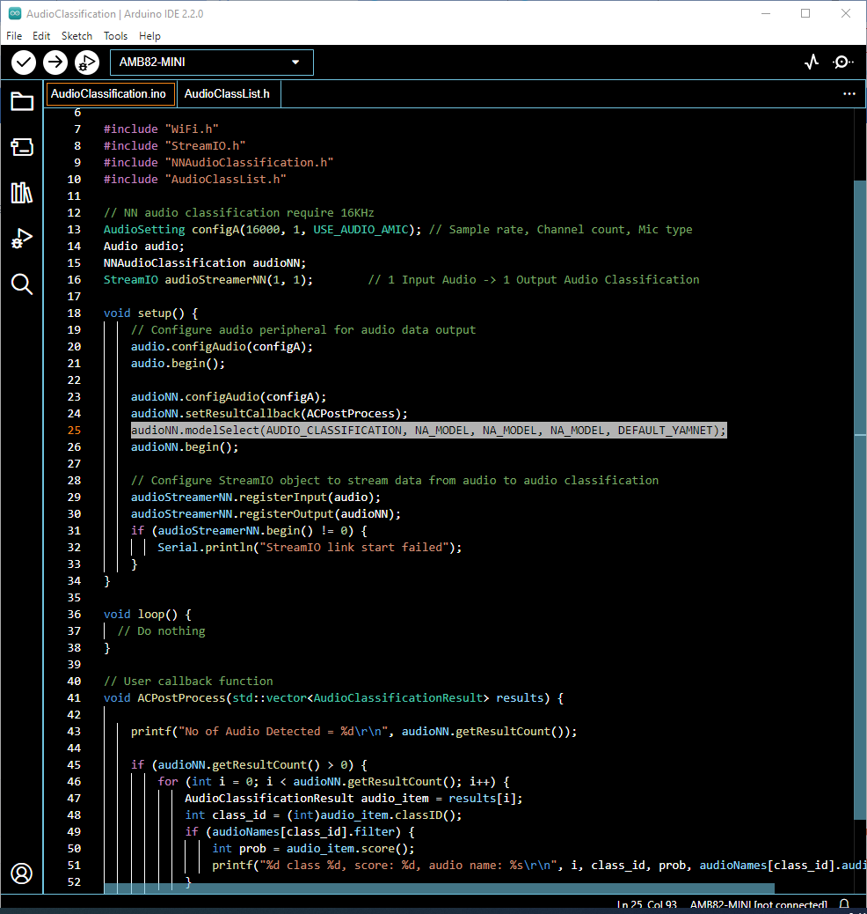
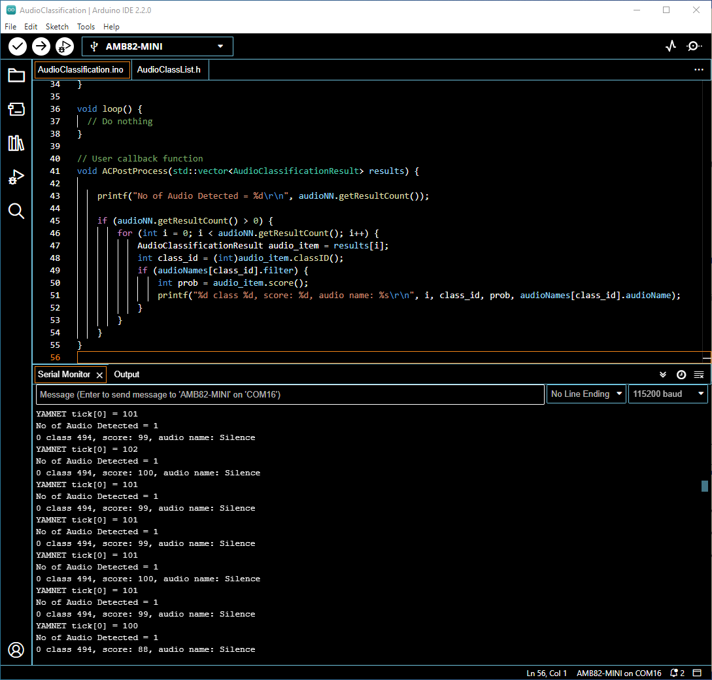
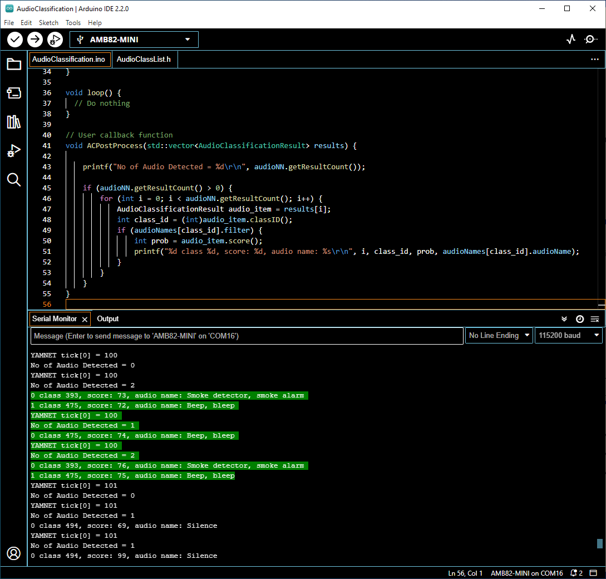
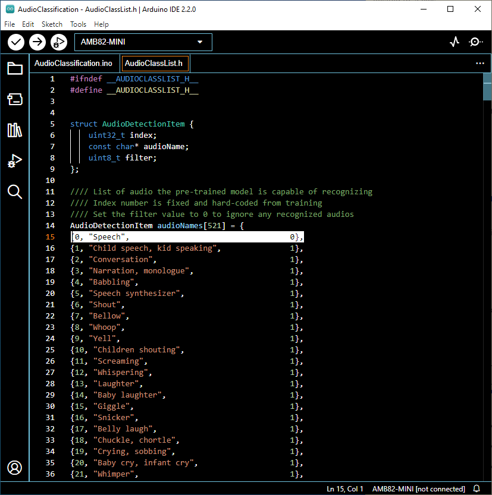

Audio Classification
====================

.. contents::
  :local:
  :depth: 2

Materials
---------
- `AMB82-mini <https://www.amebaiot.com/en/where-to-buy-link/#buy_amb82_mini>`_ x 1

Example 
-------
In this example, we will be using Ameba Pro2 development board to detect
521 different kinds of audio such as speech, animal sounds, alarms and
many more.

Open Audio Classification example in “File” -> “Examples” -> “AmebaNN”
-> “AudioClassification”.

|image01|

Select Neural Network (NN) task and models using modelSelect() function
highlighted. This function takes 5 arguments: Neural Network task,
Object Detection model, Face Detection model, Face Recognition model and
Audio Classification model. Replace with “NA_MODEL” if they are not
necessary for your selected Neural Network task. Note that it is
mandatory to call modelSelect() function before calling the begin()
function.

Valid Neural Network task: OBJECT_DETECTION, FACE_DETECTION,
FACE_RECOGNITION, AUDIO_CLASSIFICATION

Valid Object Detection model:

YOLOv3 model: DEFAULT_YOLOV3TINY, CUSTOMIZED_YOLOV3TINY

YOLOv4 model: DEFAULT_YOLOV4TINY, CUSTOMIZED_YOLOV4TINY

YOLOv7 model: DEFAULT_YOLOV7TINY, CUSTOMIZED_YOLOV7TINY

Valid Face Detection model: DEFAULT_SCRFD, CUSTOMIZED_SCRFD

Valid Face Recognition model: DEFAULT_MOBILEFACENET,
CUSTOMIZED_MOBILEFACENET

Valid Audio Classification model: DEFAULT_YAMNET, CUSTOMIZED_YAMNET

Choose the customized option (e.g., CUSTOMIZED_YOLOV4TINY/
CUSTOMIZED_SCRFD/ CUSTOMIZED_MOBILEFACENET/ CUSTOMIZED_YAMNET) if you
would like to use your own NN model. To learn about the process of
converting an AI model, refer to
https://www.amebaiot.com/en/amebapro2-ai-convert-model/ . Additionally,
refer to https://www.amebaiot.com/en/amebapro2-apply-ai-model-docs/ to
understand how to install and use the converted model.

|image02|

Compile the code and upload it to Ameba. After pressing the Reset
button, onboard microphone will start to pick up audios.

When no audio is detected, it will be recognised as “Silence” class
shown in the Serial Monitor.

|image03|

When the on-board microphone picks up audios like alarms, it will be
identified, and the results will be shown in the Serial monitor.

|image04|

The default pretrained model can recognise 521 different types of audios
in total. The audio can be found in AudioClassList.h. The index number
also known as the class ID for each audio class is fixed and should not
be changed. To deactivate the recognition of certain audios, set the
filter value to 0. For example, set the filter value to 0 to exclude
detecting speech.

|image05|

