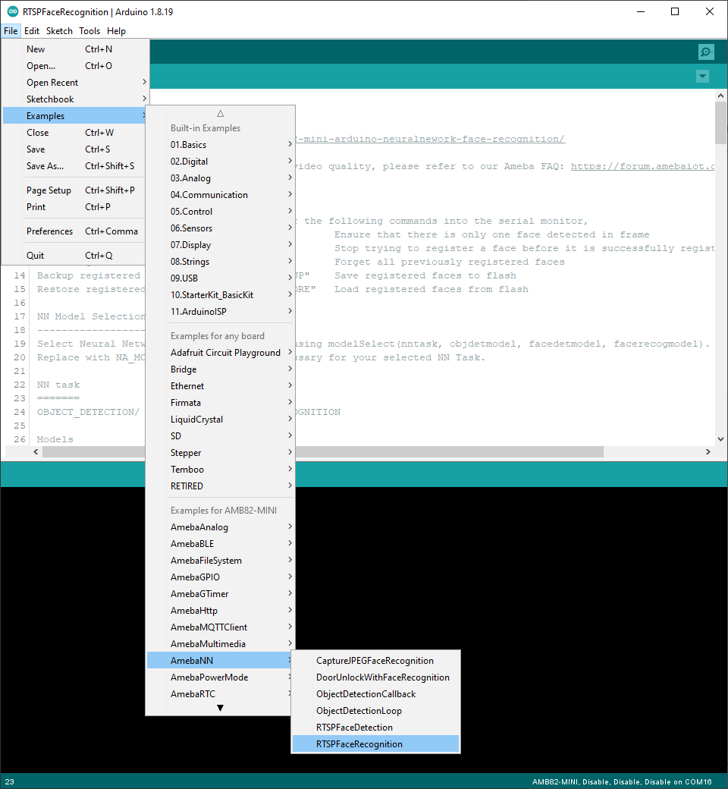
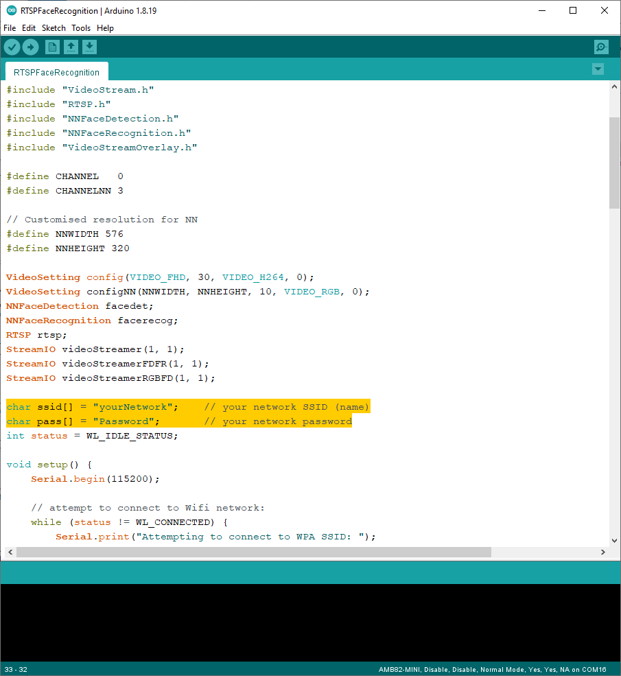
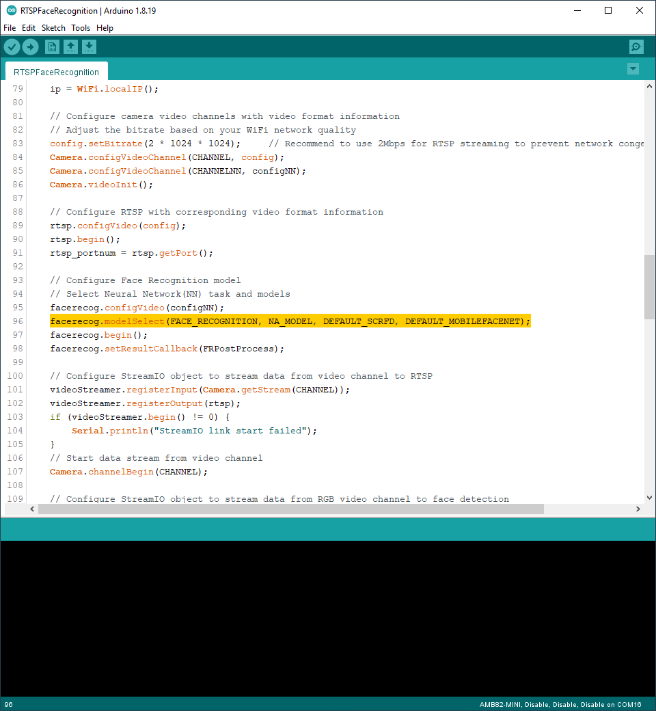
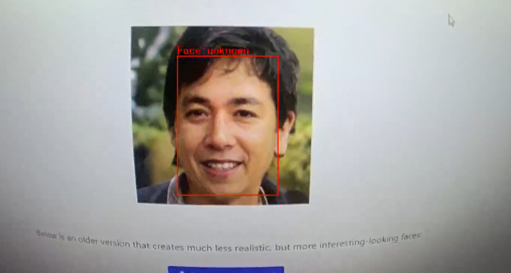
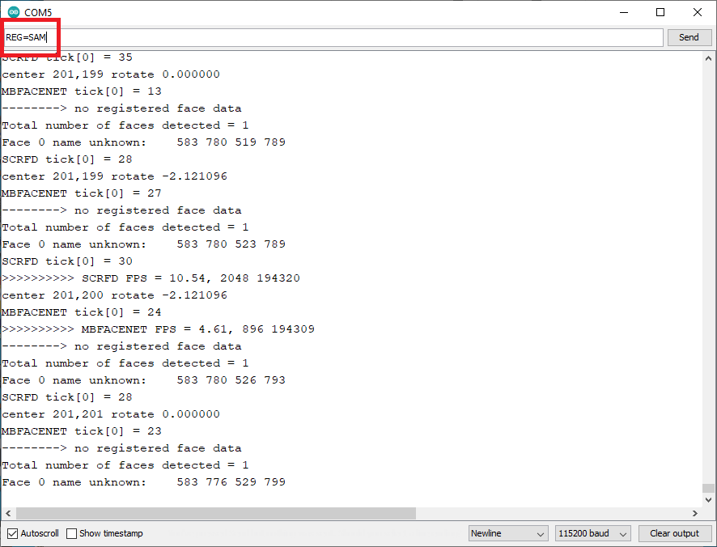
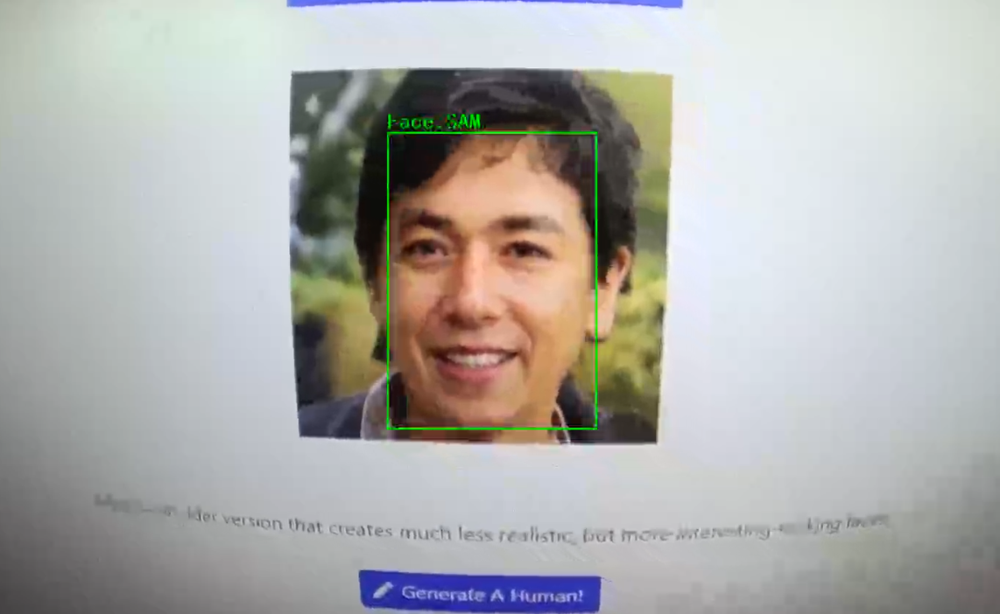
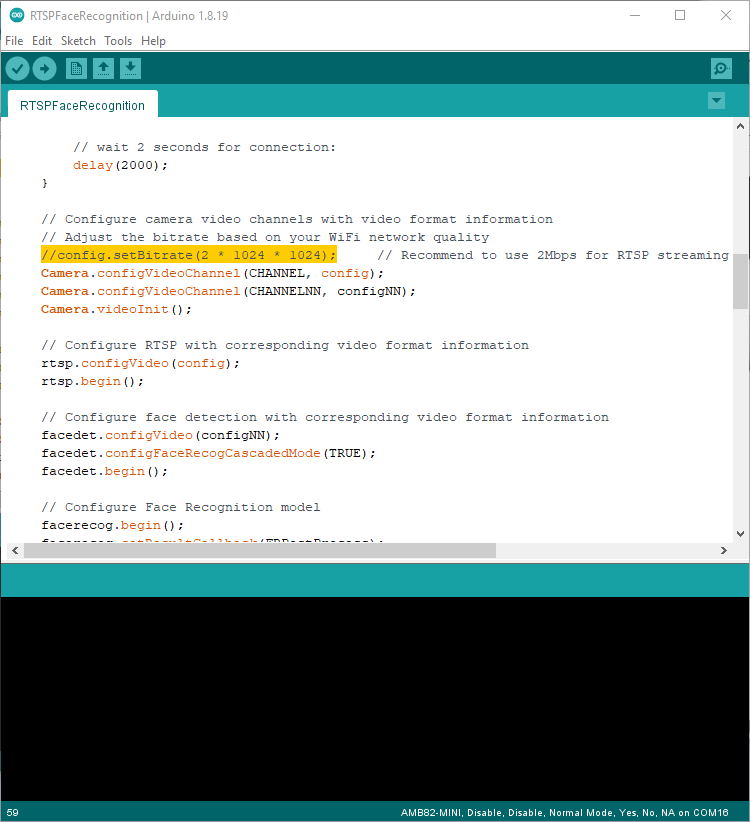

Face Recognition
================

.. contents::
  :local:
  :depth: 2

Materials
---------
- `AMB82-mini <https://www.amebaiot.com/en/where-to-buy-link/#buy_amb82_mini>`_ x 1

Example 
-------
In this example, we will be using Ameba Pro2 development board to recognize detected faces.

Open face recognition examples in “File” -> “Examples” -> “AmebaNN” -> “RTSPFaceRecognition”.

|image01|

In the highlighted code snippet, fill in the “ssid” with your WiFi network SSID and “pass” with the network password.

|image02|

Select Neural Network (NN) task and models using modelSelect() function highlighted in yellow. This function takes 4 arguments: Neural Network task, Object Detection model, Face Detection model and Face Recognition
model. Replace with “NA_MODEL” if they are not necessary for your selected Neural Network task. Note that it is mandatory to call modelSelect() function before calling the begin() function.

Valid Neural Network task:* OBJECT_DETECTION, FACE_DETECTION, FACE_RECOGNITION

Valid Object Detection model:

YOLOv3 model: DEFAULT_YOLOV3TINY, CUSTOMIZED_YOLOV3TINY

YOLOv4 model: DEFAULT_YOLOV4TINY, CUSTOMIZED_YOLOV4TINY

YOLOv7 model: DEFAULT_YOLOV7TINY, CUSTOMIZED_YOLOV7TINY

Valid Face Detection model: DEFAULT_SCRFD, CUSTOMIZED_SCRFD

Valid Face Recognition model: DEFAULT_MOBILEFACENET, CUSTOMIZED_MOBILEFACENET

Choose the customized option (e.g., CUSTOMIZED_YOLOV4TINY/ CUSTOMIZED_SCRFD/ CUSTOMIZED_MOBILEFACENET) if you would like to use your own NN model. To learn about the process of converting an AI model, refer to https://www.amebaiot.com/en/amebapro2-ai-convert-model/ .
Additionally, refer to https://www.amebaiot.com/en/amebapro2-apply-ai-model-docs/ to understand how to install and use the converted model.

|image03|

Compile the code and upload it to Ameba. After pressing the Reset button, wait for the Ameba Pro 2 board to connect to the WiFi network. The board’s IP address and network port number for RTSP will be shown in the Serial Monitor.

The result of face recognition can be validated using VLC. You may download VLC media player from the link `here <https://www.videolan.org/vlc/>`__.

Upon the completion of the software installation, open VLC media player, and go to “Media” -> “Open Network Stream”.

|image04|

Make sure your PC is connected to the same network as the Ameba Pro2 board for streaming. Since RTSP is used as the streaming protocol, key
in `“rtsp://{IPaddress}:{port}”` as the Network URL in VLC media player, replacing {IPaddress} with the IP address of your Ameba Pro2 board, and {port} with the RTSP port shown in Serial Monitor `(e.g., “rtsp://192.168.1.154:554”)`. The default RTSP port number is 554.

Next, click “Play” to start RTSP streaming to see the result. The video stream from the camera will be shown in VLC media player.

|image05|

The faces detected by the face recognition neural network model are initially labelled as “unknown”, faces need to be first registered with a name before they can be recognized.

|image06|

Aim the camera at a face and enter the following commands in the Serial Monitor.

**To register a face:**

Note: Multiple faces can be registered. However, when registering a face, ensure that there is only one face in the frame.

To register a face, aim the camera to a targeted face and enter **“REG={Name}”** to give the targeted face a name. For example, “REG=SAM”.

|image07|

|image08|

**To remove a specific registered face:**

Enter the command **“DEL={Name}”** to delete a certain registered face. For example, “DEL=SAM”.

**To reset all registered faces:**

Enter the command **“RESET”** to forget all previously registered faces. All previously assigned faces and names will be removed. You may register a face again by entering the face registration mode.

**To backup and restore registered faces to and from flash:**

Enter the command **“BACKUP”** to save a copy of registered faces to flash. If a backup exists, enter the command **“RESTORE”** to load registered faces from flash.

Code Reference
--------------

You may adjust the video bitrate based on your WiFi network quality, by uncommenting the highlighted code below.

|image09|

.. |image04| image:: ../../_static/Example_Guides/Neural_Network/Neural_Network_-_Face_Recognition/image04.png
   :width:  432 px
   :height:  482 px

.. |image05| image:: ../../_static/Example_Guides/Neural_Network/Neural_Network_-_Face_Recognition/image05.png
   :width:  633 px
   :height:  594 px

