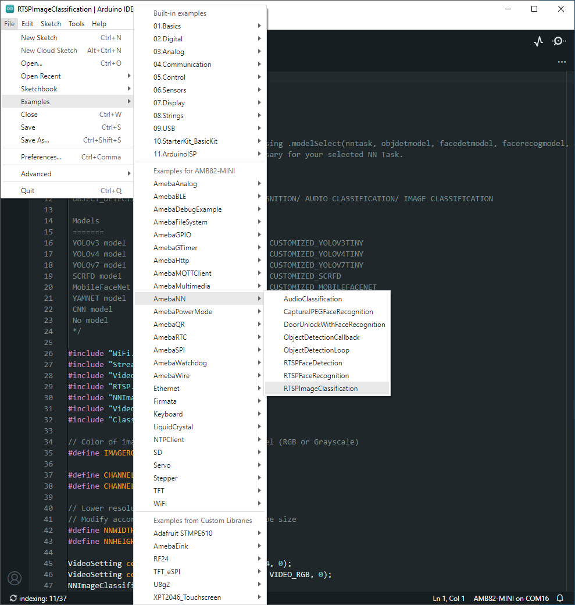
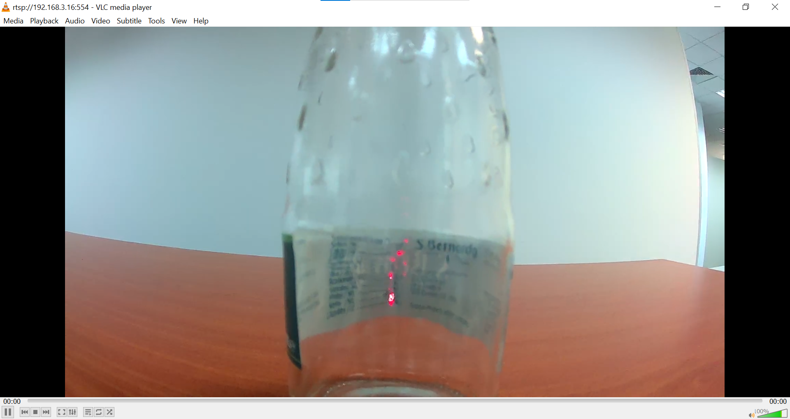
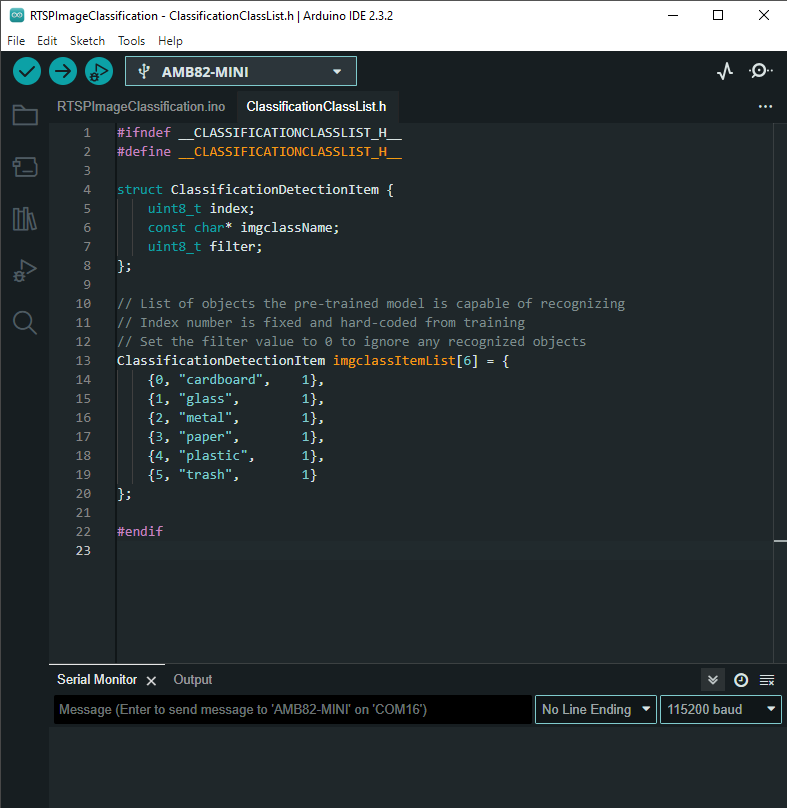

Image Classification
====================

.. contents::
  :local:
  :depth: 2

Materials
---------

- `AMB82-mini <https://www.amebaiot.com/en/where-to-buy-link/#buy_amb82_mini>`_ x 1

Example 
-------

In this example, we will be using Ameba Pro2 development board to identify images and perform classification.

Open image classification example in “File” -> “Examples” -> “AmebaNN” -> “RTSPImageClassification”.

|image01|

In the highlighted code snippet, fill in the “ssid” with your WiFi network SSID and “pass” with the network password.

|image02|

Select Neural Network (NN) task and models using modelSelect() function highlighted in a red box. This function takes 6 arguments: Neural Network task, Object Detection model, Face Detection model and Face Recognition model, Audio Classification model and Image Classification model. Replace with “NA_MODEL” if they are not necessary for your selected Neural Network task. Note that it is mandatory to call modelSelect() function before calling the begin() function.

Valid Neural Network task: OBJECT_DETECTION, FACE_DETECTION, FACE_RECOGNITION, AUDIO_CLASSIFICATION, IMAGE_CLASSIFICATION

Valid Object Detection model:

YOLOv3 model: DEFAULT_YOLOV3TINY, CUSTOMIZED_YOLOV3TINY

YOLOv4 model: DEFAULT_YOLOV4TINY, CUSTOMIZED_YOLOV4TINY

YOLOv7 model: DEFAULT_YOLOV7TINY, CUSTOMIZED_YOLOV7TINY

Valid Face Detection model: DEFAULT_SCRFD, CUSTOMIZED_SCRFD

Valid Face Recognition model: DEFAULT_MOBILEFACENET, CUSTOMIZED_MOBILEFACENET

Valid Audio Classification model: DEFAULT_YAMNET, CUSTOMIZED_YAMNET

Valid Image Classification model: DEFAULT_IMGCLASS, CUSTOMIZED_IMGCLASS

Choose the customized option (e.g., CUSTOMIZED_YOLOV4TINY/ CUSTOMIZED_SCRFD/ CUSTOMIZED_MOBILEFACENET/ CUSTOMIZED_YAMNET/ CUSTOMIZED_IMGCLASS) if you would like to use your own NN model. To learn about the process of converting an AI model, refer to https://www.amebaiot.com/en/amebapro2-ai-convert-model/ . Additionally, refer to https://www.amebaiot.com/en/amebapro2-apply-ai-model-docs/ to understand how to install and use the converted model.

|image03|

To note: If you would like to customize your own model, currently only Sequential CNN model is supported. Kindly refer to https://www.amebaiot.com/en/amebapro2-ai-convert-model/ to take note of some points when training models.

Compile the code and upload it to Ameba. After pressing the Reset button, wait for the Ameba Pro 2 board to connect to the WiFi network. The board’s IP address and network port number for RTSP will be shown in the Serial Monitor.

The live feed capture from Ameba Pro2 board’s camera sensor can be viewed on VLC media player. You may download VLC media player from the link `here <https://www.videolan.org/vlc/>`__.

Upon the completion of the software installation, open VLC media player, and go to “Media” -> “Open Network Stream”.

|image04|

Make sure your PC is connected to the same network as the Ameba Pro2 board for streaming. Since RTSP is used as the streaming protocol, key in `“rtsp://{IPaddress}:{port}”` as the Network URL in VLC media player, replacing {IPaddress} with the IP address of your Ameba Pro2 board, and {port} with the RTSP port shown in Serial Monitor `(e.g., “rtsp://192.168.1.154:554”)`. The default RTSP port number is 554.

Next, click “Play” to start RTSP streaming to see the result. The video stream from the camera will be shown in VLC media player.

|image05|

Now, you will be able to see what the camera is capturing.

|image06|

Next, aim the camera at the item you want the board to identify. The model used in this example is trained using a Convolutional Neural Network (CNN) and can classify various types of garbage, including cardboard, glass, metal, paper, plastic, and general trash. The class with the highest possibility will be displayed in the Serial Monitor.

|image07|

The model can identify 6 different types of garbage. The items can be found in ClassificationClassList.h. The index number for each object is fixed and should not be changed. To deactivate the detection of certain objects, set the filter value to 0.

|image08|

.. |image02| image:: ../../_static/Example_Guides/Neural_Network/Neural_Network_-_Image_Classification/image02.png
   :width:  902 px
   :height:  1040 px

.. |image03| image:: ../../_static/Example_Guides/Neural_Network/Neural_Network_-_Image_Classification/image03.png
   :width:  851 px
   :height:  165 px

.. |image04| image:: ../../_static/Example_Guides/Neural_Network/Neural_Network_-_Image_Classification/image04.png
   :width:  432 px
   :height:  482 px

.. |image05| image:: ../../_static/Example_Guides/Neural_Network/Neural_Network_-_Image_Classification/image05.png
   :width:  633 px
   :height:  594 px

.. |image07| image:: ../../_static/Example_Guides/Neural_Network/Neural_Network_-_Image_Classification/image07.png
   :width:  778 px
   :height:  376 px

