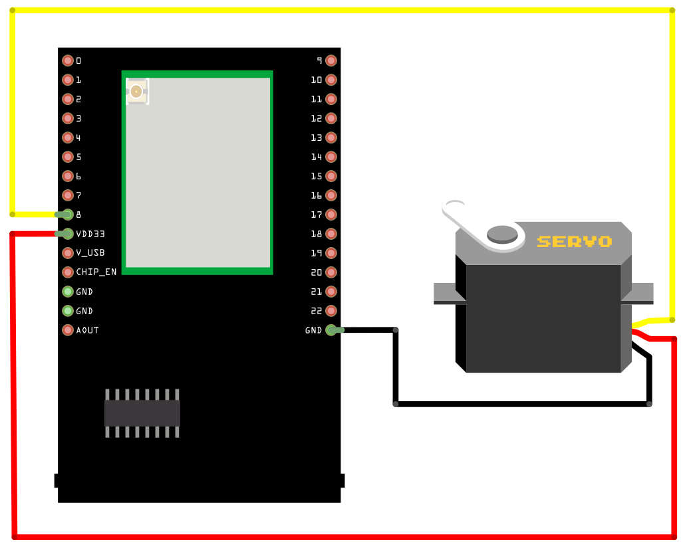

Servo Control
============== 

.. contents::
  :local:
  :depth: 2

Materials
---------

- `AMB82-mini <https://www.amebaiot.com/en/where-to-buy-link/#buy_amb82_mini>`_ x 1

- Servo x 1 (Ex. Tower Pro SG90)

Example
-------

A typical servo has 3 wires, the red wire is for power, black or brown one should be connected to GND, and the other one is for signal data. We use PWM signal to control the rotation angle of the axis of the servo. The frequency of the signal is 50Hz, that is length 20ms. Each servo defines its pulse bandwidth, which is usually 1ms~2ms.

To control the rotation angle, for example if 1ms-length pulse rotates the axis to degree 0, then 1.5 ms pulse rotates the axis to 90 degrees, and 2 ms pulse rotates the axis to 180 degrees. Furthermore, a servo defines the “dead bandwidth”, which stands for the required minimum difference of the length of two consecutive pulse for the servo to work.

**AMB82 MINI** wiring diagram:

|image01|

| Open the example, “File” -> “Examples” -> “AmebaAnalog” -> “PWM_ServoControl”
| This example makes the servo to rotate from degree 0 to 180, and then rotate back to degree 0.

Code Reference
--------------

| The Servo API of Ameba is similar to the API of Arduino. To distinguish from the original API of Arduino, we name the header file “AmebaServo.h” and the Class “AmebaServo”, the usage is identical to the Arduino API.
| The default pulse bandwidth of Arduino Servo is 0.5ms~2.4ms, which is the same as Tower Pro SG90. Therefore, we set the attached pin directly:

.. code-block:: c++

    myservo.attach(9);

Next, rotate the axis to desired position:

.. code-block:: c++

    myservo.write(pos);

