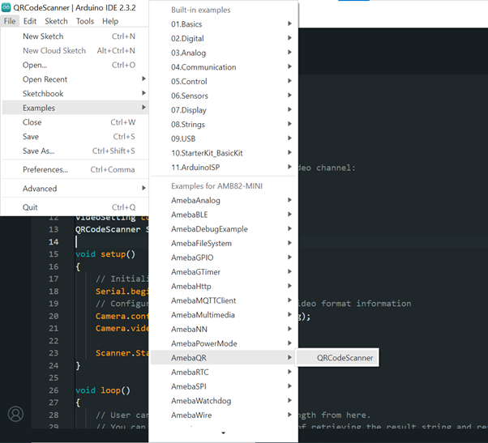
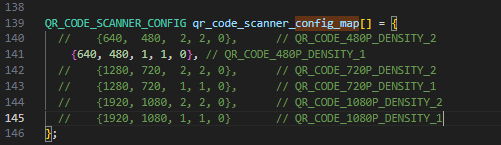
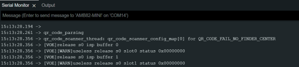
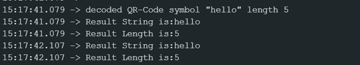

Scan QR Code And Read Result String
===================================

.. contents::
  :local:
  :depth: 2

Materials
---------

- `AMB82-mini <https://www.amebaiot.com/en/where-to-buy-link/#buy_amb82_mini>`_ x 1

Example
-------

This example will demonstrate how to retrieve the result string and length when QR code is placed in front of the camera of AMB82 MINI.

Open the QR Code Scanner example “File” -> “Examples” -> “AmebaQR” -> “QRCodeScanner”

|image01|

You can start the scanner by calling the method StartScanning(). Please note that this should be in the setup() and not in the loop().

You can retrieve the result string and result length by calling the method GetResultString() and GetResultLength().

Please note that users are to modify their conditional checks in the loop(). This is just an illustration on how to get the result string and length. Currently, 3rd successful scan onwards will be able to retrieve the result string and length reliably. Strongly encourage more people to try out and improve the performance of this example. This example may not be the most optimised version.

To optimise the performance for your application, one can modify the qr_code_scanner_config_map in qrcode_drv.c as shown in the picture below. For now, there is no API exposed on the Arduino level, but this can be done in future if there is a huge demand for it.

|image02|

To test this example, compile and run the example. Place a QR code in from the camera of AMB82 MINI. If there is no QR code detected, you will be able to see this in Serial Monitor.

|image03|

If QR Code is detected after 3 successful times, you will observe this log on the Serial Monitor.

|image04|

