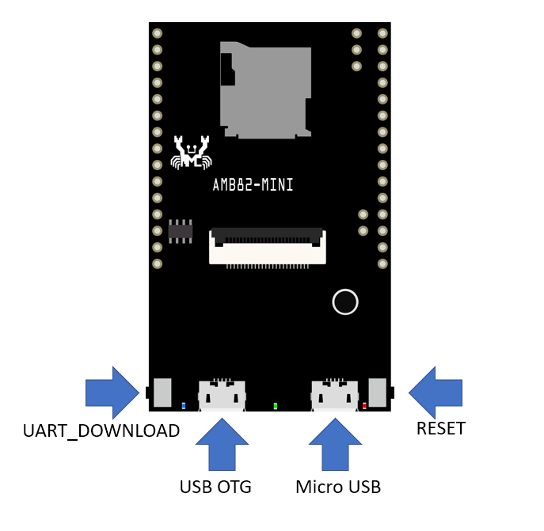

UVC Device
==========

.. contents::
  :local:
  :depth: 2

Materials
---------

- `AMB82-mini <https://www.amebaiot.com/en/where-to-buy-link/#buy_amb82_mini>`_ x 1

Example
-------

AmebaPro2 ISP can support compressed (H264 / H265 / JPG) and uncompressed (NV16 / NV12) image through UVC (wired transmission), and user can check video on pc with PC applications (e.g., Potplayer).

Connect the “Micro USB” into Arduino IDE device. Open the sample code in “File” -> “Examples” -> “AmebaUSB” -> “UVC_Device”. Compile and upload to Ameba, then press the reset button. Connect the “USB OTG” via micro-USB cable to the target device such as PC, then use the Ameba device as a USB cam.

|image01|

Review the USB cam driver as following picture.

|image02|

It is optional to open the Serial Monitor, review the processing log. At this stage “Micro USB” can be disconnected.

|image03|

.. |image02| image:: ../../_static/Example_Guides/USB/UVC_Device/image02.png
   :width:  493 px
   :height:  549 px

