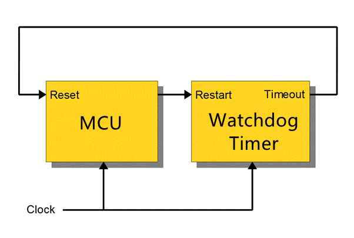
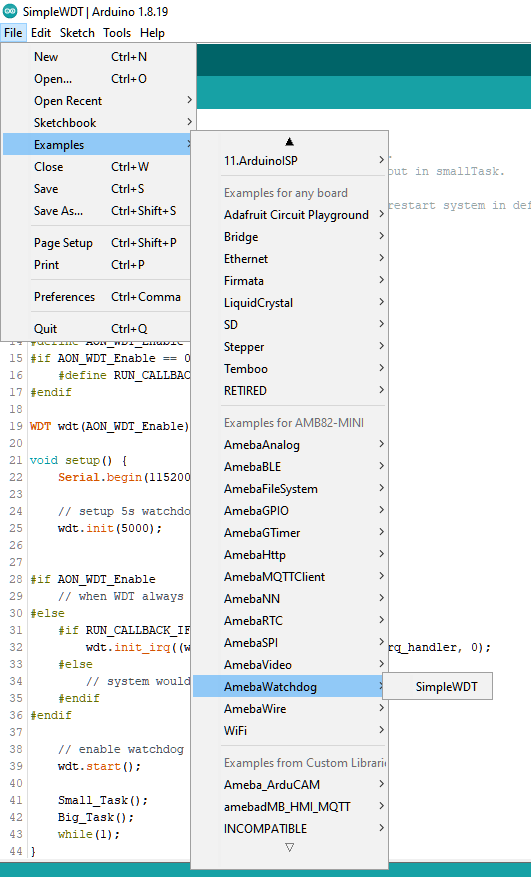
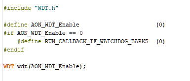
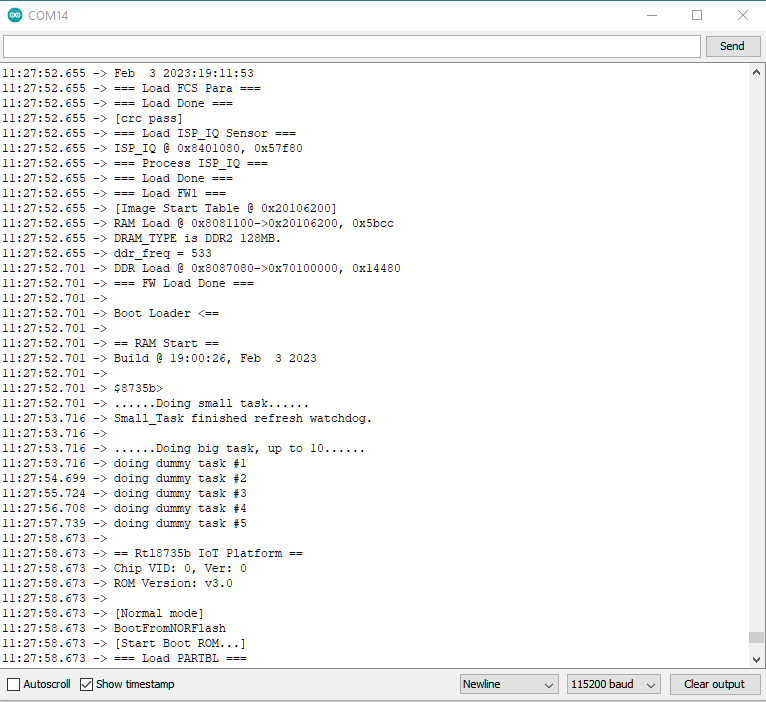
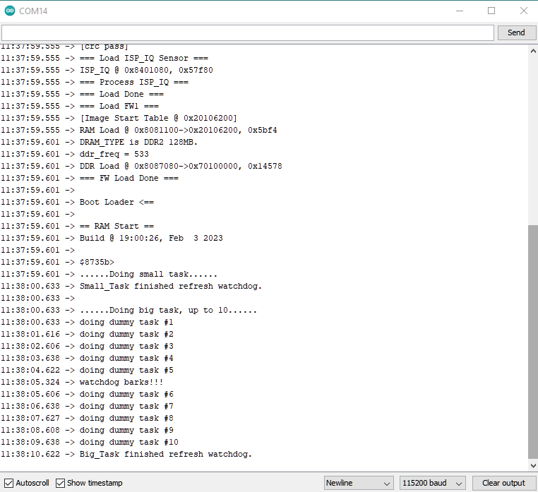

Simple WDT
==========

.. contents::
  :local:
  :depth: 2

Materials
---------

- `AMB82-mini <https://www.amebaiot.com/en/where-to-buy-link/#buy_amb82_mini>`_ x 1

Example
-------

Introduction
~~~~~~~~~~~~

This is a simple Watchdog Timer (WDT) example and demonstrate the usage of watchdog API. Refer to the following information about the definition and working principles of Watchdog.

Watchdog
^^^^^^^^

Watchdog Timer is a hardware timer that is used to detect the occurrence of a software fault, then automatically generates a system reset or a watchdog interrupt on the expiry of a programmed period.

In layman terms, imagine in the situation while your micro-controller is confused in an infinity loop, or any case like the micro-controller hang while performing some tasks. The normal troubleshooting method would be to press the reset button and jump out of the infinity loop. However, is it practically impossible to do press on the button all time, therefore, the watchdog timer that embedded inside the micro-controller would help with this situation.

Feed the Dog
^^^^^^^^^^^^

If you have a dog in your home. You need to feed that dog at a regular interval. if you can’t feed one day, it will bite you! And likewise, this is the working logic behind the watchdog timer.

|image01|

In the example, there are 2 tasks that contain some loops that runs repeatedly, one is called “Small_Task” and the other is called “Big_Task”. The watchdog timer is enabled with an initial value 5 seconds greater than the total delay in the “Small_Task” (1s), but shorter than the “Big_Task” (10s).

For the successful case, the watchdog is being refreshed/feed within 5 seconds, however, for the failed case, the loop is under processing and the watchdog is not being fresh after 5 seconds, which triggers the watchdog (dog barks), an interrupt is generated to reset the processor. Likewise, the watchdog timer protects the micro-controller from the hanging case.

Procedure
~~~~~~~~~

Connect the board, then open the example from Arduino IDE, “File” -> “Examples” -> “AmebaWatchdog” -> “SimpleWDT”.

|image02|

There are 2 settings needs to be done before uploading.

+----------------------------------+----------------+---------------------------+
| **Define names**                 | **Set values** | **Functions description** |
+==================================+================+===========================+
| AON_WDT_Enable                   | 1              | Watchdog timer sets to    |
|                                  |                | always on                 |
+----------------------------------+----------------+---------------------------+
| AON_WDT_Enable                   | 0              | Always on disabled        |
+----------------------------------+----------------+---------------------------+
| RUN_CALLBACK_IF_WATCHDOG_BARKS   | 1              | Execute IRQ functions     |
|                                  |                | after “barks”             |
+----------------------------------+----------------+---------------------------+
| RUN_CALLBACK_IF_WATCHDOG_BARKS   | 0              | IRQ disabled              |
+----------------------------------+----------------+---------------------------+

.. note :: IRQ is not supported when “AON_WDT_Enable” sets to “1”.

|image03|

Upon successfully upload the sample code, open the serial monitor, and press the reset button. You will find that the “Small_Task” can refresh the watchdog within the 5 seconds (initialized in the watchdog timer). However, the “Big_Task” will not be able to refresh the watchdog within 5 seconds, which the watchdog “barks” then the microcontroller reset.

|image04|

When set “#define RUN_CALLBACK_IF_WATCHDOG_BARKS (0)” value be “1”, for customized “my_watchdog_irq_handler”. Write the code inside the handler for execution after “barks”.

|image05|

