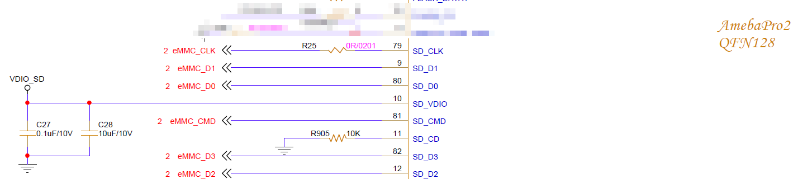
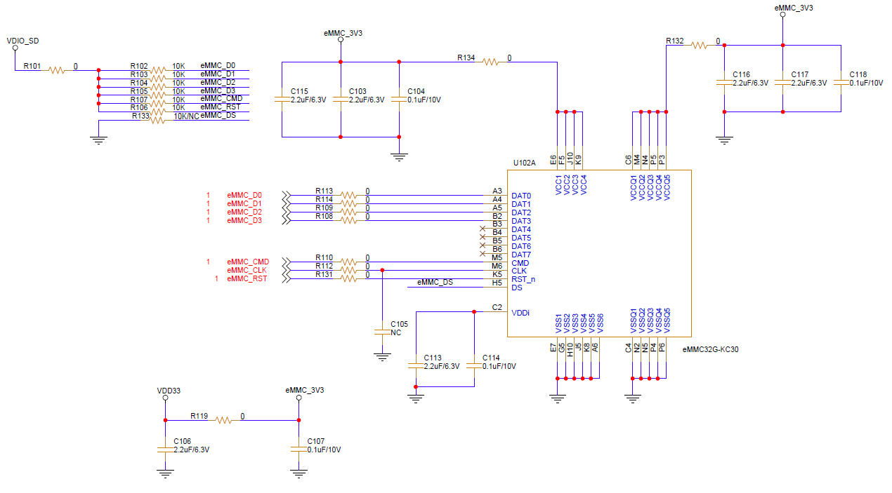

.. tags:: AMB82-mini, hardware, EMMC

Is it possiable to use EMMC for Ameba Pro2 IC, when not using SDIO
==================================================================

For example, there is no need for any SD card connections.

**Answer**

Ameba Pro2 family IC chips is able to use EMMC to replace the SDIO connections. Please refer to the following hardware example of EMMC connections.

|image01|

|image02|

