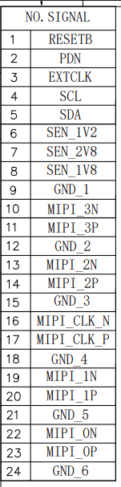
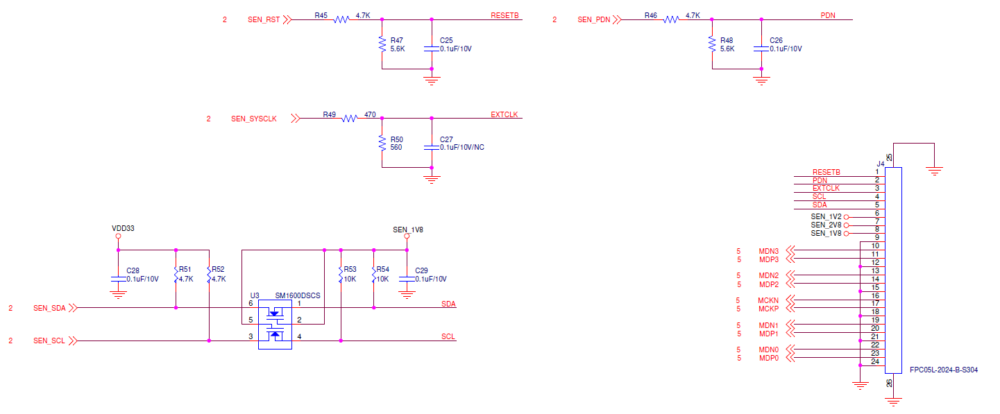

.. tags:: amb82-mini, hardware, mipi, camera, sensor, f37

What is the mipi connection for AMB82-mini (Ameba-pro2)?
========================================================

Ameba Pro2 uses a 4 line MIPI CSI-2 connection design. Refer to `mipi alliance <https://www.mipi.org/specifications/csi-2>`_

**Answer**

Please refer to camera sensor F37 pinout for MIPI conneciton to AMB82-mini.

|image01|

Also foe detial hardware connections to the Ameba-pro2 module please refer to the following images.

|image02|

|image03|

