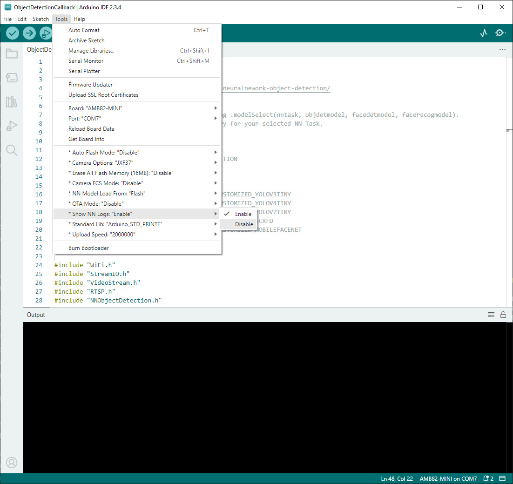

.. tags:: Neural Network, AMB82-mini

Is it possible to disable the continuously looping logs (e.g. YOLOv4t tick) in Neural Network examples?
============================================================================================================

**Answer**

Yes, it is possible. 

Navigate to "Tools" -> "Show NN Logs" -> "Disable". It is set to "Enable" by default.

|image01|

