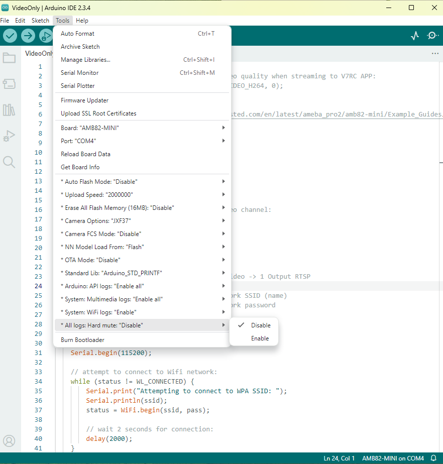

.. tags:: multimedia, neural network, log system, amb82-mini

How can I control debug logs?
===============================

**Answer**

**1. Arduino API logs**

Navigate to "Tools" -> "Arduino: API logs".

Options:

- Enable all (Default)
    - Activates all available Arduino API logs, including error, info, and debug messages.
    - For development and troubleshooting.

- Error logs
    - Displays only error messages.

- Info logs
    - Displays general informational messages.

- Disable all
    - Turns off all Arduino API logs.

|image01|

**2. Multimedia Logs**

Navigate to "Tools" -> "System: Multimedia logs".

Options:

- Enable all (Default)
    - Enables all multimedia logs.

- Video/OSD logs only
    - Enables logs for Video and OSD components only.

- NN/OSD logs only
    -  Enables logs for Neural Network (NN) and OSD components only.

- Disable all
    - Turns off NN, Video, and OSD logs.
    - You can add your own custom debug logs if needed.

|image02|

**3. WiFi Driver Logs**

Navigate to "Tools" -> "System: WiFi logs".

- Enable (Default)
    - Turns on WiFi driver logging.

- Disable
    - Turns off WiFi driver logging.

|image03|

**4. Hard Mute Logs**

Navigate to "Tools" -> "All logs: Hard Mute".

Options:

- Disable (Default) 
    - Keeps the logging system active.

- Enable
    - Completely disables all logs, including printf.
    - Not recommended if you still need debugging capabilities.

|image04|

.. |image01| image:: ../_static/FAQ/disable_logs/image01.png
   :width:  885 px
   :height:  922 px
.. |image02| image:: ../_static/FAQ/disable_logs/image02.png
   :width:  1263 px
   :height:  1028 px
   :scale: 80%
.. |image03| image:: ../_static/FAQ/disable_logs/image03.png
   :width:  892 px
   :height:  918 px
