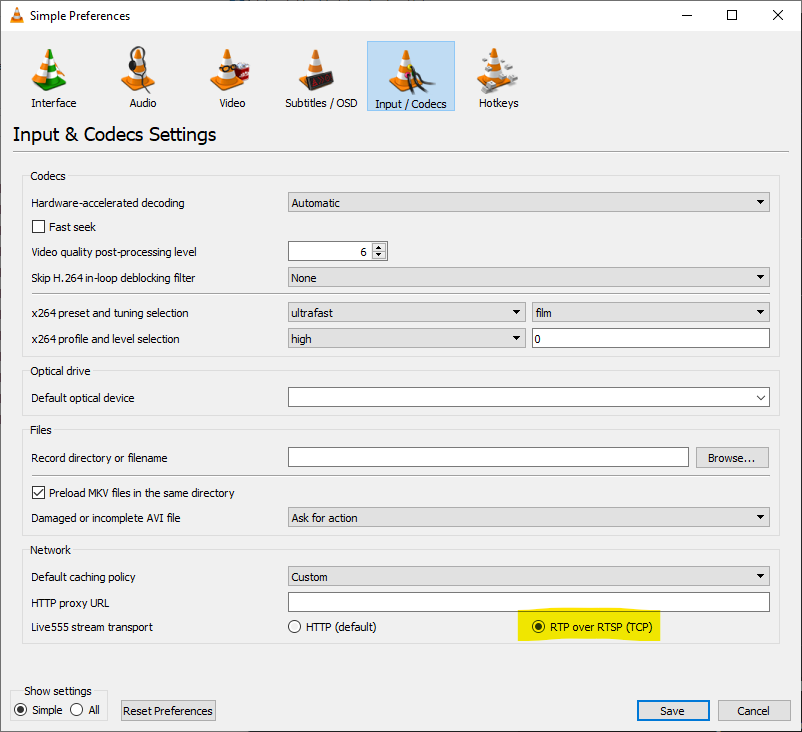

.. tags:: video streaming, rtsp, amb82-mini

What should I do if "skb_unavailable={number} in last 2 seconds" warnings keep appearing during video streaming?
================================================================================================================

**Answer**

You will see this warning because the application that you are running requires high throughput and the driver is waiting for an available socket buffer to store the next incoming packet. If too many packets are coming in (overloading), this warning will appear.

To avoid having this warning, switch to TCP for video streaming. 

|image01|

|image02|

