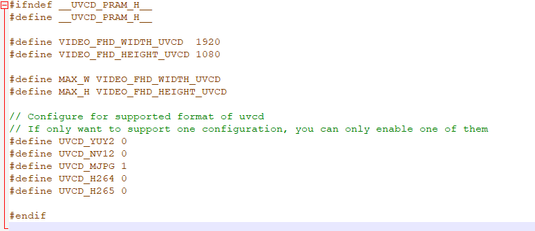

.. tags:: amb82-mini, wifi, usb

How to ensure AMB82-mini is detected as USB webcam?
===================================================

**Answer**

Please make sure that you are running the USB UVCD example and have modified the ``UVCD_pram.h`` accordingly.

|image01|

