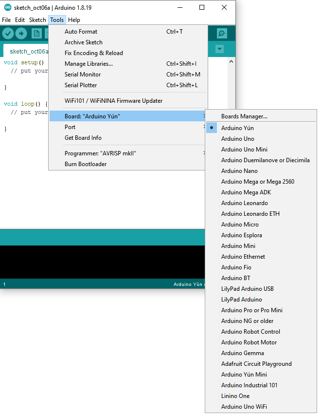
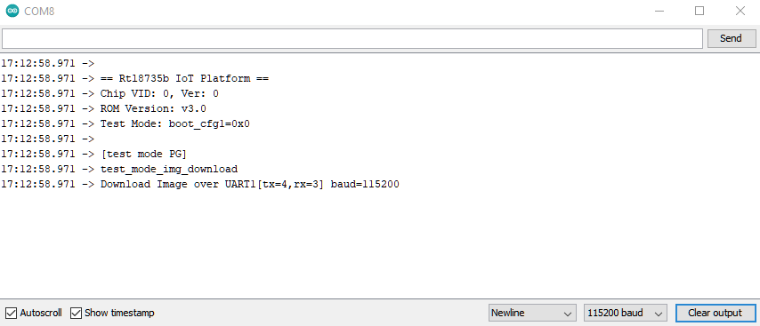

Ameba ARDUINO with AMB82-mini (RTL8735B)
========================================

.. contents::
  :local:
  :depth: 2

Introduction
------------

Ameba is an easy-to-program platform for developing all kinds of IoT applications. AMB82 MINI is equipped with various peripheral interfaces, including WiFi, BLE, GPIO INT, I2C, UART, SPI, PWM, ADC. Through these interfaces, AMB82 MINI can connect with electronic components such as LED, switches, manometer, hygrometer, PM2.5 dust sensors, …etc. Besides, AMB82 MINI has 3 key features, Audio codec, Video codec and NN (build in NPU for AIoT). The collected data can be uploaded via WiFi and be utilized by applications on smart devices to realize IoT implementation.

AMB82 mini is connected to the open-source world by one of the widest development environments, Arduino. For more information, HDK, SDK, API documents, Example Guides and so on, refer to `Ameba Arduino SDK page <https://www.amebaiot.com/en/ameba-arduino-summary/>`_

|image01|

AMB82 MINI uses Micro USB to supply power, which is common in many smart devices.

Please refer to the following figure and table for the pin diagram and functions.

|image02|

+--------+----------+----------+---------+---------+------------+-----------+-----------+----------+---------------+
|        | **GPIO** | **GPIO** | **ADC** | **PWM** | **UART**   | **SPI**   | **I2C**   | **SWD**  | **LED**       |
|        | **pin**  | **INT**  |         |         |            |           |           |          |               |
+========+==========+==========+=========+=========+============+===========+===========+==========+===============+
| **0**  | PF5      | ✓        |         |         |            | SPI1_MISO |           |          |               |
+--------+----------+----------+---------+---------+------------+-----------+-----------+----------+---------------+
| **1**  | PF6      | ✓        |         | ✓       |            | SPI1_SCLK |           |          |               |
+--------+----------+----------+---------+---------+------------+-----------+-----------+----------+---------------+
| **2**  | PF7      | ✓        |         | ✓       |            | SPI1_MOSI |           |          |               |
+--------+----------+----------+---------+---------+------------+-----------+-----------+----------+---------------+
| **3**  | PF8      | ✓        |         | ✓       |            | SPI1_SS   |           |          |               |
+--------+----------+----------+---------+---------+------------+-----------+-----------+----------+---------------+
| **4**  | PF11     | ✓        |         | ✓       |            |           |           |          |               |
+--------+----------+----------+---------+---------+------------+-----------+-----------+----------+---------------+
| **5**  | PF12     | ✓        |         | ✓       |            |           |           |          |               |
+--------+----------+----------+---------+---------+------------+-----------+-----------+----------+---------------+
| **6**  | PF13     | ✓        |         | ✓       |            |           |           |          |               |
+--------+----------+----------+---------+---------+------------+-----------+-----------+----------+---------------+
| **7**  | PF14     | ✓        |         | ✓       |            |           |           |          |               |
+--------+----------+----------+---------+---------+------------+-----------+-----------+----------+---------------+
| **8**  | PF15     | ✓        |         | ✓       |            |           |           |          |               |
+--------+----------+----------+---------+---------+------------+-----------+-----------+----------+---------------+
| **9**  | PF2      | ✓        | A2      |         |            |           | I2C1_SDA  |          |               |
+--------+----------+----------+---------+---------+------------+-----------+-----------+----------+---------------+
| **10** | PF1      | ✓        | A1      |         |            |           | I2C1_SCL  |          |               |
+--------+----------+----------+---------+---------+------------+-----------+-----------+----------+---------------+
| **11** | PF0      | ✓        | A0      |         |            |           |           |          |               |
+--------+----------+----------+---------+---------+------------+-----------+-----------+----------+---------------+
| **12** | PE4      | ✓        |         |         |            | SPI_SS    | I2C_SDA   |          |               |
+--------+----------+----------+---------+---------+------------+-----------+-----------+----------+---------------+
| **13** | PE3      | ✓        |         |         |            | SPI_MOSI  | I2C_SCL   |          |               |
+--------+----------+----------+---------+---------+------------+-----------+-----------+----------+---------------+
| **14** | PE2      | ✓        |         |         | SERIAL3_RX | SPI_MISO  |           |          |               |
+--------+----------+----------+---------+---------+------------+-----------+-----------+----------+---------------+
| **15** | PE1      | ✓        |         |         | SERIAL3_TX | SPI_SCLK  |           |          |               |
+--------+----------+----------+---------+---------+------------+-----------+-----------+----------+---------------+
| **16** | PD18     | ✓        |         |         |            |           |           |          |               |
+--------+----------+----------+---------+---------+------------+-----------+-----------+----------+---------------+
| **17** | PD17     | ✓        |         |         |            |           |           |          |               |
+--------+----------+----------+---------+---------+------------+-----------+-----------+----------+---------------+
| **18** | PD16     | ✓        |         |         | SERIAL2_RX |           |           |          |               |
+--------+----------+----------+---------+---------+------------+-----------+-----------+----------+---------------+
| **19** | PD15     | ✓        |         |         | SERIAL2_TX |           |           |          |               |
+--------+----------+----------+---------+---------+------------+-----------+-----------+----------+---------------+
| **20** | PD14     | ✓        |         |         |            |           |           |          |               |
+--------+----------+----------+---------+---------+------------+-----------+-----------+----------+---------------+
| **21** | PA2      | ✓        | A6      |         | SERIAL1_TX |           |           |          |               |
+--------+----------+----------+---------+---------+------------+-----------+-----------+----------+---------------+
| **22** | PA3      | ✓        | A7      |         | SERIAL1_RX |           |           |          |               |
+--------+----------+----------+---------+---------+------------+-----------+-----------+----------+---------------+
| **23** | PF9      | ✓        |         | ✓       |            |           |           |          | LED_BUILTIN / |
|        |          |          |         |         |            |           |           |          | LEB_B (blue)  |
+--------+----------+----------+---------+---------+------------+-----------+-----------+----------+---------------+
| **24** | PE6      | ✓        |         |         |            |           |           |          | LED_G (green) |
+--------+----------+----------+---------+---------+------------+-----------+-----------+----------+---------------+
| **25** | PF4      | ✓        |         |         | LOG_TX     |           |           |          |               |
+--------+----------+----------+---------+---------+------------+-----------+-----------+----------+---------------+
| **26** | PF3      | ✓        | \*A3    |         | LOG_RX     |           |           |          |               |
+--------+----------+----------+---------+---------+------------+-----------+-----------+----------+---------------+
| **27** | PA1      | ✓        | A5      |         |            |           | I2C2_SDA  | SWD_CLK  |               |
+--------+----------+----------+---------+---------+------------+-----------+-----------+----------+---------------+
| **28** | PA0      | ✓        | A4      |         |            |           | I2C2_SCL  | SWD_DATA |               |
+--------+----------+----------+---------+---------+------------+-----------+-----------+----------+---------------+
| **29** | PF10     | ✓        |         |         |            |           |           |          |               |
+--------+----------+----------+---------+---------+------------+-----------+-----------+----------+---------------+

Set up developing environment
-----------------------------

Step 1. OS environment
~~~~~~~~~~~~~~~~~~~~~~

AMB82 MINI board currently supports Windows OS 64-bits (Windows 10 and above), Linux OS (Ubuntu22 and above) and MacOS (Intel and Apple Silicon). To have the best experiences, please use the latest version of OS.

For any Linux OS (Ubuntu) related issues, refer to https://forum.amebaiot.com/t/ubuntu-linux-environment/2259.

For any macOS related issues, refer to https://forum.amebaiot.com/t/macos-environment/2260.

Step 2. Installing the Driver
~~~~~~~~~~~~~~~~~~~~~~~~~~~~~

First, connect AMB82 MINI to the computer via Micro USB:

|image03|

If this is the first time connects board to computer, the USB driver for board will be automatic installed.

If you have driver issue of connect board to computer please go to http://www.wch-ic.com/downloads/CH341SER_ZIP.html for USB driver.

Check the COM port number in Device Manager of computer:

|image04|

Step 3. Set up Arduino IDE
~~~~~~~~~~~~~~~~~~~~~~~~~~~~~

From version 1.6.5, Arduino IDE supports third-party hardware. Therefore, we can use Arduino IDE to develop applications, and the Arduino basic examples are supported. Arduino IDE can be downloaded in the Arduino website: https://www.arduino.cc/en/Main/Software

When the installation is finished, open Arduino IDE. To set up correctly in Arduino IDE, go to “File” -> “Preferences”

|image05|

And paste the following URL into “Additional Boards Manager URLs” field: https://github.com/ambiot/ambpro2_arduino/raw/main/Arduino_package/package_realtek.com_amebapro2_index.json

Next, go to “Tools” -> “Board” -> “Boards Manager”:

|image06|

The “Boards Manager” requires about 10~20 seconds to refresh all hardware files (if the network is in bad condition, it may take longer).

Every time the new hardware is connected, we need to reopen the Board Manager. Find “Realtek Ameba Boards” in the list, click “Install”, then the Arduino IDE starts to download required files.

|image07|

After the installation tool running successfully, you may open Arduino IDE and proceed to “tools” -> “Board“ -> “Boards Manager…”. Try to find “Realtek Ameba Boards” in the list, click “Install”, then the Arduino IDE starts to download required files.

Finally, we select board in “tools” -> “Board” -> “AmebaPro2 ARM (32-bits) Boards” -> “AMB82-MINI”

|image08|

Try the First Example
---------------------

Step 1. Selection Ameba Modes
~~~~~~~~~~~~~~~~~~~~~~~~~~~~~

There are many different Modes for user to select for different settings of compile and upload. Please refer to the following picture and table.

|image09|

+----------------------------------+------------------------------------------+-------------+
| **Mode Name**                    | **Usage**                                | **Remarks** |
+==================================+==========================================+=============+
| \* Erase All Flash Memory (16MB) | -  Erase only. Erase entire flash.       |             |
|                                  |                                          |             |
|                                  | -  Erase then Upload. Erase entire flash |             |
|                                  |    then upload the current application.  |             |
|                                  |                                          |             |
|                                  | -  Disable. Disable this option.         |             |
+----------------------------------+------------------------------------------+-------------+
| \* Auto Flash Mode               | -  Enable. Avoid manual process when     |             |
|                                  |    uploading.                            |             |
|                                  |                                          |             |
|                                  | -  Disable. Disable this option.         |             |
+----------------------------------+------------------------------------------+-------------+
| \* Standard Lib                  | -  Arduino_STD_PRINTF. Choose the        |             |
|                                  |    standard library function for compile |             |
|                                  |    and upload.                           |             |
|                                  |                                          |             |
|                                  | -  Disable. No standard library          |             |
|                                  |    function.                             |             |
+----------------------------------+------------------------------------------+-------------+
| \* Upload Speed                  | -  Different upload baud rate to select. |             |
|                                  |    The default is 2000000.               |             |
+----------------------------------+------------------------------------------+-------------+

Step 2. Compile
~~~~~~~~~~~~~~~

Arduino IDE provides many built-in examples, which can be compiled, uploaded, and run directly on the boards. Here, we take the “Blink” example as the first try.

Open “File” -> “Examples” -> “01.Basics” -> “Blink”:

|image10|

Arduino IDE opens a new window with the complete sample code.

Next, we compile the sample code directly; click “Sketch” -> “Verify/Compile”

Arduino IDE prints the compiling messages in the bottom area of the IDE window. When the compilation is finished, you will get the message as following.

|image11|

Afterwards, we will upload the compiled code to board.

Step 3. Upload
~~~~~~~~~~~~~~

Please make sure board is connected to computer, then click “Sketch” -> “Upload”.

The Arduino IDE will compile first then upload. Users are required to enter the upload mode of the board. To enter upload mode, first press and hold the UART_DOWNLOAD button, then press and release the RESET button, lastly release the UART_DOWNLOAD button.

Additionally, if the board has the hardware updates and enabled “Auto Flash Mode”, please ignore above instruction.

|image12|

It is optional for users to check if the board entered the upload mode. Open serial monitor/terminal and check the following information,.

|image13|

When upload completed, the “Done uploading” message is printed.

Step 4. Run the Blink example
~~~~~~~~~~~~~~~~~~~~~~~~~~~~~

In each example, Arduino not only provides sample code, but also detailed documentation, including wiring diagram, sample code explanation, technical details, …etc. Please refer the detailed information of the Blink example: https://www.arduino.cc/en/Tutorial/Blink

In short, this example makes on-board LED blinks.

|image14|

Video Tutorials and Demos
-------------------------

YouTube Channel:

- `AMB82 Mini: Start Here! <https://youtube.com/playlist?list=PLEQfNjOZQRyP1dyegDVYqgw53_AORspMK&feature=shared>`_

- `AMB82 Mini Tutorials <https://youtube.com/playlist?list=PLEQfNjOZQRyPnmXCuRqE1f5au2HT4E9CP&feature=shared>`_

- `AMB82 Mini 教程 <https://youtube.com/playlist?list=PLEQfNjOZQRyOxXFV7X_2fIcnd_J6VBmyM&feature=shared>`_

- `AMB82 mini Maker Projects <https://youtube.com/playlist?list=PLEQfNjOZQRyPWhySw16ZgBOPWnzLWDAjz&feature=shared>`_

- `BiliBili Channel <https://space.bilibili.com/457777430>`_

Useful Links
------------

- `Ameba Arduino SDK page <https://www.amebaiot.com/en/ameba-arduino-summary/>`_

- `Forum <https://forum.amebaiot.com/>`_

- `FAQ <https://forum.amebaiot.com/t/welcome-to-ameba-faq/1748>`_

- `Facebook Group Chinese <https://www.facebook.com/groups/AmebaIoT>`_

- `Facebook Group English <https://www.facebook.com/groups/amebaioten>`_

.. |image03| image:: ../_static/Getting_Started/Getting_Started_with_AMB82-mini/image03.png
   :width:  687 px
   :height:  671 px

.. |image05| image:: ../_static/Getting_Started/Getting_Started_with_AMB82-mini/image05.png
   :width:  478 px
   :height:  587 px

.. |image09| image:: ../_static/Getting_Started/Getting_Started_with_AMB82-mini/image09.png
   :width:  476 px
   :height:  588 px

