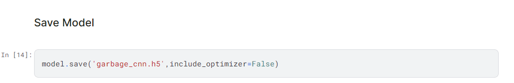
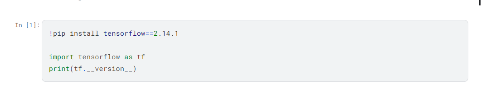

AI related Guides
=================

.. contents::
  :local:
  :depth: 2

Online AI Model Conversion Guide
--------------------------------

+-----------------------+-----------------------+----------------------+
| **Models**            | **Basic functions**   | **Required files**   |
+=======================+=======================+======================+
| yolov3-tiny, darknet  | Object Detection      | “.cfg”, “.weights”   |
+-----------------------+-----------------------+----------------------+
| yolov4-tiny, darknet  | Object Detection      | “.cfg”, “.weights”   |
+-----------------------+-----------------------+----------------------+
| yolov7-tiny, darknet  | Object Detection      | “.cfg”, “.weights”   |
+-----------------------+-----------------------+----------------------+
| yolov7-tiny, pytorch  | Object Detection      | “.pt”                |
+-----------------------+-----------------------+----------------------+
| scrfd/mobilefacenet   | Face Detection &      | “.pt” or “.onnx”     |
|                       | Recognition           |                      |
+-----------------------+-----------------------+----------------------+
| yamnet                | Sound Classification  | “.h5”                |
+-----------------------+-----------------------+----------------------+
| CNN Gray/RGB          | Image Classification  | “.h5” or “.onnx”     |
+-----------------------+-----------------------+----------------------+

| The quantize images are optional for uploading that up to 10.
| For CNN Gray/RGB, please refer to the following instructions to get
  correct converted models.

-  When training model: supported tensorflow version up to 2.14.1

|image01|

-  When saving model: set flag as “include_optimizer=False”

|image02|

After AI Model Conversion, there will be download link send out by
email.

| For more information, please refer to the Customized AI model
  Installation Guide
| at `https://www.amebaiot.com/en/ameba-arduino-summary/ <https://www.amebaiot.com/ameba-arduino-summary>`__.

| Please refer to AMB82 MobileFaceNet Convert To ONNX
  at `https://www.amebaiot.com/en/amebapro2-mobilefacenet-convert-to-onnx/ <https://www.amebaiot.com/amebapro2-mobilefacenet-convert-to-onnx>`__.
| Please refer to AMB82 SCRFD Convert To ONNX
  at `https://www.amebaiot.com/en/amebapro2-scrfd-convert-to-onnx/ <https://www.amebaiot.com/amebapro2-scrfd-convert-to-onnx>`__.

