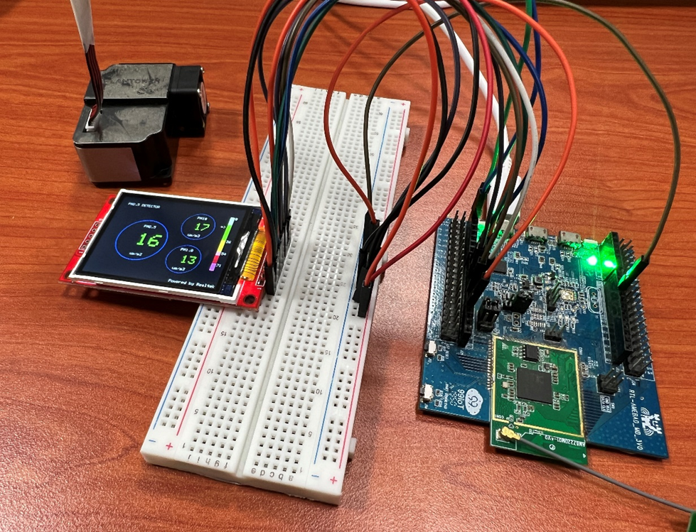
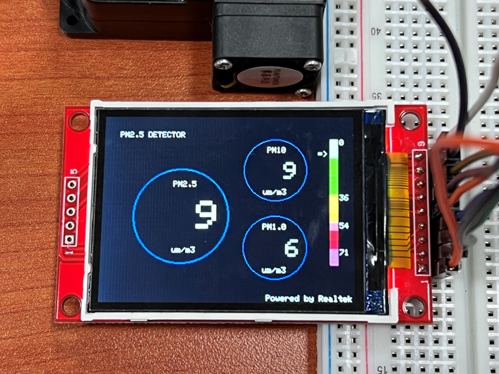

SPI - Show PM2.5 Concentration on ILI9341 TFT LCD
==================================================

.. contents::
  :local:
  :depth: 2

If you are not familiar with SPI, please read `Introduction to
SPI <https://www.amebaiot.com/spi-intro/>`_ first.

Materials
---------

- AmebaD [AMB21 / AMB22 / AMB23 / AMB25 / AMB26 / BW16 / AW-CU488 Thing Plus] x 1

- ILI9341 TFT LCD with SPI interface x 1

- PlanTower PMS3003 or PMS5003 x 1

This example extends previous PM2.5 example to show the PM2.5 concentration on the LCD.

**QVGA 2.2″ TFT LCD Wiring Diagrams**

.. only:: amb21

|image01|

.. only:: end amb21  

.. only:: amb23
    
|image02|

.. only:: end amb23 

.. only:: amb25
    
|image06|

.. only:: end amb25 

.. only:: amb26
    
|image07|

.. only:: end amb26 

.. only:: bw16-typeb
    
|image03|

.. only:: end bw16-typeb

.. only:: bw16-typec
    
|image04|

.. only:: end bw16-typec

.. only:: aw-cu488

|image05|

.. only:: end aw-cu488 

**Adafruit 2.8″ TFT LCD touch shield Wiring Diagrams**

.. only:: amb21

|image08|

.. only:: end amb21  

.. only:: amb23
    
|image09|

.. only:: end amb23 

.. only:: amb25
    
|image13|

.. only:: end amb25 

.. only:: amb26
    
|image14|

.. only:: end amb26 

.. only:: bw16-typeb
    
|image10|

.. only:: end bw16-typeb

.. only:: bw16-typec
    
|image11|

.. only:: end bw16-typec

.. only:: aw-cu488

|image12|

.. only:: end aw-cu488

Open the example, “Files” → “Examples” → “AmebaSPI” → “ILI9341_TFT_LCD_PM2.5”

|image15|

Compile and upload to Ameba, then press the reset button.

Then you can see the concentration value of PM1.0, PM2.5 and PM10 on the LCD.

|image16|

|image17|

Code Reference
---------------
In this example, first rotate the screen by 90 degrees, and draw the static components such as the circles, the measuring scale, and the title text. After the concentration value is detected, it is printed inside the circle.

.. |image06| image:: ../../../_static/amebad/Example_Guides/SPI/SPI_Show_PM2.5_Concentration_On_ILI9341_LCD/image06.png
   :width: 773 px
   :height: 375 px

.. |image12| image:: ../../../_static/amebad/Example_Guides/SPI/SPI_Show_PM2.5_Concentration_On_ILI9341_LCD/image12.png
   :width: 565 px
   :height: 389 px

