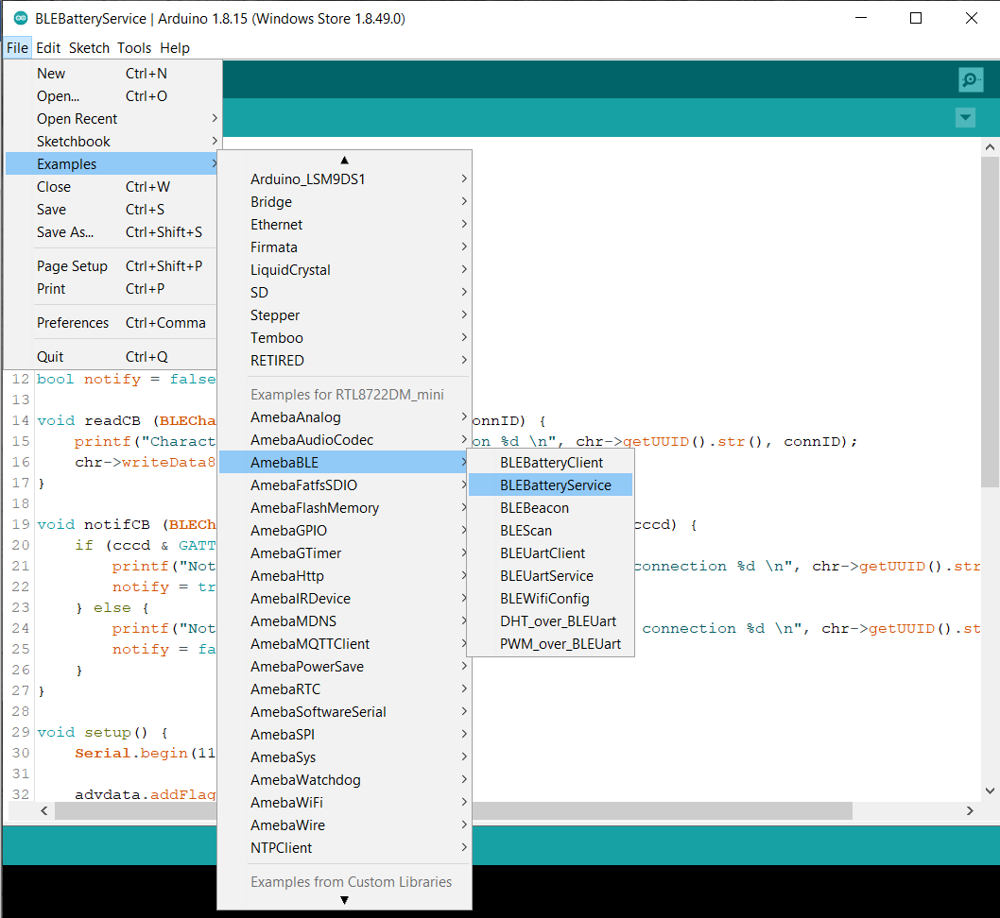
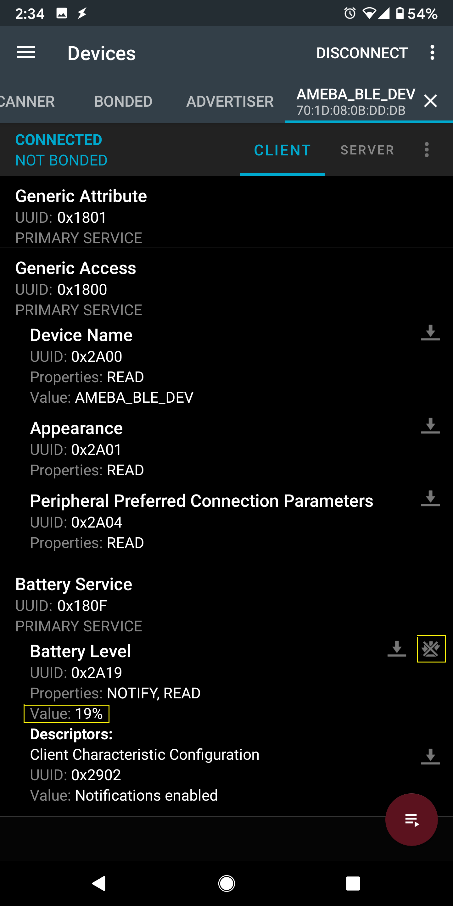

BLE - BLE Battery Service
=========================

.. contents::
  :local:
  :depth: 2

Materials
---------

- AmebaD [AMB21 / AMB22 / AMB23 / AMB25 / AMB26 / BW16 / AW-CU488 Thing Plus] x 1

- Android / iOS mobile phone

Example
-------

Introduction
~~~~~~~~~~~~

BLE connections use a server client model. The server contains the data of interest, while the client connects to the server to read the data. Commonly, a Bluetooth peripheral device acts as a server, while a Bluetooth central device acts as a client. Servers can contain many services, with each service containing a some set of data. Clients can send requests to read or write some data and can also subscribe to notifications so that the server can send data updates to a client.

In this example, a basic battery service is set up on the Ameba Bluetooth stack. A mobile phone is used to connect to the Ameba peripheral device and read the battery data.

Procedure
~~~~~~~~~

Ensure that the following Bluetooth apps are installed on your mobile phone. These apps will show you the raw data sent by Ameba and allow you to interact with the data.
The recommended application is nRF connect, and is available at the links below:

- Android: https://play.google.com/store/apps/details?id=no.nordicsemi.android.mcp

- iOS: https://apps.apple.com/us/app/nrf-connect/id1054362403
  
LightBlue is an alternative application that can also be used, but has less features:

- Android: https://play.google.com/store/apps/details?id=com.punchthrough.lightblueexplorer

- iOS: https://apps.apple.com/us/app/lightblue/id557428110

Open the example, ``“Files” → “Examples” → “AmebaBLE” → “BLEBatteryService”``

|image01|

Upload the code and press the reset button on Ameba once the upload is finished. 
On your mobile phone, open the Bluetooth app and scan for the Bluetooth signal broadcast by Ameba, it should appear as a device named “AMEBA_BLE_DEV”.

|image02|

Connect to the Ameba Bluetooth device, and a list of available services should appear. Click on the battery service to expand it, and you can see the battery level data value. The arrows highlighted in the box on the right are used to read data and subscribe to notifications. Click on the single arrow to read the battery level value, and a 90% value will appear.

|image03|

Click on the triple arrow to subscribe to updates on the battery level value, and the battery value will start updating by itself.

|image04|

The serial monitor will show the sketch increasing the battery level every second. When you click on either of the arrows, the sketch running on the Ameba will be notified, and will print out the action taken.

|image05|

Code Reference
--------------

BLEService and BLECharacteristic classes are used to create and define the battery service to run on the Bluetooth device.

``BLE.configAdvert()->setAdvType(GAP_ADTYPE_ADV_IND)`` is used to set the advertisement type to a general undirected advertisement that allows for connections.

``setReadCallback() and setCCCDCallback()`` is used to register functions that will be called when the battery level data is read, or notification is enabled by the user.

``BLE.configServer(1)`` is used to tell the Bluetooth stack that there will be one service running.

``addService()`` registers the battery service to the Bluetooth stack.

.. |image02| image:: ../../../../_static/amebad/Example_Guides/BLE/BLE_Battery_Service/image02.png
   :width:  1440 px
   :height:  2880 px
   :scale: 30%
.. |image03| image:: ../../../../_static/amebad/Example_Guides/BLE/BLE_Battery_Service/image03.png
   :width:  1440 px
   :height:  2880 px
   :scale: 30%

.. |image05| image:: ../../../../_static/amebad/Example_Guides/BLE/BLE_Battery_Service/image05.png
   :width:  749 px
   :height:  509 px
