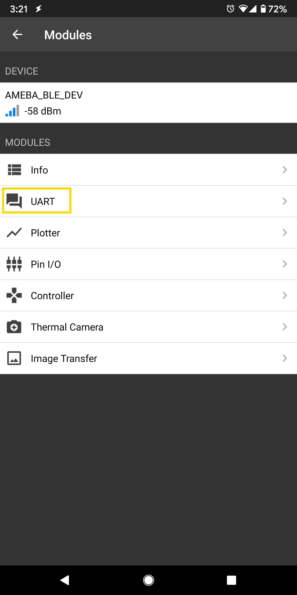

BLE - DHT over BLE UART
=======================

Materials
---------

- AmebaD [AMB21 / AMB22 / AMB23 / AMB25 / AMB26 / BW16 / AW-CU488 Thing Plus] x 1

- Android / iOS mobile phone

Example
-------

Introduction
~~~~~~~~~~~~

In this example, the data obtained from a DHT temperature and humidity sensor are transmitted over a BLE UART service to a smartphone. Refer to the other examples for detailed explanations of using the DHT sensor and the BLE UART service.

Procedure
~~~~~~~~~

Take note that if you are using a DHT sensor that is not mounted on a PCB, you will have to add in a 10K Ohm pull up resistor.

Connect the DHT sensor to the Ameba board following the diagram.

.. only:: amb21

**AMB21 / AMB22:**

|image01|

.. only:: end amb21

.. only:: amb23

**AMB23:**

|image02|

.. only:: end amb23

.. only:: bw16-typeb

**BW16:**

|image03|

.. only:: end bw16-typeb

.. only:: bw16-typec

**BW16-TypeC:**

|image04|

.. only:: end bw16-typec

.. only:: aw-cu488

**AW-CU488 Thing Plus:**

|image05|

.. only:: end aw-cu488

.. only:: amb25

**AMB25:**

|image06|

.. only:: end amb25

.. only:: amb26

**AMB26:**

|image06|

.. only:: end amb26

Ensure that a compatible BLE UART app is installed on your smartphone,
it is available at:

- Google Play Store:

https://play.google.com/store/apps/details?id=com.adafruit.bluefruit.le.connect

https://play.google.com/store/apps/details?id=de.kai_morich.serial_bluetooth_terminal

- Apple App Store:

https://apps.apple.com/us/app/bluefruit-connect/id830125974

Open the example, :guilabel:`Files -> Examples -> AmebaBLE -> DHT_over_BLEUart`

|image07|

Upload the code and press the reset button on Ameba once the upload is finished.
Open the app on your smartphone, scan and connect to the Ameba board shown as "AMEBA_BLE_DEV" and choose the UART function in the app.

|image08|

|image09|

After starting the UART function, notifications should be received every 5 seconds containing the measured temperature and humidity.

|image10|

.. |image01| image:: ../../../../_static/amebad/Example_Guides/BLE/BLE_DHT_over_BLE_UART/image01.png
   :width:  943 px
   :height:  762 px

.. |image03| image:: ../../../../_static/amebad/Example_Guides/BLE/BLE_DHT_over_BLE_UART/image03.png
   :width:  935 px
   :height:  692 px
.. |image04| image:: ../../../../_static/amebad/Example_Guides/BLE/BLE_DHT_over_BLE_UART/image04.png
   :width:  863 px
   :height:  731 px
.. |image05| image:: ../../../../_static/amebad/Example_Guides/BLE/BLE_DHT_over_BLE_UART/image05.png
   :width:  591 px
   :height:  792 px

.. |image08| image:: ../../../../_static/amebad/Example_Guides/BLE/BLE_DHT_over_BLE_UART/image08.png
   :width:  1440 px
   :height:  2880 px
   :scale: 30%

.. |image10| image:: ../../../../_static/amebad/Example_Guides/BLE/BLE_DHT_over_BLE_UART/image10.png
   :width:  1440 px
   :height:  2880 px
   :scale: 30%
