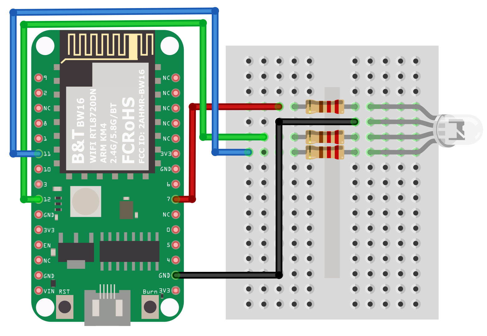
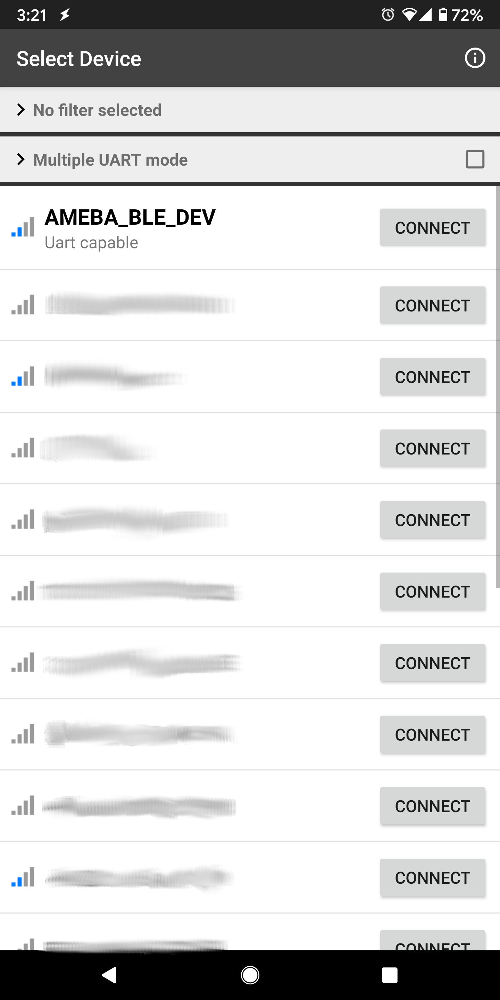

BLE - PWM over BLE UART
=======================

.. contents::
  :local:
  :depth: 2

Materials
---------

- AmebaD [AMB21 / AMB22 / AMB23 / AMB25 / AMB26 / BW16 / AW-CU488 Thing Plus] x 1

- RGB LED

- Android / iOS smartphone

Example
-------

Introduction
~~~~~~~~~~~~

In this example, a smartphone app is used to transmit commands over BLE UART to control the PWM outputs and change the color of a RGB LED. Refer to the other example guides for detailed explanations of the BLE UART service.

Procedure
~~~~~~~~~

Connect the RGB LED to the AmebaD board following the diagram, the common LED pin may need to connect to 3.3V or GND depending on the type of LED (common anode / common cathode).
   
.. only:: amb21

**AMB21 / AMB22:**

|image01|

.. only:: end amb21

.. only:: amb23

**AMB23:**

|image02|

.. only:: end amb23

.. only:: bw16-typeb

**BW16:**

|image03|

.. only:: end bw16-typeb

.. only:: bw16-typec

**BW16-TypeC:**

|image04|

.. only:: end bw16-typec

.. only:: aw-cu488

**AW-CU488 Thing Plus:**

|image05|

.. only:: end aw-cu488

.. only:: amb25

**AMB25:**

|image06|

.. only:: end amb25

.. only:: amb26

**AMB26:**

|image06|

.. only:: end amb26

Ensure that the required app is installed on your smartphone, it is available at:

- Google Play Store:

https://play.google.com/store/apps/details?id=com.adafruit.bluefruit.le.connect

- Apple App Store:

https://apps.apple.com/us/app/bluefruit-connect/id830125974

Open the example, "Files" -> "Examples" -> “AmebaBLE” -> “PWM_over_BLEUart”. 

Upload the code and press the reset button on Ameba once the upload is finished. 

|image07|

Open the app on your smartphone, scan and connect to the board shown as “AMEBA_BLE_DEV” and choose the controller -> color picker function in the app. 

|image08|

|image09|

|image10|

Using the color selection wheel, saturation, and brightness sliders, choose a desired color and click select to send the RGB values to the board. You should see the RGB LED change to the matching color. 

|image11|

Code Reference
--------------

The RGB values are sent as three consecutive bytes prefixed by “!C” characters. The “!” exclamation mark is used to indicate that the following data is a command, and the “C” character is used to indicate that the data is RGB values. The received UART message is checked in the callback function for “!C” first, otherwise it is treated as a regular message and printed to the serial terminal.

.. |image07| image:: ../../../../_static/amebad/Example_Guides/BLE/BLE_PWM_over_BLE_UART/image07.png
   :width:  682 px
   :height:  1202 px

.. |image10| image:: ../../../../_static/amebad/Example_Guides/BLE/BLE_PWM_over_BLE_UART/image10.png
   :width:  1440 px
   :height:  2880 px
   :scale: 30%

