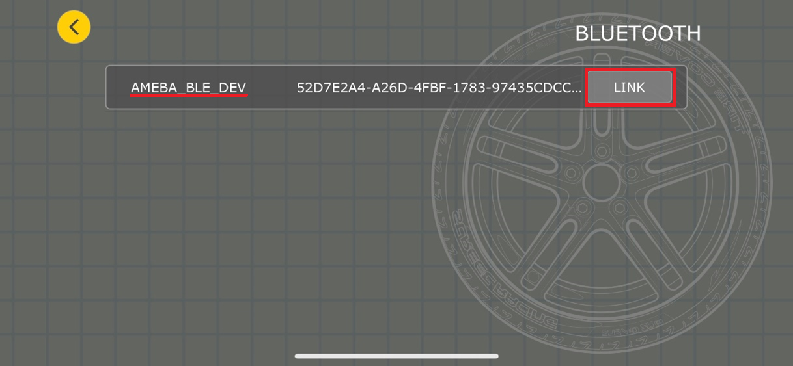

BLE - V7RC Car
==============

Materials
---------

- AmebaD [AMB21 / AMB22 / AMB23 / AMB25 / AMB26 / BW16 / AW-CU488 Thing Plus] x 1

- Android / iOS smartphone

- L9110S Servo Motor Controller x1

- TT Motor x2

Example
-------

Introduction
~~~~~~~~~~~~

In this example, we will use AmebaD as the BLE Peripheral device and the servo motor controller to communicate with the V7RC mobile app. V7RC is a remote controller APP that provides two kinds of control UI: one is 2 channels for RC cars, and the other is 4 channels for tanks and bulldozers.

Procedure
~~~~~~~~~

1.	Establish BLE Connection

Open the example, "Files" -> "Examples" -> "AmebaBLE" -> "BLEV7RC_CAR":

|image01|

Upload the code and press the reset button on Ameba once the upload is finished.

Open V7RC APP and select "Control Centre":

|image02|

Under NETWORK section, select "BLE":

|image03|

Click DEVICE, and select AMEBA_BLE_DEV and click "LINK" button to connect to your Ameba board:

|image04|

Open the Arduino serial monitor, and you should see log of AmebaD is successfully connected to mobile phone:

|image05|

Back to the V7RC home page, you can monitor the log printed data received when moving the two controller buttons indicated in the image below. Successfully data receiving indicating the BLE connection has been established:

|image06|

2.	Setup Servo Motors

We will use two sets of servo motor to control the movement of the car upon the BLE connection has been established. The two servo motors will be connected to L9110S servo controller first using predefined MotoA_1A, MotoA_1B, MotoA_1B, and MotoA_1B pins.

    -	1A pins are connected to GPIO pins, used for controlling the motor directions.

    -	1B pins are connected to PWM pins, used for controlling the motor speed.

.. code:: c++

    #define MotoA_1A  6  // Control MotorA moving Forward（HIGH）/Backward（LOW）
    #define MotoA_1B  12 // Control MotorA’s from speed 0~255, or stop (LOW)
    #define MotoB_1A    2 // Control MotorB moving Forward（HIGH）/Backward（LOW）
    #define MotoB_1B    3 // Control MotorB’s speed from 0~255, or stop (LOW)

In this example, we will use BW16 as a demonstration. A detailed connection pin map can be found below. Upon the connection being established, the user can remotely control the servo motors via the V7RC App BLE.

|image07|

Code Reference
--------------

``ParseCMDString(String cmd)`` is a customized function will take a string "cmd" as input and process it. Currently, there are 6 available commands from V7RC App, which are: "SS2","SS4","SRT","SR2", and "SRV".

.. |image02| image:: ../../../../_static/amebad/Example_Guides/BLE/BLE_V7RC_Car/image02.png
   :width:  1218 px
   :height:  563 px
   :scale: 80%

.. |image06| image:: ../../../../_static/amebad/Example_Guides/BLE/BLE_V7RC_Car/image06.png
   :width:  1379 px
   :height:  637 px
   :scale: 70%

