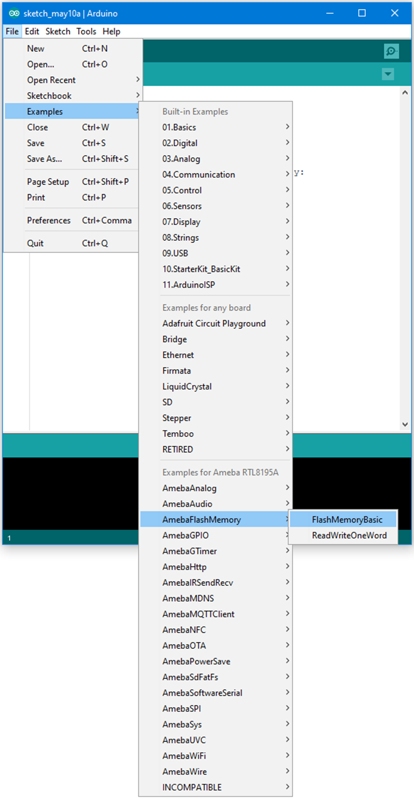
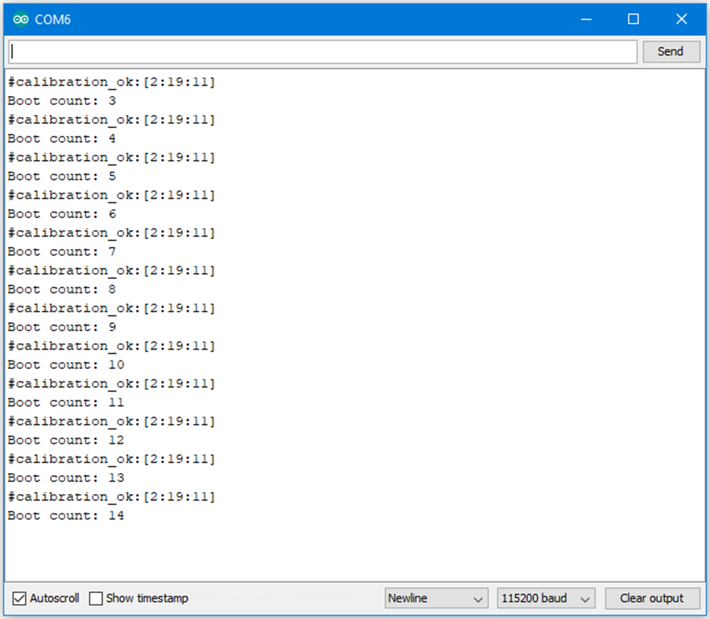

Flash Memory - Store data in FlashEEProm
========================================

Materials
---------

- AmebaD [AMB21 / AMB22 / AMB23 / AMB25 / AMB26 / BW16 / AW-CU488 Thing Plus] x 1

Example
-------

Ameba provides Flash Memory component for data storage and the data can be preserved when the power is off if necessary, e.g., compiled program. To avoid the memory space overlapped with the program on Ameba, the Flash API uses the tail part of the address space, with sector size 4K.
In this example, we store the value of boot times in flash memory. Every time Ameba reboots, it reads the boot times from flash, increases the value by 1, and writes it back to flash memory.

First open the example, "File" -> "Examples" -> "AmebaFlashMemory" -> "FlashMemoryBasic"

|image01|

Compile and upload to Ameba, then press the reset button.

Open the Serial Monitor, press the reset button for a few times. Then you can see the boot times value increases.

|image02|

Code Reference
--------------

By default, the Flash Memory API uses address 0xFF000~0xFFFFF to store data.

There is limitation when writing to flash memory. That is, you can not directly write data to the same address you used in last write. To do that correctly, you need erase the sector first. The Flash API of Ameba uses a 4K SRAM to record the user modification and do the erase/write task together.

Use ``FlashMemory.read()`` to read from Flash memory.
Use ``FlashMemory.buf[0]`` = 0x00; to manipulate the 4K buf.
Use ``FlashMemory.update();`` to update the data in buf to Flash Memory.

