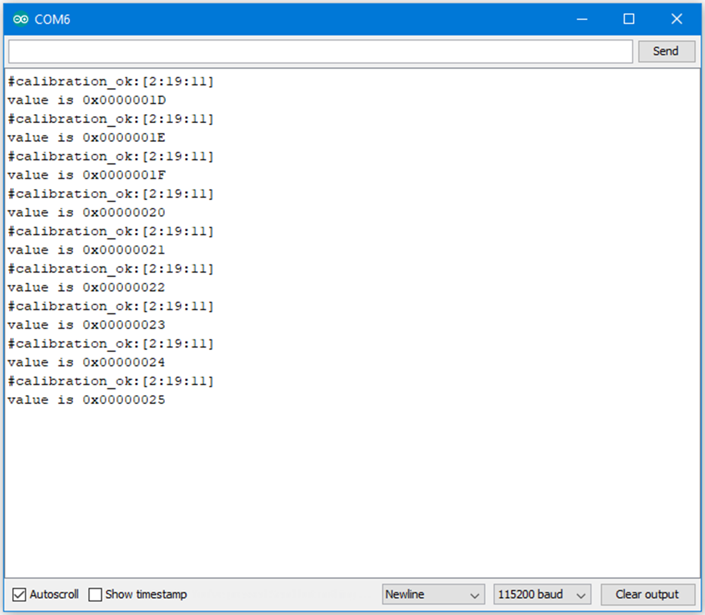

Flash Memory - Use Flash Memory Larger Than 4K
==============================================

Materials
---------

- AmebaD [AMB21 / AMB22 / AMB23 / AMB25 / AMB26 / BW16 / AW-CU488 Thing Plus] x 1

Example
-------

Flash Memory API uses memory of 4K bytes, which is normally sufficient for most application. However, larger memory can be provided by specifying a specific memory address and required size.

First, open the sample code in :guilabel:`File -> Examples -> AmebaFlashMemory -> ReadWriteOneWord`

In this example, we specify the starting address of flash memory is 0xFC000 and size is 0x4000 (The default starting address is 0xFF000 and size is 0x1000).
Then calculate correct address according to the specified offset and perform read/write operation. In the sample code we use offset 0x3F00, that is, 0xFC000 + 0x3F00 = 0xFFF00 in flash. We set the value to 0 at first, then increase by 1 every time Ameba reboots.

|image01|

Code Reference
--------------

We can use the flash api we used in previous flash memory example, but we need to use begin() function to specify the desired starting address and memory size.

.. code:: c++

    FlashMemory.begin(0xFC000, 0x4000);

Use ``readWord()`` to read the value stored in a memory address. In the example, we read the value stored in memory offset 0x3F00, that is 0xFC000 + 0x3F00 = 0xFFF00. ``readWord()`` function

.. code:: c++

    value = FlashMemory.readWord(0x3F00);

Use ``writeWord()`` to write to a memory address. The first argument is the memory offset, the second argument is the value to write to memory.

.. code-block:: C

    FlashMemory.writeWord(0x3F0C, value);

