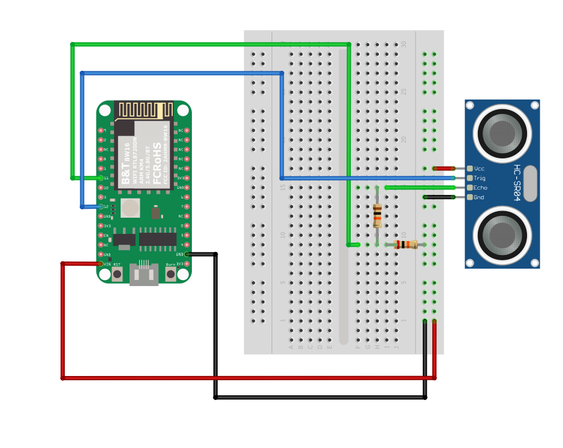

GPIO - Measure Distance By Ultrasound Module
============================================

Materials
---------

- AmebaD [AMB21 / AMB22 / AMB23 / AMB25 / AMB26 / BW16 / AW-CU488 Thing Plus] x 1

- HC-SR04 Ultrasonic x 1

- Dropping resistor or Level converter

Example
-------

Introduction
~~~~~~~~~~~~

HC-SR04 is a module that uses ultrasound to measure the distance. It looks like a pair of eyes in its appearance; therefore, it’s often installed onto robot-vehicle or mechanical bugs to be their eyes.
The way it works is that first we "toggle high" the TRIG pin (that is to pull high then pull low). The HC-SR04 would send eight 40kHz sound wave signal and pull high the ECHO pin. When the sound wave returns, it pulls low the ECHO pin.

|image01|

Assume the velocity of sound is 340 m/s, the time it takes for the sound to advance 1 cm in the air is 340*100*10^-6 = 29 us。
The sound wave actually travels twice the distance between HC-SR04 and the object, therefore the distance can be calculated by (time/29) / 2 = time / 58。
The working voltage of HC-SR04 is 5V. When we pull high the ECHO pin to 5V, the voltage might cause damage to the GPIO pin of Ameba. To avoid this situation, we need to drop the voltage as follows:

Procedure
~~~~~~~~~

.. only:: amb21

**AMB21 / AMB22** Wiring Diagram:

|image02|

.. only:: end amb21

.. only:: amb23

**AMB23** Wiring Diagram:

|image03|

.. only:: end amb23

.. only:: bw16-typeb

**BW16** Wiring Diagram:

|image04|

.. only:: end bw16-typeb

.. only:: bw16-typec

**BW16-TypeC** Wiring Diagram:

|image05|

.. only:: end bw16-typec

.. only:: aw-cu488

**AW-CU488 Thing Plus** Wiring Diagram:

|image06|

.. only:: end aw-cu488

.. only:: amb25

**AMB25** Wiring Diagram:

|image07|

.. only:: end amb25

.. only:: amb26

**AMB26** Wiring Diagram:

|image16|

.. only:: end amb26

We pick the resistors with resistance 1:2, any value of resistance is fine but too high values is not recommended.
If you do not have resistors in hand, you can use a level converter instead. The TXB0108 8 channel level converter is a suitable example:

.. only:: amb21

**AMB21 / AMB22** Wiring Diagram:

|image08|

.. only:: end amb21

.. only:: amb23

**AMB23** Wiring Diagram:

|image09|

.. only:: end amb23

.. only:: bw16-typeb

**BW16** Wiring Diagram:

|image10|

.. only:: end bw16-typeb

.. only:: bw16-typec

**BW16-TypeC** Wiring Diagram:

|image11|

.. only:: end bw16-typec

.. only:: aw-cu488

**AW-CU488 Thing Plus** Wiring Diagram:

|image12|

.. only:: end aw-cu488

.. only:: amb25

**AMB25** Wiring Diagram:

|image13|

.. only:: end amb25

.. only:: amb26

**AMB26** Wiring Diagram:

|image17|

.. only:: end amb26

Next, open the sample code in "File" -> "Examples" -> "AmebaGPIO" -> "HCSR04_Ultrasonic"

|image14|

Compile and upload to Ameba, then press the reset button. Open the Serial Monitor, the calculated result is output to serial monitor every 2 seconds.

|image15|

Note that the HCSR04 module uses the reflection of sound wave to calculate the distance, thus the result can be affected by the surface material of the object (e.g., harsh surface tends to cause scattering of sound wave, and soft surface may cause the sound wave to be absorbed).

Code Reference
--------------

Before the measurement starts, we need to pull high the TRIG pin for 10us and then pull low. By doing this, we are telling the HC-SR04 that we are about to start the measurement:

.. code:: c++

   digitalWrite(trigger_pin, HIGH);
   delayMicroseconds(10);
   digitalWrite(trigger_pin, LOW);

Next, use pulseIn to measure the time when the ECHO pin is pulled high.

.. code:: c++

   duration = pulseIn(echo_pin, HIGH);

Finally, use the formula to calculate the distance.

.. code:: c++

   distance = duration / 58;

.. |image01| image:: ../../../../_static/amebad/Example_Guides/GPIO/GPIO_Measure_the_Distance_by_Ultrasound_Module/image01.png
   :width:  1103 px
   :height:  679 px
   :scale: 70%

.. |image10| image:: ../../../../_static/amebad/Example_Guides/GPIO/GPIO_Measure_the_Distance_by_Ultrasound_Module/image10.png
   :width:  1140 px
   :height:  757 px
   :scale: 80%

.. |image12| image:: ../../../../_static/amebad/Example_Guides/GPIO/GPIO_Measure_the_Distance_by_Ultrasound_Module/image12.png
   :width:  798 px
   :height:  737 px

.. |image15| image:: ../../../../_static/amebad/Example_Guides/GPIO/GPIO_Measure_the_Distance_by_Ultrasound_Module/image15.png
   :width:  649 px
   :height:  372 px

