GPIO - Measure Temperature and Humidity
=======================================

Materials
---------

- AmebaD [AMB21 / AMB22 / AMB23 / AMB25 / AMB26 / BW16 / AW-CU488 Thing Plus] x 1

- DHT11 or DHT22 or DHT21

Example
-------

Introduction
~~~~~~~~~~~~

DHT11 is a temperature and humidity sensor which operates at voltage 3.3V~5V. At room temperature, the measurable range of the humidity is 20% ~ 90%RH with ±5%RH precision, the measurable range of the temperature is 0 ~ 50℃ with ±2℃ precision.
Another choice of temperature and humidity sensor is DHT22 sensor, which has better precision. Its measurable range of the humidity is 0%~100%RH with ±5%RH precision, the measurable range of the temperature is -40~125 ℃ with ±0.2℃ precision.
There are 4 pins on the sensor:

|image01|

Since one of the 4 pins has no function, there are temperature/humidity sensors with only 3 pins on the market:

|image02|

DHT is normally in the sleeping mode. To get the temperature/humidity data, please follow the steps:

   1. Awake DHT: Ameba toggles low its DATA pin of GPIO. Now the DATA pin of GPIO serves as digital out to Ameba.

   2. DHT response: DHT also toggle low its DATA pin of GPIO. Now the DATA pin of GPIO serves as digital in for Ameba.

   3. DHT sends data: DHT sends out the temperature/humidity data (which has size 5 bytes) in a bit by bit manner. To represent each bit, DHT first pull low the DATA GPIO pin for a while and then pull high. If the duration of high is smaller than low, it stands for bit 0. Otherwise it stands for bit 1.

|image03|

Procedure
~~~~~~~~~

Take note that if you are using a DHT sensor that is not mounted on a PCB, you will have to add in a 10K Ohm pull up resistor. You may refer to the wiring diagrams.

.. only:: amb21

**AMB21 / AMB22** Wiring Diagram:

|image04|

**DHT sensor mounted on a PCB board**

|image05|

.. only:: end amb21

.. only:: amb23

**AMB23** Wiring Diagram:

|image06|

.. only:: end amb23

.. only:: bw16-typeb

**BW16** Wiring Diagram:

|image07|

.. only:: end bw16-typeb

.. only:: bw16-typec

**BW16-TypeC** Wiring Diagram:

|image08|

.. only:: end bw16-typec

.. only:: aw-cu488

**AW-CU488 Thing Plus** Wiring Diagram:

|image09|

.. only:: end aw-cu488

.. only:: amb25

**AMB25** Wiring Diagram:

|image10|

.. only:: end amb25

.. only:: amb26

**AMB26** Wiring Diagram:

|image12|

.. only:: end amb26

Open the sample code in :guilabel:`Files -> Examples -> AmebaGPIO -> DHT_Tester` Compile and upload to Ameba, then press the reset button. The result would be shown on the Serial Monitor.

|image11|

Code Reference
--------------

Use ``dht.readHumidity()`` read the humidity value, and
use ``dht.readTemperature()`` to read the temperature value.

Every time we read the temperature/humidity data, Ameba uses the buffered temperature/humidity data unless it found the data has expired (i.e., has not been updated for over 2 seconds). If the data is expired, Ameba issues a request to DHT to read the latest data.

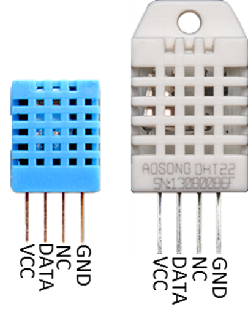
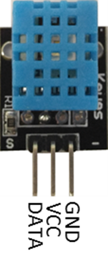
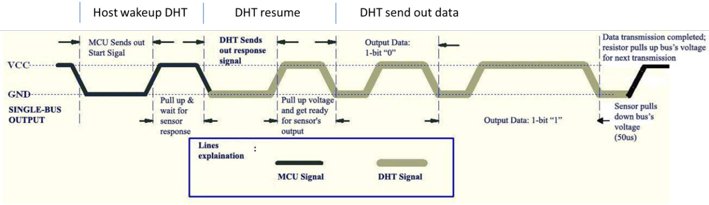
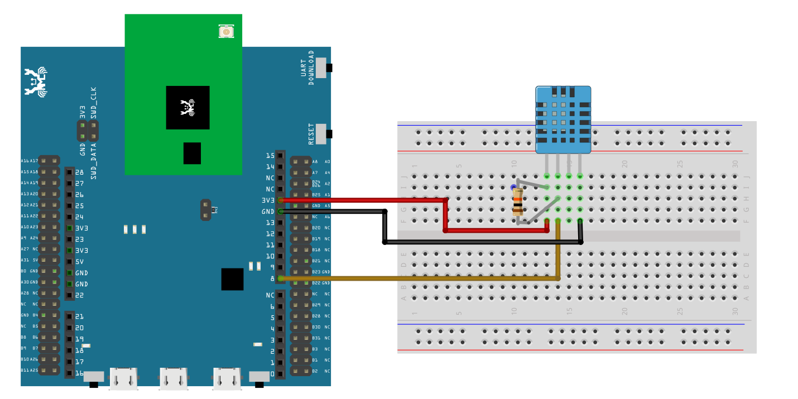
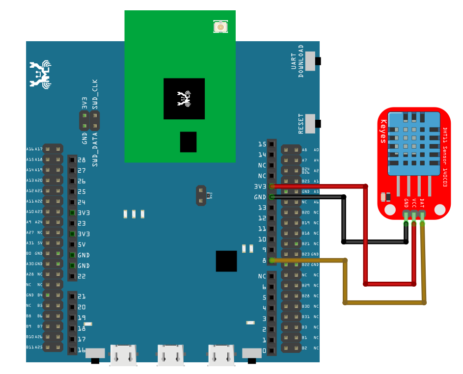
.. |image06| image:: ../../../../_static/amebad/Example_Guides/GPIO/GPIO_Measure_Temperature_And_Humidity/image06.png
   :width:  797 px
   :height:  756 px
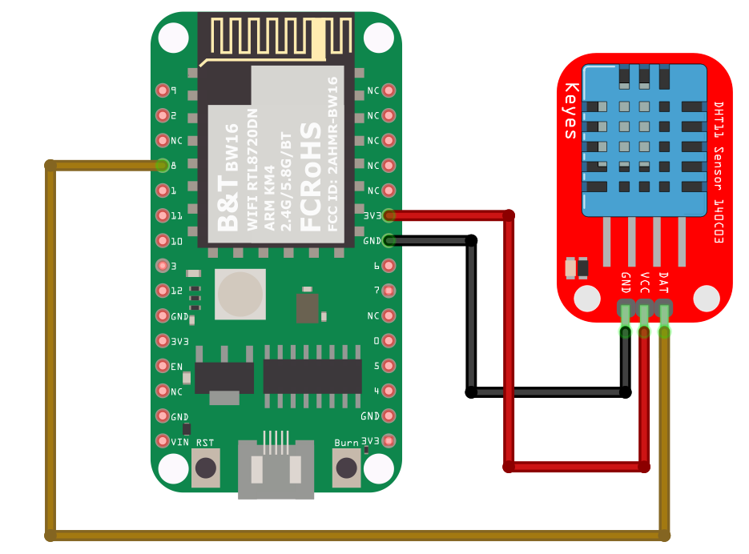
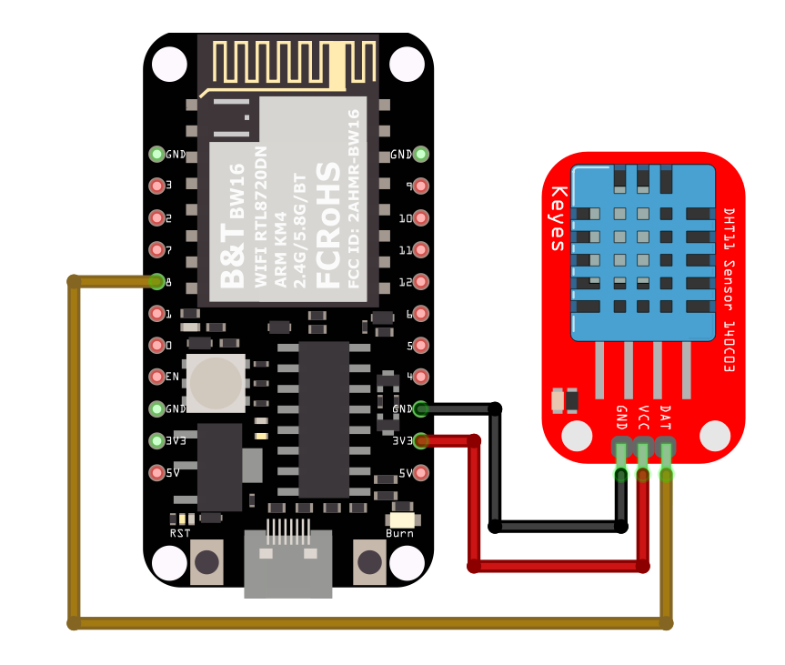
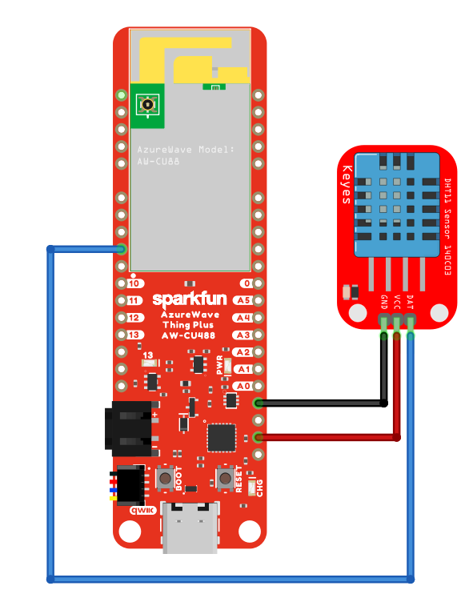
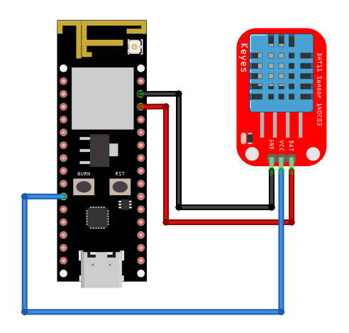
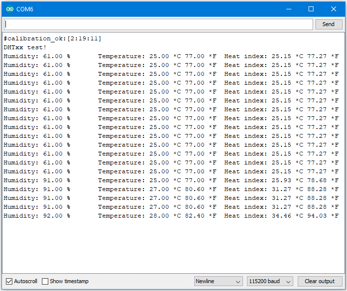
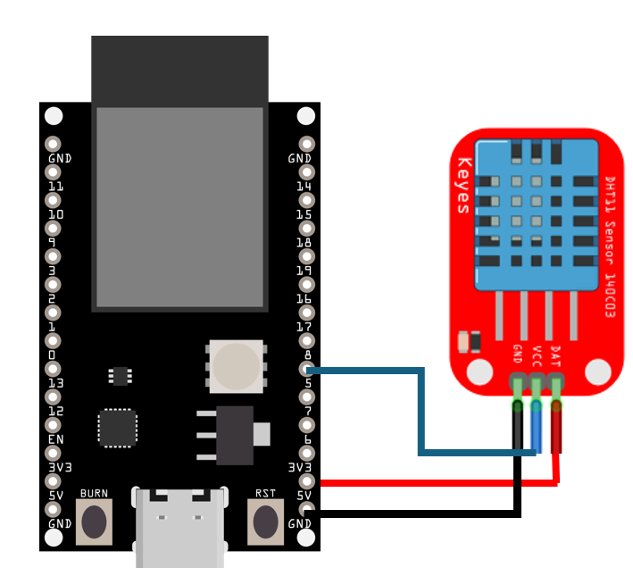
