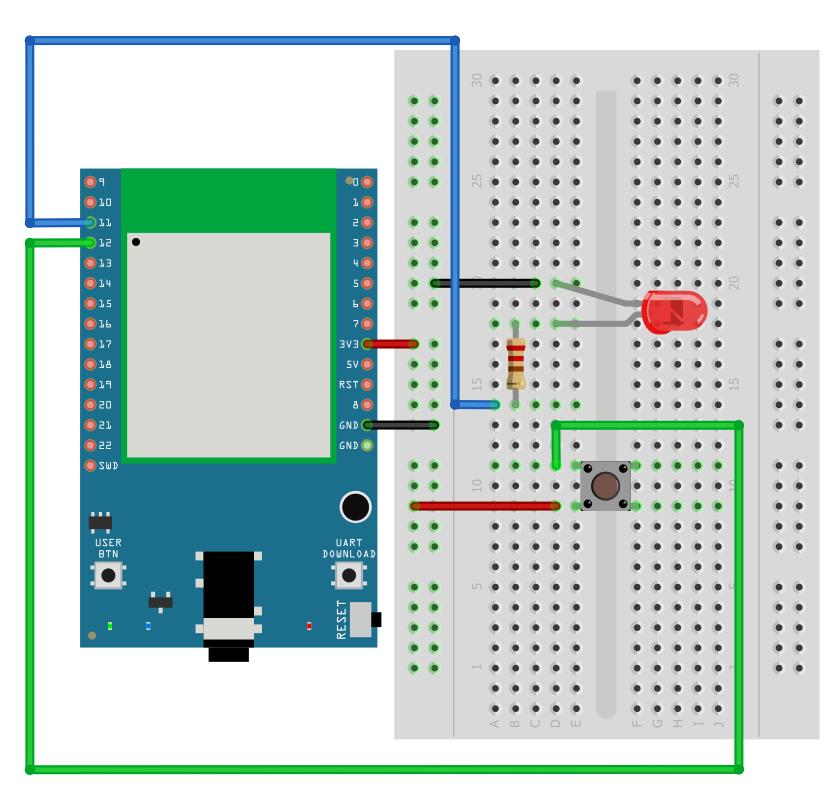
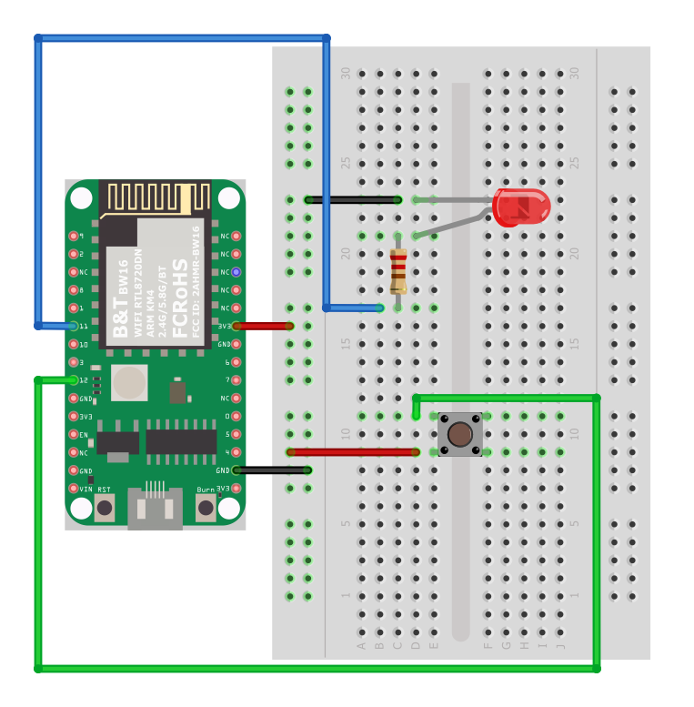

GPIO - Use GPIO Interrupt To Control LED
========================================

Materials
---------

- AmebaD [AMB21 / AMB22 / AMB23 / AMB25 / AMB26 / BW16 / AW-CU488 Thing Plus] x 1

- LED x 1

- Button x 1

Example
-------

Introduction
~~~~~~~~~~~~

In this example, we use a button to trigger interrupt and control the LED. When we press and release the button, the LED dims, press and release the button again, and the LED lights up. Note that in the Arduino example "Button and LED", LED only lights up when the button is pressed and hold, when we release the button, the LED dims.

Procedure
~~~~~~~~~

Open the example, ``"Files" → "Examples" → "AmebaGPIO" → "LED_InterruptCtrl"``

.. only:: amb21

**AMB21 / AMB22** Wiring Diagram:

|image01|

.. only:: end amb21

.. only:: amb23

**AMB23** Wiring Diagram:

|image02|

.. only:: end amb23

.. only:: bw16-typeb

**BW16** Wiring Diagram:

|image03|

.. only:: end bw16-typeb

.. only:: bw16-typec

**BW16-TypeC** Wiring Diagram:

|image04|

.. only:: end bw16-typec

.. only:: aw-cu488

**AW-CU488 Thing Plus** Wiring Diagram:

|image05|

.. only:: end aw-cu488

.. only:: amb25

**AMB25** Wiring Diagram:

|image06|

.. only:: end amb25

.. only:: amb26

**AMB26** Wiring Diagram:

|image07|

.. only:: end amb26

Compile and upload the program, press the reset button on the Ameba.
The LED will light up at first. Press and release the button, then the LED should dim. Pressing the button again should light up the LED.

Code Reference
--------------

In

.. code:: c++

  setup()

we set Pin 12 to:

.. code:: c++

  INPUT_IRQ_RISE

This means that an interrupt occurs when the voltage of this pin changes from GND to 3V3. Therefore, we connect the other side of the button to 3V3, so as to trigger interrupt event when the button is pressed.

.. code:: c++

  pinMode(button, INPUT_IRQ_RISE);

On the other hand, we can set pin 12 to:

.. code:: c++

  INPUT_IRQ_FALL

This means that an interrupt occurs when the voltage of this pin changes from 3V3 to GND. In this case, the other side of the button is connected to GND. Next, we need to specify the function to be executed to handle the interrupt:

.. code:: c++

  digitalSetIrqHandler(button, button_handler);

The second parameter is a function pointer, with prototype:

.. code:: c++

  void button_handler(uint32_t id, uint32_t event)

In this handler, every time we press and release the button, we trigger an interrupt, and change the status of the LED.

