HTTP - Set up Server to Control LED
=====================================

Materials
---------

- AmebaD [AMB21 / AMB22 / AMB23 / AMB25 / AMB26 / BW16 / AW-CU488 Thing Plus] x 1

- Breadboard x 1

- LED x 1

- 1KΩ Resistor x 1

Example
-------

In this example, by connecting Ameba to WiFi and using Ameba as a server, the user can control the LED through a webpage.

In a LED, the longer pin is the positive pole, and the shorter pin is the negative pole. So, we connect the shorter pin to GND and connect the longer pin to D13. Additionally, to avoid the electric current exceeding the tolerance of the LED and causing damage, we connect a resistor to the positive pole.

.. only:: amb21

|image01|

.. only:: end amb21

.. only:: amb23

|image02|

.. only:: end amb23

.. only:: amb25

|image03|

.. only:: end amb25

.. only:: amb26

|image04|

.. only:: end amb26

.. only:: bw16-typeb

|image05|

.. only:: end bw16-typeb

.. only:: bw16-typec

|image06|

.. only:: end bw16-typec

.. only:: aw-cu488

|image07|

.. only:: end aw-cu488

.. Note:
   For RTL8720DN(BW16) board, you may consider re-defining "LED_PIN" macro to 10 for built-in green LED, or 11 for blue built-in LED, or 12 for red built-in LED to avoid using extra components.

Then open :guilabel:`File -> Examples -> WiFi -> SimpleWebServerWiFi`

|image08|

Upload the code and press the reset button on Ameba. When the connection is established, you will see the message "To see this page in action, open a browser to http://xxx.xxx.xxx.xxx" in the Arduino IDE, as shown in the figure:

|image09|

Next, open the browser of a computer or a cell phone under the same WiFi domain, enter the address in the message.

|image10|

In the webpage, you can turn on/off the LED.

|image11|

Code Reference
----------------

| Use WiFi.begin() to establish WiFi connection.
| https://www.arduino.cc/en/Reference/WiFiBegin
| To get the information of a WiFi connection:
| Use WiFi.SSID() to get SSID of the current connected network.
| https://www.arduino.cc/en/Reference/WiFiSSID
| Use WiFi.RSSI() to get the signal strength of the connection.
| https://www.arduino.cc/en/Reference/WiFiRSSI
| Use WiFi.localIP() to get the IP address of Ameba.
| https://www.arduino.cc/en/Reference/WiFiLocalIP
| Use WiFiServer server() to create a server that listens on the specified port.
| https://www.arduino.cc/en/Reference/WiFiServer
| Use server.begin() to tell the server to begin listening for incoming connections.
| https://www.arduino.cc/en/Reference/WiFiServerBegin
| Use server.available() to get a client that is connected to the server and has data available for reading.
| https://www.arduino.cc/en/Reference/WiFiServerAvailable
| Use client.connected to get whether or not the client is connected.
| https://www.arduino.cc/en/Reference/WiFiClientConnected
| Use client.println() to print data followed by a carriage return and newline.
| https://www.arduino.cc/en/Reference/WiFiClientPrintln
| Use client.print() to print data to the server that a client is connected to.
| https://www.arduino.cc/en/Reference/WiFiClientPrint
| Use client.available() to return the number of bytes available for reading.
| https://www.arduino.cc/en/Reference/WiFiClientAvailable
| Use client.read() to read the next byte received from the server the client is connected to.
| https://www.arduino.cc/en/Reference/WiFiClientRead
| Use client.stop() to disconnect from the server the client is connected to.
| https://www.arduino.cc/en/Reference/WiFIClientStop

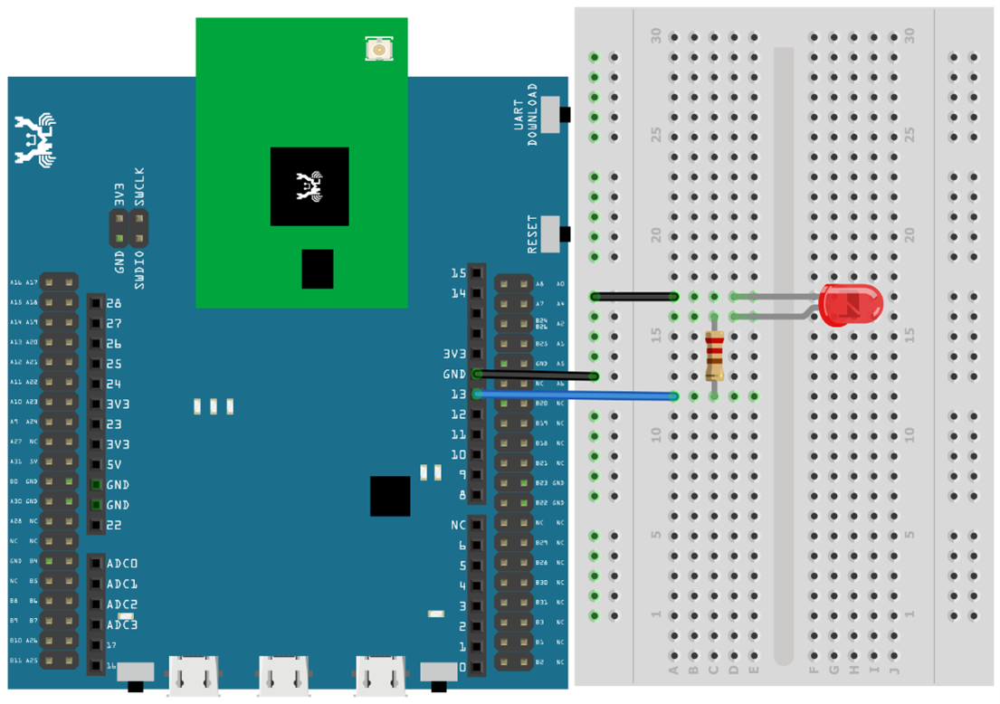
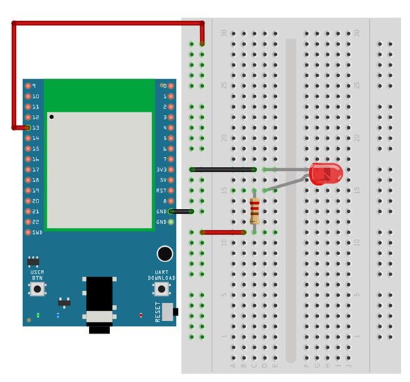
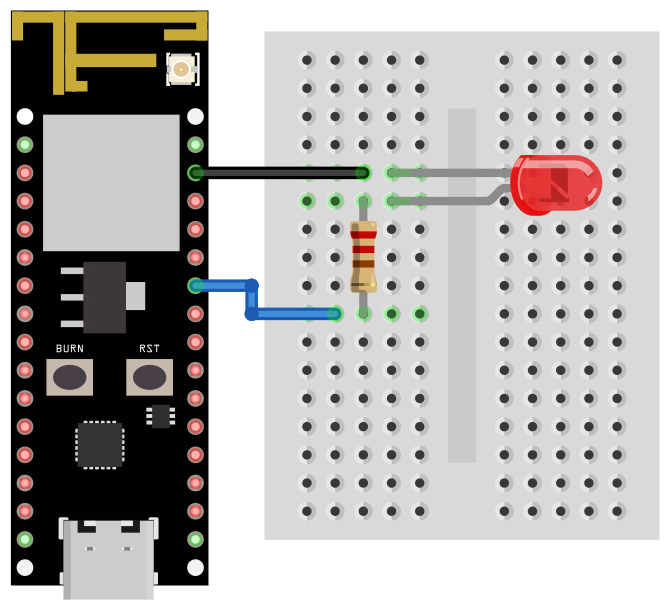
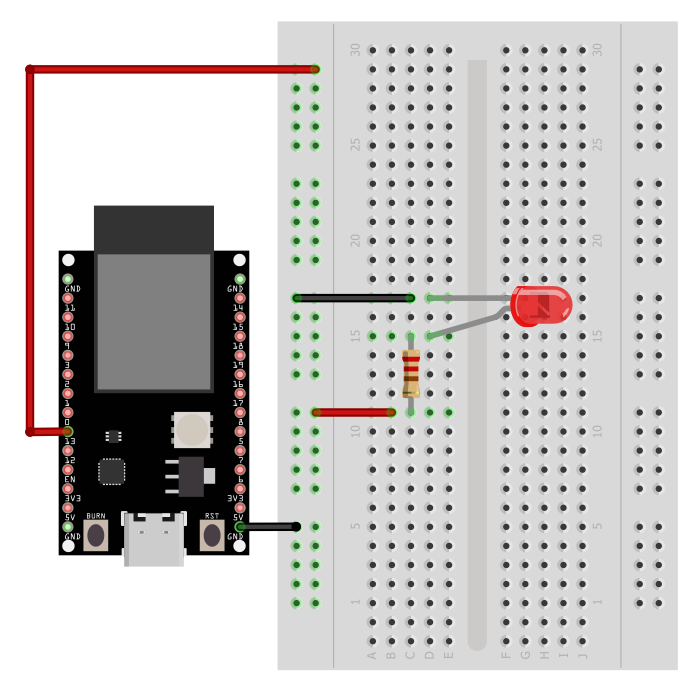
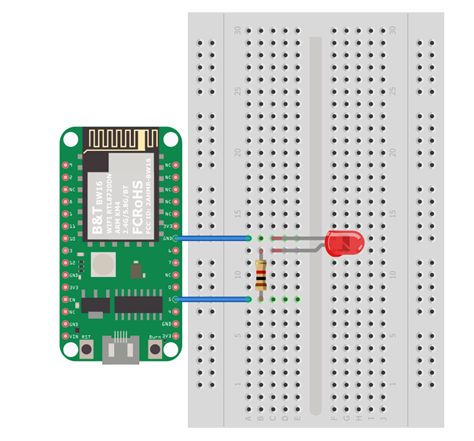
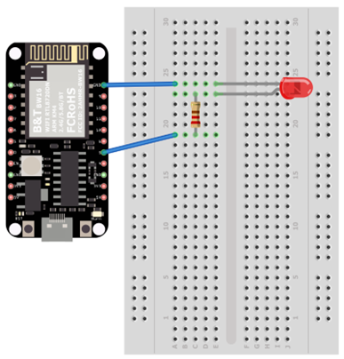
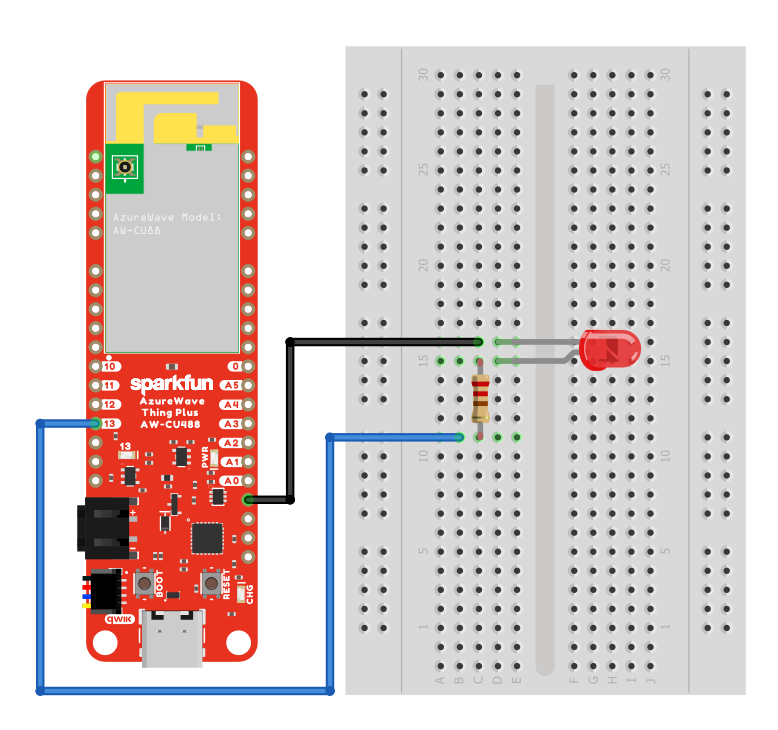
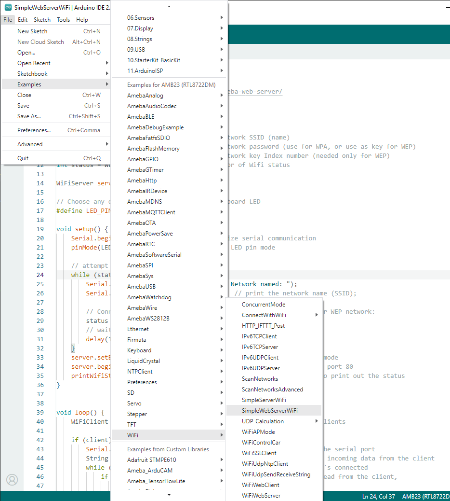
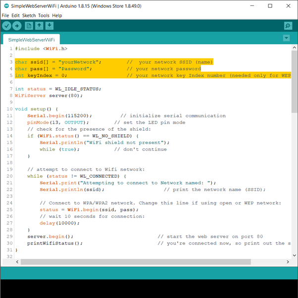
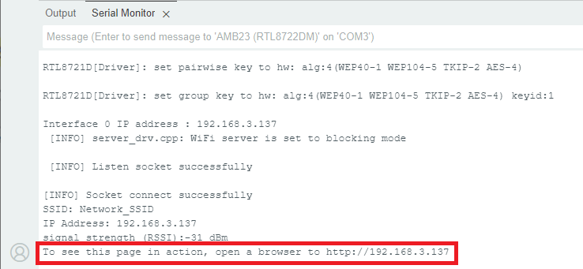
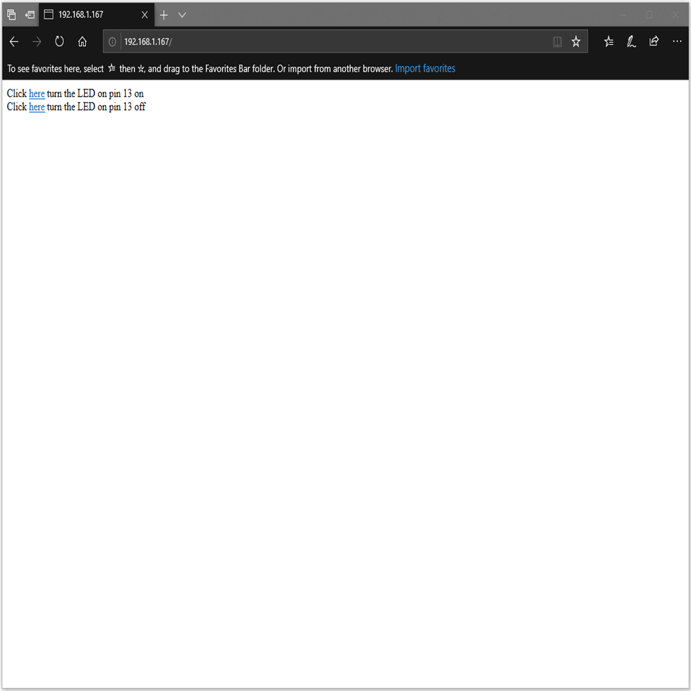
