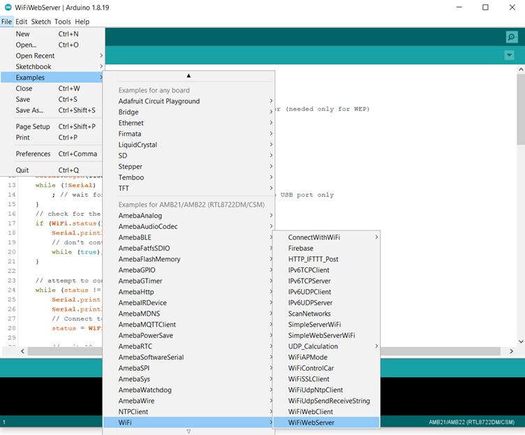
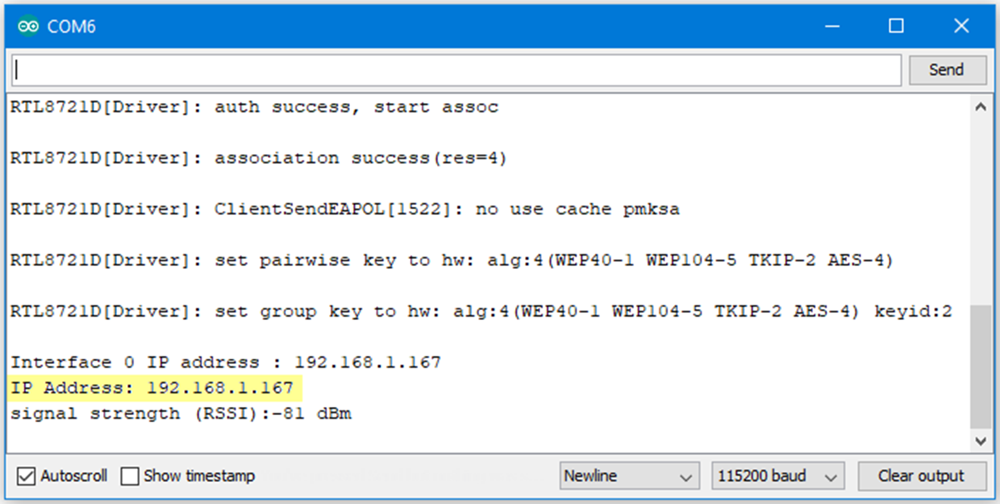
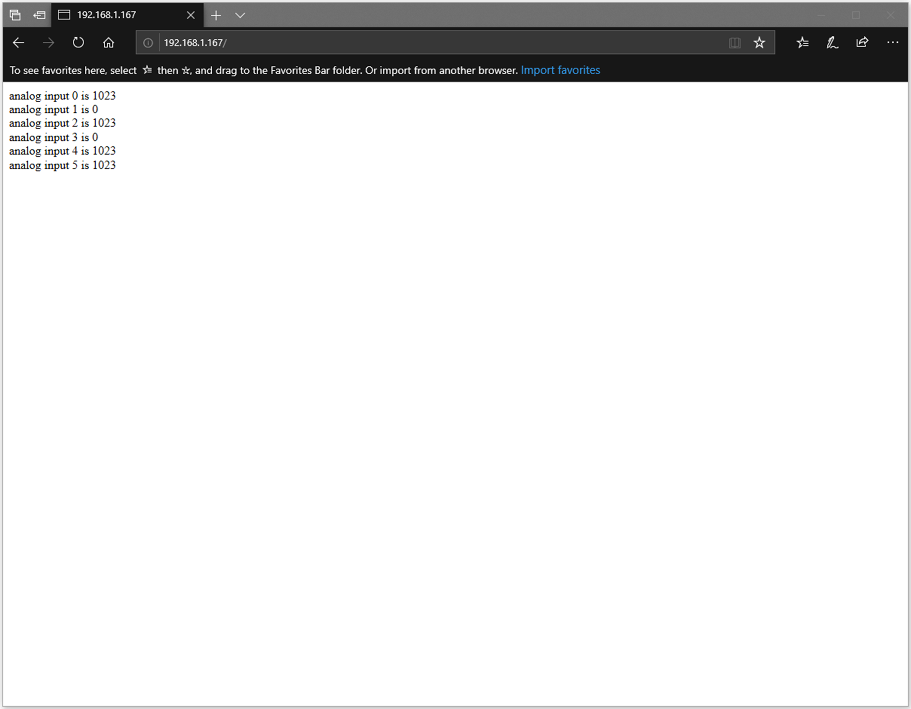

HTTP - Set up Server to Get the Ameba Status
================================================

.. contents::
  :local:
  :depth: 2
  
Materials
---------

- AmebaD [AMB21 / AMB22 / AMB23 /  AMB25 / AMB26 / BW16 / AW-CU488 Thing Plus] x 1

Example
-------

In this example, we connect Ameba to WiFi and use Ameba as server to send message to connected client.

First, open  “File” -> “Examples” -> “WiFi” -> “WiFiWebServer”

|image01|

In the sample code, modify the highlighted snippet and enter the required information (ssid, password, key index) required to connect to your WiFi network.

|image02|

Upload the code and press the reset button on Ameba. After connecting to WiFi, Ameba starts to run as server. The IP of the server is shown in the serial monitor, and port is 80.

|image03|

We connect to the server in a browser, and we can see the data sent from the server.

|image04|

Code Reference
----------------

| Use WiFi.begin() to establish WiFi connection.
| https://www.arduino.cc/en/Reference/WiFiBegin
| To get the information of a WiFi connection:
| Use WiFi.SSID() to get SSID of the current connected network.
| https://www.arduino.cc/en/Reference/WiFiSSID
| Use WiFi.RSSI() to get the signal strength of the connection.
| https://www.arduino.cc/en/Reference/WiFiRSSI
| se WiFi.localIP() to get the IP address of Ameba.
| https://www.arduino.cc/en/Reference/WiFiLocalIP
| Use WiFiServer server() to create a server that listens on the specified port.
| https://www.arduino.cc/en/Reference/WiFiServer
| Use server.begin() to tell the server to begin listening for incoming connections.
| https://www.arduino.cc/en/Reference/WiFiServerBegin
| Use server.available() to get a client that is connected to the server and has data available for reading.
| https://www.arduino.cc/en/Reference/WiFiServerAvailable
| Use client.connected to check whether or not the client is connected.
| https://www.arduino.cc/en/Reference/WiFiClientConnected
| Use client.println() to print data followed by a carriage return and newline.
| https://www.arduino.cc/en/Reference/WiFiClientPrintln
| Use client.print() to print data to the server that a client is connected to.
| https://www.arduino.cc/en/Reference/WiFiClientPrint
| Use client.available() to return the number of bytes available for reading.
| https://www.arduino.cc/en/Reference/WiFiClientAvailable
| Use client.read() to read the next byte received from the server the client is connected to.
| https://www.arduino.cc/en/Reference/WiFiClientRead
| Use client.stop() to disconnect from the server the client is connected to.
| https://www.arduino.cc/en/Reference/WiFIClientStop

.. |image02| image:: ../../../../_static/amebad/Example_Guides/HTTP/HTTP_Set_up_Server_to_Get_the_Ameba_Status/image02.png
   :width:  602 px
   :height:  623 px

