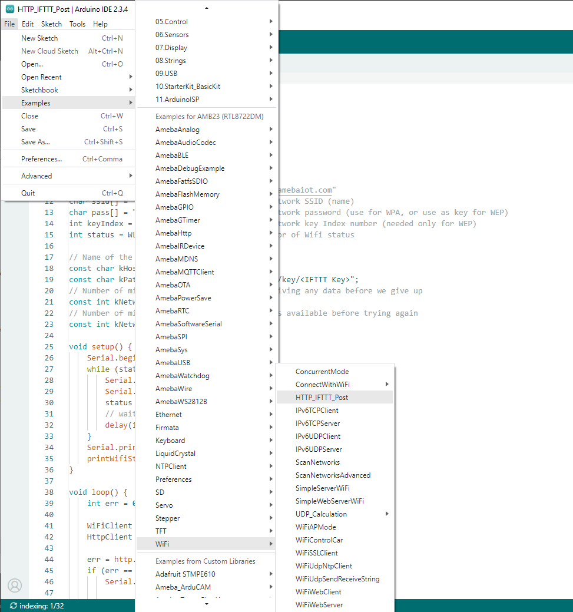

HTTP - Use IFTTT for Web Service
=================================

.. contents::
  :local:
  :depth: 2

IFTTT, known as If This Then That, is a website and mobile app and free
web-based service to create the applets, or the chains of simple
conditional statements. The applet is triggered by changes that occur
within other web services such as Gmail, Facebook, Telegram, Instagram,
Pinterest etc.

.. note:: IFTTT platforms have transitioned to a paid service model, requiring users to subscribe in order to access their features.
  
Materials
---------

- AmebaD [AMB21 / AMB22 / AMB23 /  AMB25 / AMB26 / BW16 / AW-CU488 Thing Plus] x 1

- An account from https://ifttt.com/, in order to access IFTTT service*

|image01|

.. Note::
    Upon log in, there are several cloud and online services that
    are integrated with IFTTT platforms.

Example
--------

- Generate Applet from IFTTT

In this example, we obtain an example of IFTTT Applet to send email to specified recipient.

To run the example, HTTP POST feature of the Ameba is used to post a simple webhook service that is received by IFTTT platform and in turn be used to trigger a response (sending an email).

After logging in https://ifttt.com/, click **Create** from the top bar.

|image02|

Click **“Add”** to add the trigger.

|image03|

Choose Webhooks service as shown below. Alternatively, search the service by typing into the search bar.

|image04|

After that, the available triggers will appear. Choose Receive a Web request.

|image05|

Next, an Event Name is required to identify the trigger successfully. In this example, set the Event name as “test_event”.

|image06|

Next, click **Add** in Then That field to create the action service taken in response to the last trigger.

|image07|

Choose Email as the action service.

|image08|

Click on Send me an email.

|image09|

Under the template of Send me an Email, the contents of the email, such as subject and body is editable. Click Create Action to complete the action. Take note that Email service is offered to the email address registered under IFTTT account.

|image10|

-  Post the Trigger via Ameba

Once the Applet is ready in the IFTTT dashboard, the example program can be flashed onto the Ameba board to post the HTTP request.

Open the example code in “File” -> “Examples” -> “AmebaHttp” -> “HTTP_IFTTT_Post”

|image11|

| In the example program, edit the following 3 items inside the code to make the program work.
   
| 1. The WiFi credentials to connect to the Wi-Fi hotspot or access point of desirable choice.
| 2. Under the Host name field, enter the host name of the IFTTT service “maker.ifttt.com”.
| 3. Under the Path name field, enter the Event name and key field “/trigger/Event name/with/key/Key Field”
   
- Event name: The event name should be the same as the one specified in the IFTTT applet. In this example, the event name is “test_event”.

- Key Field: Available under webhook service in individual IFTTT account. See the next step for the steps to obtain the Key Field.
   
|image12|

To obtain a key from documentation tab of the Webhooks, find the webhook service in the Explore tab.

|image13|

On the Webhooks service page, click on the Documentation tab.

|image14|

The key can be found in the documentation page. Also, information on how HTTP request can be used.

|image15|

Once the example is ready, connect to Ameba board via USB Cable.

On the Arduino IDE, compile the code and upload the code onto Ameba and press the reset button. After the event has been successfully fired, “Congratulations! You have fired the test_event event” can be seen on the serial monitor and an email reminder for this event will be delivered.

|image16|

Thereafter an email is sent to recipient email account registered at IFTTT Applet and an email will be received.

|image17|

- IFTTT Line Notify

Alternatively, an example to send a message with the LINE messaging app on iPhone or Android using IFTTT Applet is available. It can be achieved by modifying the “Then That” settings.

You may follow the same steps previously in “Generate Applet from IFTTT” section to create a Webhooks service as the trigger. The Event Name required to identify the trigger will remain as “test_event”. Next, click the “Add” button in “Then That” field to create the action service taken in response to the last trigger.

|image18|

Choose Line as the action service.

|image19|

Click on “Send message”.

|image20|

Click on “Connect” and login to your Line Account.

|image21|

Select LINE account, set the Recipient to “1-on-1 chat with LINE Notify” which means the message triggered by IFTTT will directly send to your chats. Next, input your desired message in the input box under “Message”. For sending images, you can insert a link to your photo in the input box under “Photo URL”.

|image22|

On the Arduino IDE, compile the code and upload the code onto Ameba and press the reset button. After the event has been successfully fired, you will receive a message from “LINE Notify” on your Mobile devices or PC.

|image23|

.. |image01| image:: ../../../../_static/amebad/Example_Guides/HTTP/HTTP_Use_IFTTT_for_Web_Service/image01.png
   :width:  940 px
   :height:  511 px

.. |image18| image:: ../../../../_static/amebad/Example_Guides/HTTP/HTTP_Use_IFTTT_for_Web_Service/image18.png
   :width:  752 px
   :height:  542 px

