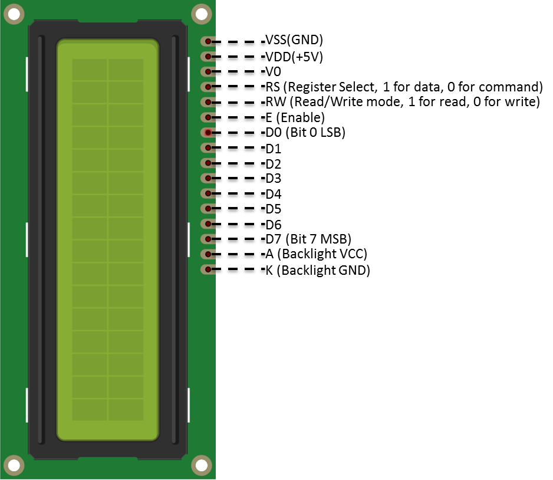
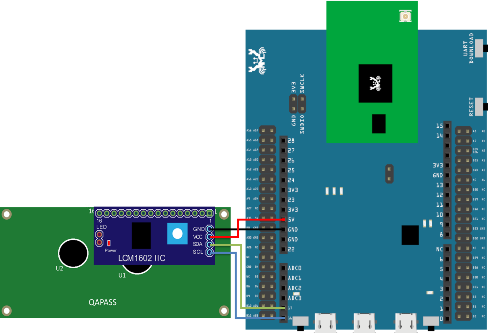
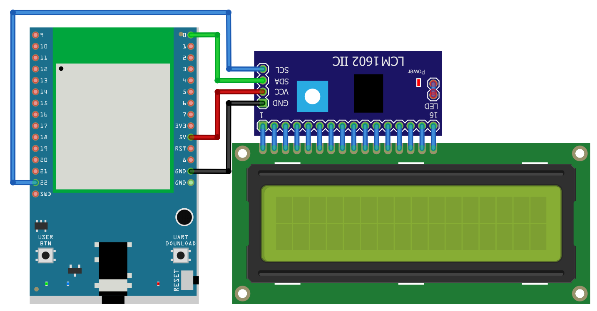
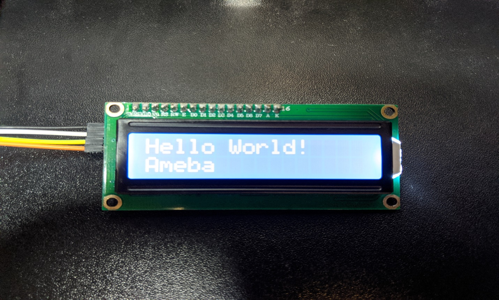

I2C - Display Data On LCD Screen
================================

Materials
---------

- AmebaD [AMB21 / AMB22 / AMB23 / AMB25 / AMB26 / BW16 / AW-CU488 Thing Plus] x 1
- I2C 2x16 LCD

Example
-------

**Introduction**
~~~~~~~~~~~~~~~~

Normally there are many pins on an LCD display, as shown in below figure.

|image01|

An LCD display can be equipped with an additional processing chip to process the data. The processing chip can connect to a microcontroller using the I2C interface.

**Procedure**
~~~~~~~~~~~~~

.. only:: amb21

**AMB21 / AMB22** Wiring Diagram:

|image02|

.. only:: end amb21

.. only:: amb23

**AMB23** Wiring Diagram:

|image03|

.. only:: end amb23

.. only:: bw16-typeb

**BW16** Wiring Diagram:

|image04|

.. only:: end bw16-typeb

.. only:: bw16-typec

**BW16-TypeC** Wiring Diagram:

|image05|

.. only:: end bw16-typec

.. only:: aw-cu488

**AW-CU488 Thing Plus** Wiring Diagram:

|image06|

.. only:: end aw-cu488

.. only:: amb25

**AMB25** Wiring Diagram:

|image07|

.. only:: end amb25

.. only:: amb26

**AMB26** Wiring Diagram:

|image08|

.. only:: end amb26

Open the example in :guilabel:`File -> Examples -> AmebaWire -> LCD_HelloWorld`
Compile and upload to Ameba, then press the reset button.
Then you can see "Hello World" in the first line, and "Ameba" in the
second line displayed on the LCD screen.

|image09|

After 8 seconds, you can input to the Serial Monitor the string you would like to display on the LCD.

|image10|

For example, we enter "123456789" and press "Send":

|image11|

Code Reference
--------------

The required settings of each model of LCD might be different, the constructor we use in this example is:

.. code-block:: c++

  LiquidCrystal_I2C(uint8_t lcd_Addr, uint8_t En, uint8_t Rw, uint8_t Rs,
                    uint8_t d4, uint8_t d5, uint8_t d6, uint8_t d7,
                    uint8_t backlighPin, t_backlighPol pol);

And the setting parameters are as follows:

.. code-block:: c++

    LiquidCrystal_I2C lcd(0x27, 2, 1, 0, 4, 5, 6, 7, 3, POSITIVE); // Set the LCD I2C address

The first parameter 0x27 is the address of I2C. Each of the following 8 parameters represents the meaning of each bit in a byte, i.e., En is bit 2, Rw is bit 1, Rs is bit 0, d4 is bit 4, and so forth.

Call ``backlight()`` to light the screen.
Call ``setCursor(0, 0)`` to set the position of the cursor.
LCD inherits the Print class, so we can use ``lcd.print()`` to output string on the screen.

.. |image04| image:: ../../../../_static/amebad/Example_Guides/I2C/I2C_Display_Data_on_LCD_Screen/image04.png
   :width:  1158 px
   :height:  621 px
   :scale: 80%

.. |image10| image:: ../../../../_static/amebad/Example_Guides/I2C/I2C_Display_Data_on_LCD_Screen/image10.png
   :width:  1431 px
   :height:  851 px
   :scale: 60%
.. |image11| image:: ../../../../_static/amebad/Example_Guides/I2C/I2C_Display_Data_on_LCD_Screen/image11.png
   :width:  1431 px
   :height:  870 px
   :scale: 60%
