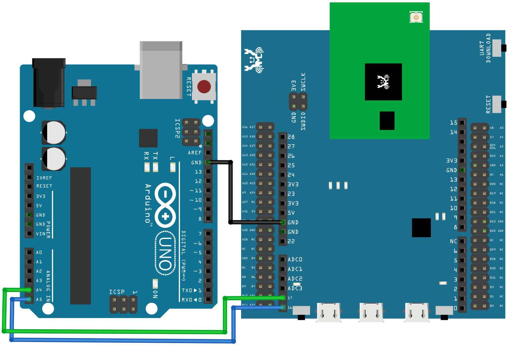

I2C - Receive Data from Arduino UNO			
===================================

.. contents::
  :local:
  :depth: 2

Materials
---------

- AmebaD [AMB21 / AMB22 / AMB23 / AMB25 / AMB26 / BW16 / AW-CU488 Thing Plus] x 1
- Arduino UNO x 1

Example
-------

**Introduction**
~~~~~~~~~~~~~~~~

.. only:: amb21 

In the previous example `“I2C - Communicate with Arduino UNO via I2C” <https://ameba-doc-arduino-sdk.readthedocs-hosted.com/en/latest/ameba_d/amb21/Example_Guides/I2C/I2C%20-%20Send%20Data%20to%20Arduino%20UNO.html>`_, Ameba, the I2C master, transmits data to the Arduino UNO, the I2C slave. Whereas in this example, Ameba is the I2C master, and receives data from the Arduino UNO, which is the I2C slave.

.. only:: end amb21

.. only:: amb23

In the previous example `“I2C - Communicate with Arduino UNO via I2C” <https://ameba-doc-arduino-sdk.readthedocs-hosted.com/en/latest/ameba_d/amb23/Example_Guides/I2C/I2C%20-%20Send%20Data%20to%20Arduino%20UNO.html>`_, Ameba, the I2C master, transmits data to the Arduino UNO, the I2C slave. Whereas in this example, Ameba is the I2C master, and receives data from the Arduino UNO, which is the I2C slave.

.. only:: end amb23

.. only:: bw16-typeb

In the previous example `“I2C - Communicate with Arduino UNO via I2C” <https://ameba-doc-arduino-sdk.readthedocs-hosted.com/en/latest/ameba_d/bw16-typeb/Example_Guides/I2C/I2C%20-%20Send%20Data%20to%20Arduino%20UNO.html>`_, Ameba, the I2C master, transmits data to the Arduino UNO, the I2C slave. Whereas in this example, Ameba is the I2C master, and receives data from the Arduino UNO, which is the I2C slave.

.. only:: end bw16-typeb

.. only:: bw16-typec 

In the previous example `“I2C - Communicate with Arduino UNO via I2C” <https://ameba-doc-arduino-sdk.readthedocs-hosted.com/en/latest/ameba_d/bw16-typec/Example_Guides/I2C/I2C%20-%20Send%20Data%20to%20Arduino%20UNO.html>`_, Ameba, the I2C master, transmits data to the Arduino UNO, the I2C slave. Whereas in this example, Ameba is the I2C master, and receives data from the Arduino UNO, which is the I2C slave.

.. only:: end bw16-typec 

.. only:: aw-cu488 

In the previous example `“I2C - Communicate with Arduino UNO via I2C” <https://ameba-doc-arduino-sdk.readthedocs-hosted.com/en/latest/ameba_d/aw-cu488/Example_Guides/I2C/I2C%20-%20Send%20Data%20to%20Arduino%20UNO.html>`_, Ameba, the I2C master, transmits data to the Arduino UNO, the I2C slave. Whereas in this example, Ameba is the I2C master, and receives data from the Arduino UNO, which is the I2C slave.

.. only:: end aw-cu488

.. only:: amb25 

In the previous example `“I2C - Communicate with Arduino UNO via I2C” <https://ameba-doc-arduino-sdk.readthedocs-hosted.com/en/latest/ameba_d/amb25/Example_Guides/I2C/I2C%20-%20Send%20Data%20to%20Arduino%20UNO.html>`_, Ameba, the I2C master, transmits data to the Arduino UNO, the I2C slave. Whereas in this example, Ameba is the I2C master, and receives data from the Arduino UNO, which is the I2C slave.

.. only:: end amb25

.. only:: amb26 

In the previous example `“I2C - Communicate with Arduino UNO via I2C” <https://ameba-doc-arduino-sdk.readthedocs-hosted.com/en/latest/ameba_d/amb26/Example_Guides/I2C/I2C%20-%20Send%20Data%20to%20Arduino%20UNO.html>`_, Ameba, the I2C master, transmits data to the Arduino UNO, the I2C slave. Whereas in this example, Ameba is the I2C master, and receives data from the Arduino UNO, which is the I2C slave.

.. only:: end amb26

**Procedure**
~~~~~~~~~~~~~

**Setting up Arduino Uno to be I2C Slave**

First, select Arduino in the Arduino IDE in ``“Tools” → “Board” → “Arduino Uno”``:

Open ``“Examples” → “Wire” → “slave_sender”``

|image01|
   
Then click “Sketch” → “Upload” to compile and upload the example to Arduino Uno.

**Setting up Ameba to be I2C Master**

Next, open another window of Arduino IDE, make sure to choose your Ameba development board in the IDE: “Tools” → “Board”

Open ``“File” → “Examples” → “AmebaWire” → “MasterReader”``

|image02|

Click “Sketch” → “Upload” to compile and upload the example to Ameba.

**Wiring**

The Arduino example uses A4 as the I2C SDA and A5 as the I2C SCL.
Another important thing is that the GND pins of Arduino and Ameba should be connected to each other.

.. only:: amb21

**AMB21 / AMB22** Wiring Diagram:
  
|image03|

.. only:: end amb21

.. only:: amb23

**AMB23** Wiring Diagram:

|image04|

.. only:: end amb23

.. only:: bw16-typeb

**BW16** Wiring Diagram:

|image05|

.. only:: end bw16-typeb

.. only:: bw16-typec

**BW16-TypeC** Wiring Diagram:

|image06|

.. only:: end bw16-typec

.. only:: aw-cu488

**AW-CU488 Thing Plus** Wiring Diagram:

|image07|

.. only:: end aw-cu488

.. only:: amb25

**AMB25** Wiring Diagram:

|image08|

.. only:: end amb25

.. only:: amb26

**AMB26** Wiring Diagram:

|image09|

.. only:: end amb26

Next, we will observe the data received by Ameba in the Serial Monitor.
.. note :: If you do not know which port the Ameba development board is connected to, please find it in the Device Manager of Windows first. Ameba is connected as “mbed Serial Port”. For example, if you find mbed Serial Port (COM15), that means Ameba is connected to port COM15.

|image10|

We select the port in “Tools” → “Port” → “COM15” (the port connected to Ameba)
Open the Arduino IDE window of the Ameba, go to “Tools” → “Serial
Monitor” to display the messages printed by Ameba.
Press the reset button on Arduino Uno, Arduino Uno now waits for
connection from I2C master.
Then press the reset button on Ameba, Ameba will start to receive
messages from Arduino Uno. And you can see the “hello ” message
printed every half second in serial monitor.

.. note :: If the message does not show in the Serial Monitor of Ameba, please close and open the serial monitor again.

|image11|

Code Reference
--------------

You can find detailed information of this example in the documentation of Arduino:
https://www.arduino.cc/en/Tutorial/MasterReader

First use ``Wire.begin()`` / ``Wire.begin(address)`` to join the I2C bus as a master or slave, in the Master case the address is not required.
https://www.arduino.cc/en/Reference/WireBegin

Next, the Master uses ``Wire.requestFrom()`` to specify from which Slave to request data.
https://www.arduino.cc/en/Reference/WireRequestFrom

.. |image01| image:: ../../../../_static/amebad/Example_Guides/I2C/I2C_Receive_Data_from_Arduino_UNO/image01.png
   :width: 683
   :height: 1028

.. |image04| image:: ../../../../_static/amebad/Example_Guides/I2C/I2C_Receive_Data_from_Arduino_UNO/image04.png
   :width:  882 px
   :height:  670 px
.. |image05| image:: ../../../../_static/amebad/Example_Guides/I2C/I2C_Receive_Data_from_Arduino_UNO/image05.png
   :width:  923 px
   :height:  717 px
   :scale: 80%
.. |image06| image:: ../../../../_static/amebad/Example_Guides/I2C/I2C_Receive_Data_from_Arduino_UNO/image06.png
   :width:  959 px
   :height:  690 px
   :scale: 80%

.. |image08| image:: ../../../../_static/amebad/Example_Guides/I2C/I2C_Receive_Data_from_Arduino_UNO/image08.png
   :width:  487 px
   :height:  457 px
.. |image09| image:: ../../../../_static/amebad/Example_Guides/I2C/I2C_Receive_Data_from_Arduino_UNO/image09.png
   :width:  519 px
   :height:  457 px
.. |image10| image:: ../../../../_static/amebad/Example_Guides/I2C/I2C_Receive_Data_from_Arduino_UNO/image10.png
   :width: 434
   :height: 405

