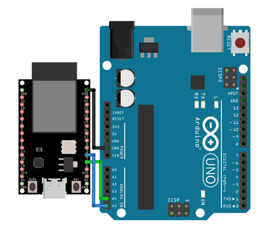

I2C - Send Data to Arduino UNO
==============================

Materials
---------

- AmebaD [AMB21 / AMB22 / AMB23 / AMB25 / AMB26 / BW16 / AW-CU488 Thing Plus] x 1
- Arduino UNO x 1

Example
-------

**Introduction**
~~~~~~~~~~~~~~~~

There are two roles in the operation of I2C, one is "master", the other is "slave". Only one master is allowed and can be connected to many slaves. Each slave has its unique address, which is used in the communication between master and the slave. I2C uses two pins, one is for data transmission (SDA), the other is for the clock (SCL). Master uses the SCL to inform slave of the upcoming data transmission, and the data is transmitted through SDA. The I2C example was named "Wire" in the Arduino example.

**Procedure**
~~~~~~~~~~~~~

In this example, we use Ameba as the I2C master writer, and Arduino as the I2C slave receiver.
When the I2C slave receives a string sent from I2C master, it prints the received string.

**Setting up Arduino Uno to be I2C Slave**

First, select Arduino in the Arduino IDE in :guilabel:`Tools -> Board -> Arduino Uno`

Open the "Slave Receiver" example in :guilabel:`Examples -> Wire -> slave_receiver`

|image01|

Then click :guilabel:`Sketch -> Upload` to compile and upload the example to Arduino Uno.

**Setting up Ameba to be I2C Master**

Next, open another window of Arduino IDE, make sure to choose your Ameba development board in the IDE: :guilabel:`Tools -> Board`

Then open the "Master Writer" example in :guilabel:`File -> Examples -> AmebaWire -> MasterWriter`

|image02|

**Wiring**

The Arduino example uses A4 as the I2C SDA and A5 as the I2C SCL.

**Another important thing to note**

.. note :: The GND pins of Arduino and Ameba should be connected to each other.

.. only:: amb21

**AMB21 / AMB22** Wiring Diagram:

|image03|

.. only:: end amb21

.. only:: amb23

**AMB23** Wiring Diagram:

|image04|

.. only:: end amb23

.. only:: bw16-typeb

**BW16** Wiring Diagram:

|image05|

.. only:: end bw16-typeb

.. only:: bw16-typec

**BW16-TypeC** Wiring Diagram:

|image06|

.. only:: end bw16-typec

.. only:: aw-cu488

**AW-CU488 Thing Plus** Wiring Diagram:

|image07|

.. only:: end aw-cu488

.. only:: amb25

**AMB25** Wiring Diagram:

|image08|

.. only:: end amb25

.. only:: amb26

**AMB26** Wiring Diagram:

|image09|

.. only:: end amb26

Open the Arduino IDE of the Arduino Uno and open the serial monitor :guilabel:`Tools -> Serial Monitor`
In the Serial Monitor, you can see the messages printed from Arduino Uno.
Next, press the reset button on Arduino Uno. Now the Arduino Uno is waiting for the connection from I2C Master.
We press the reset button on Ameba to start to send messages. Then observe the serial monitor, you can see the messages show up every half second.

|image10|

Code Reference
--------------

You can find detailed information of this example in the documentation of Arduino:
https://www.arduino.cc/en/Tutorial/MasterWriter

First use Wire.begin()/Wire.begin(address) to join the I2C bus as a master or slave, in the Master case the address is not required.
https://www.arduino.cc/en/Reference/WireBegin

Next, the Master uses Wire.beginTransmission(address) to begin a transmission to the I2C slave with the given address:
https://www.arduino.cc/en/Reference/WireBeginTransmission

Uses Wire.write() to send data, and finally use Wire.endTransmission() to end a transmission to a Slave and transmits the bytes that were queued:
https://www.arduino.cc/en/Reference/WireEndTransmission

.. |image01| image:: ../../../../_static/amebad/Example_Guides/I2C/I2C_Send_data_to_Arduino_UNO/image01.png
   :width: 578
   :height: 1028

.. |image03| image:: ../../../../_static/amebad/Example_Guides/I2C/I2C_Send_data_to_Arduino_UNO/image03.png
   :width: 1540
   :height: 1051
   :scale: 50%

.. |image05| image:: ../../../../_static/amebad/Example_Guides/I2C/I2C_Send_data_to_Arduino_UNO/image05.png
   :width: 923
   :height: 717
   :scale: 80%
.. |image06| image:: ../../../../_static/amebad/Example_Guides/I2C/I2C_Send_data_to_Arduino_UNO/image06.png
   :width: 959
   :height: 690
   :scale: 80%
.. |image07| image:: ../../../../_static/amebad/Example_Guides/I2C/I2C_Send_data_to_Arduino_UNO/image07.png
   :width:  546 px
   :height:  501 px

