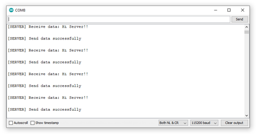

IPv6 - Ameba as IPv6 Server/Client over UDP
===========================================

.. contents::
  :local:
  :depth: 2

Materials
---------

- AmebaD [AMB21 / AMB22 / AMB23 / AMB25 / AMB26 / BW16 / AW-CU488 Thing Plus] x 2

Example
-------

**Introduction**
~~~~~~~~~~~~~~~~

This example shows how Ameba can communicate on the local network using Internet Protocol version 6 over UDP.
Note that this example only works after you have set up the server and then configure the client accordingly.

**Procedure**
~~~~~~~~~~~~~

Step 1. IPv6UDPServer
Open the example, ``“Files” → “Examples” → “WiFi” → “IPv6UDPServer”``.

|image01|

In the sample code, modify the highlighted section to enter the information required (ssid, password) to connect to your WiFi network.

|image02|

Next, upload the code and press the reset button on Ameba once the upload is finished.
Open Serial Monitor and copy the IPv6 address of the Server (the highlighted area) for later use,

|image03|

Step 2. IPv6UDPClient
Now take the second Ameba D and open another example, ``“Files” → “Examples” → “WiFi” → “IPv6UDPClient”``.
    
|image04|

In the sample code, modify the highlighted section to enter the information required (ssid, password) to connect to your WiFi network.

|image05|

From the previous step, we have obtained the Server's IPv6 address, now we copy the server's IPv6 address to “IPv6UDPClient” example in the highlighted area below,

|image06|

Next, upload the code and press the reset button on Ameba once the upload is finished.
Open Serial Monitor on the port to the second Ameba D, you should see server and client are sending text message to each other at the same time.

|image07|

|image08|

.. |image01| image:: ../../../../_static/amebad/Example_Guides/IPv6/IPv6_Ameba_As_IPv6_Server_Client_Over_UDP/image01.png
   :width: 1158
   :height: 961
   :scale: 70%
.. |image02| image:: ../../../../_static/amebad/Example_Guides/IPv6/IPv6_Ameba_As_IPv6_Server_Client_Over_UDP/image02.png
   :width: 458
   :height: 527
.. |image03| image:: ../../../../_static/amebad/Example_Guides/IPv6/IPv6_Ameba_As_IPv6_Server_Client_Over_UDP/image03.png
   :width: 602
   :height: 294
.. |image04| image:: ../../../../_static/amebad/Example_Guides/IPv6/IPv6_Ameba_As_IPv6_Server_Client_Over_UDP/image04.png
   :width: 1156
   :height: 962
.. |image05| image:: ../../../../_static/amebad/Example_Guides/IPv6/IPv6_Ameba_As_IPv6_Server_Client_Over_UDP/image05.png
   :width: 436
   :height: 491
.. |image06| image:: ../../../../_static/amebad/Example_Guides/IPv6/IPv6_Ameba_As_IPv6_Server_Client_Over_UDP/image06.png
   :width: 471
   :height: 449

.. |image08| image:: ../../../../_static/amebad/Example_Guides/IPv6/IPv6_Ameba_As_IPv6_Server_Client_Over_UDP/image08.png
   :width: 517
   :height: 271
