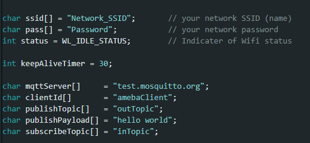
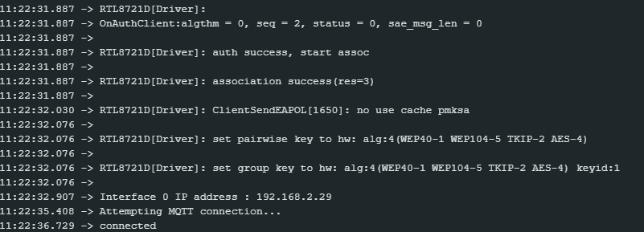
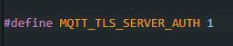

MQTT - Set up MQTT Client over TLS
==================================

.. contents::
  :local:
  :depth: 2

Materials
---------

- AmebaD [AMB21 / AMB22 / AMB23 / AMB25 / AMB26 / BW16 / AW-CU488 Thing Plus] x 1

Example
-------

In this example, Ameba connect to a MQTT broker using TLS authentication. Then send messages as a publisher and receive messages as a subscriber.

Open the MQTT example ``“File” → “Examples” →“AmebaMQTTClient” → “MQTT_TLS”`` 

Please modify the WiFi-related parameters and MQTT parameters.

|image01|

- “ssid” is the network SSID for internet access.

- “pass” is the network password for internet access.

- The “mqttServer” refers to the MQTT-Broker, there is free MQTT sandbox “test.mosquitto.org” for testing.

- “clientId” is an identifier for MQTT-Broker to identify the connected device.

- “publishTopic” is the topic of the published message. It is “outTopic” in the example. The devices that subscribed to “outTopic” will receive the message.

- “publishPayload” is the content to be published.

- “subscribeTopic” is to tell MQTT-broker which topic to subscribe to by the board.

Next, compile the code and upload it to Ameba. Press the reset button, then open the serial monitor.

|image02|

After Ameba is connected to MQTT server, it sends the message “hello world” to “outTopic”. To see the message, use another MQTT client. Refer to the MQTT_Basic example guide on how to setup a PC-based MQTT client.

In addition to use TLS client authentication to server authentication, it requires to generate an OpenSSL private key and obtain a signed certificate from the server. For testing purposes, signed certificates can be obtained from test.mosquitto.org by following the guide at https://test.mosquitto.org/ssl/.

Replace the character strings “certificateBuff” and “privateKeyBuff” with the signed certificate and OpenSSL private key, ensuring that they are formatted the same way as the shown in the example code. Set “MQTT_TLS_SERVER_AUTH” to be “1”.

|image03|

